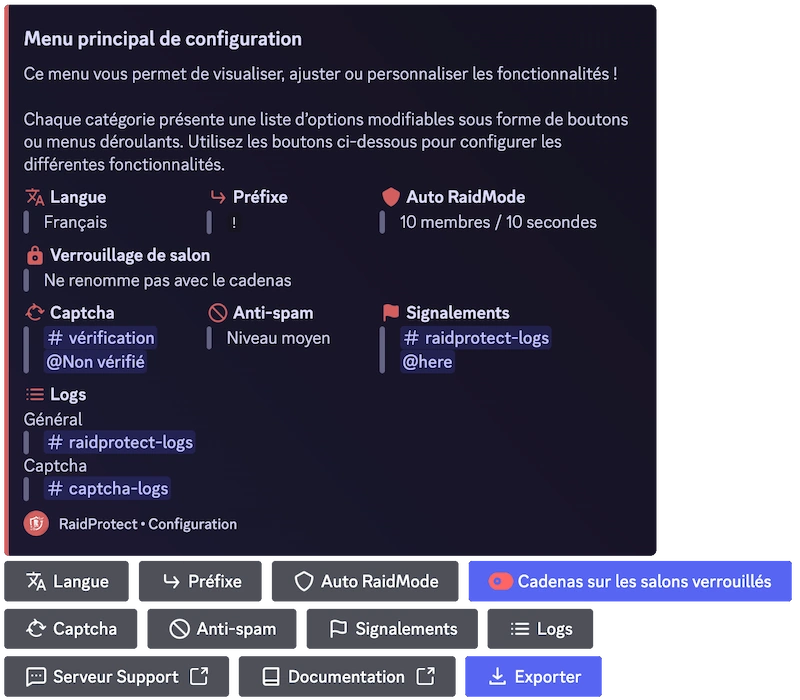

Cela faisait un moment que nous n'avions pas proposé de mise à jour majeure pour RaidProtect et nous tenons à nous excuser pour cette longue attente. Ces derniers mois, nous avons travaillé dur pour moderniser et améliorer l'expérience du bot ; aujourd'hui, nous sommes ravis de vous présenter l'**Interaction Update** !

<!--truncate-->

## ✨ Ce qui change (et ça change beaucoup) {#new}

Cette mise à jour marque un tournant dans le fonctionnement de RaidProtect en mettant l'accent sur **l'interaction et l'ergonomie**, notamment avec l'ajout des **commandes slash** et une **refonte de la configuration**. De plus, nous avons écouté <a href="https://suggestions.raidprotect.bot" target="_blank">vos retours et idées</a>, cette mise à jour intègre de nombreuses fonctionnalités que vous nous avez demandées ! Vous pouvez d'ailleurs [consulter le changelog](../changelog.mdx) pour voir les suggestions réalisées.

### Commandes Slash {#slash-commands}

Oui, vous les attendiez depuis longtemps... Nous aussi. Fini les commandes textuelles d’une autre époque, place aux commandes slash ! Plus simples, plus rapides, elles rendent RaidProtect enfin digne de l’année 2021 (oui, nous sommes au courant, c'est déjà 2025).

Pas d’inquiétude pour les habitués, les commandes textuelles restent disponibles et maintenant vous pouvez même configurer le préfixe de votre choix !

### Internationalisation (RP devient bilingue) {#internationalization}

Nous avons posé les bases d’un [**système multilingue**](../language.md) et avons ajouté l’anglais en tant que seconde langue officielle ! D’autres langues viendront à l’avenir.

### Une commande de signalement {#report}

Une fonctionnalité demandée depuis longtemps : [**un système de signalement**](../features/reports.md) permettant à votre communauté de rapporter facilement des incidents sur votre serveur.

### Nouvelles commandes de configuration {#configuration}

On sait que configurer un bot peut vite devenir un casse-tête, alors on a simplifié tout ça :
- **Un panneau interactif avec [`/settings`](../setup.md#settings)** pour gérer RaidProtect en un clin d’œil.
- **Un nouveau [`/setup`](../setup.md#install)** qui vous guide dès l’installation.
- **Des options plus flexibles** pour une configuration aux petits oignons.

### Une meilleure expérience utilisateur {#ux}

En plus des nouveautés, on a bossé sur l’ergonomie :
- Un captcha plus intelligent et mieux intégré.
- Une détection automatique des erreurs de permissions.
- Des messages plus clairs et uniformisés.

### Mise à jour du site web et de la documentation {#web}

En plus des améliorations du bot, nous avons également mis à jour **le site web et la documentation** pour rendre l'accès aux informations plus clair et structuré. N'hésitez pas à y jeter un œil !

## 🔎 Et après ? {#next}

Cette mise à jour est une première étape vers une version encore plus complète de RaidProtect. D'autres améliorations sont en cours de réflexion et nous avons hâte de vous en dire plus !

Pour connaître les prochaines évolutions prévues, [jetez un œil à notre roadmap](https://suggestions.raidprotect.bot/roadmap).

:::tip Rejoignez la conversation !
Vous voulez suivre l’évolution de RaidProtect en temps réel, donner votre avis sur les futures fonctionnalités ou simplement discuter avec la communauté ? [Rejoignez notre serveur Discord !](https://raidprotect.bot/discord)
:::

---

## ❤️ Merci pour votre patience (vraiment) {#thanks}

On le sait, cette mise à jour s’est fait attendre. Merci à tous ceux qui nous ont soutenus et attendus patiemment (ou pas 😆).

Encore merci à tous ceux qui ont partagé leurs [idées et suggestions](https://suggestions.raidprotect.bot), elles nous ont été précieuses pour façonner cette mise à jour ! Continuez à nous faire part de vos retours et on promet d’être plus rapides la prochaine fois (enfin, on va essayer).