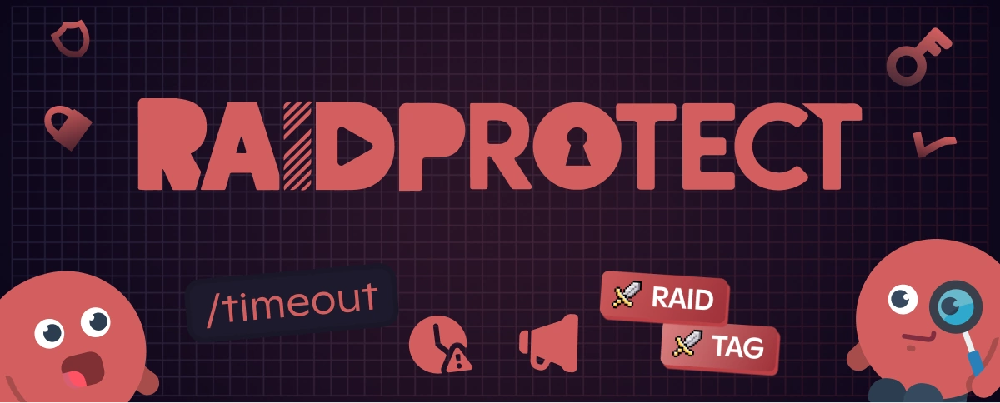

Vous cherchez comment attribuer un **rôle de tag Discord** automatiquement à vos membres ? Vous souhaitez donner un rôle quand un membre porte le **tag de votre serveur Discord** ? Bonne nouvelle : RaidProtect 3.1.1 introduit la fonctionnalité **Rôle de tag**.

<!--truncate-->

## 🎉 Nouveau : Un Rôle de Tag Discord automatique {#new}

Grâce à cette mise à jour, vous pouvez désormais **attribuer un rôle dès qu’un membre ajoute le tag du serveur** à son profil Discord. Et si ce tag est retiré, le rôle est automatiquement enlevé. Pratique, efficace, et 100 % automatisé.

Cette fonctionnalité permet notamment de :
- **Récompenser** les membres qui représentent activement votre communauté.
- **Renforcer la cohésion** et la reconnaissance interne sur le serveur.
- **Identifier facilement** vos ambassadeurs et membres engagés.

💡 **Fonctionnement :**  
Dès qu’un utilisateur ajoute le **tag de guild** à son profil, le bot RaidProtect lui attribue automatiquement le rôle défini dans votre configuration. Et inversement, si le tag est retiré, le rôle l’est aussi.  
➡️ Plus de détails dans [notre documentation](/features/tag-role).

---

## 🛠️ Nouveautés complémentaires de la version 3.1.1 {#changelog}

En plus du **rôle Discord guild tag**, cette version introduit d’autres améliorations importantes :

- **Nouvelle commande de modération [`/timeout`](/features/moderation#timeout)**  
  Permet d'exclure un membre sans avoir à le bannir, pour mieux gérer les comportements inappropriés temporaires. La commande vous permet de choisir une durée plus précise et plus longue (28 jours maximum) que ce que permet Discord par défaut.

- **Suivi automatique des mises à jour**  
  Recevez directement les alertes dans votre salon de logs (maj, incidents, correctifs). Plus de réactivité, plus de clarté.

- **Optimisations et corrections diverses**  
  De nombreuses améliorations internes ont été apportées pour garantir performance et stabilité.  
  ➕ Consultez le [changelog complet](/changelog#3-1-1) pour tous les détails.

---

## ❓ FAQ : Rôle automatique lié aux tags Discord {#faq}

### Quel bot peut automatiser les rôles selon les tags Discord ? {#which-bot}

Avec RaidProtect, il vous suffit de configurer un **rôle basé sur le tag Discord**. Dès qu’un membre ajoute le tag à son profil Discord, le rôle lui est automatiquement attribué. Si le tag est retiré, le rôle disparaît aussi.

### Comment ajouter un rôle avec un tag Discord ? {#how-to}

1. Installez RaidProtect sur votre serveur.
2. Rendez-vous dans la configuration des rôles liés aux tags.
3. Définissez le rôle à attribuer lorsqu’un utilisateur porte le tag guild.
4. Enregistrez les modifications.

La gestion est ensuite entièrement automatique.

:::tip 📚 Ressources utiles
- 🔗 [Ajouter RaidProtect à votre serveur](https://raidprotect.bot/invite)
- 📘 [Consulter la documentation complète](https://docs.raidprotect.bot/)
- 💡 [Soumettre une suggestion ou un retour](https://suggestions.raidprotect.bot/)
- 📣 [Suivre les annonces et rejoindre la communauté](https://raidprotect.bot/discord)
:::