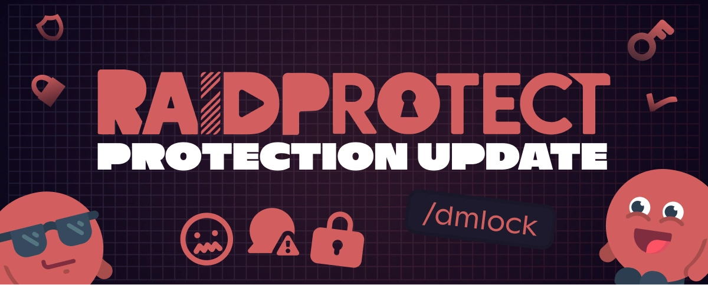

La version 3.2.0 marque une étape majeure pour la sécurité de votre communauté Discord avec l’introduction de la Fermeture des MP – un bouclier inédit contre le spam, le scam et les arnaques par message privé.

<!--truncate-->

## 🛡️ Fini le scam par message privé ! {#new}

Protégez vos membres en bloquant automatiquement la réception de messages privés avec la [Fermeture des MP](/features/dm-lock). Cas d’usage typiques :

- Les vagues de spams automatisés lors d’événements (lancements, concours, périodes de forte affluence).
- Les tentatives de scam ciblant les membres, en particulier sur les serveurs publics à fort trafic.
- Les comportements inappropriés envers les mineurs ou les communautés sensibles.
- Les attaques coordonnées pendant des événements importants (raids, campagnes de phishing).

Tout cela de façon automatisée, sans risque d’oubli manuel, assurant une protection continue pour votre serveur.

---

## ✨ Autres nouveautés de la 3.2.0 {#changelog}

- **Choix des [sanctions anti-spam](/features/anti-spam#triggers)** : Définissez précisément comment RaidProtect réagit face aux différents types de spams (kick, ban...), pour une modération parfaitement adaptée à votre communauté.
- **Nouvelles [logs d’anti-spam](/features/anti-spam#logs)** : Plus de visibilité sur ce qui est détecté et quand, pour garder le contrôle en un coup d’œil.
- **[Âge minimum](/features/raid-mode#minage) du compte sans captcha** : Filtrez directement les nouveaux membres trop récents, même si le captcha n’est pas activé.
- **Commande [`/bypass minage`](/features/raid-mode#bypass-minage)** : Admettez manuellement un membre qui n’a pas l’âge de compte requis, pratique pour les cas exceptionnels.
- **Refonte complète de [`/userinfo`](/features/utilities#userinfo)** : Interface améliorée, informations complètes et plus claires.
- **Logs de configuration** : Traçabilité accrue à chaque changement majeur sur la configuration du bot.

---

Pour la liste exhaustive des nouveautés, correctifs et détails techniques, consultez le [changelog officiel](/changelog#3-2-0).

:::tip 📚 Ressources utiles
- 🔗 [Ajouter RaidProtect à votre serveur](https://raidprotect.bot/invite)
- 📘 [Consulter la documentation complète](https://docs.raidprotect.bot/)
- 💡 [Soumettre une suggestion ou un retour](https://suggestions.raidprotect.bot/)
- 📣 [Suivre les annonces et rejoindre la communauté](https://raidprotect.bot/discord)
:::