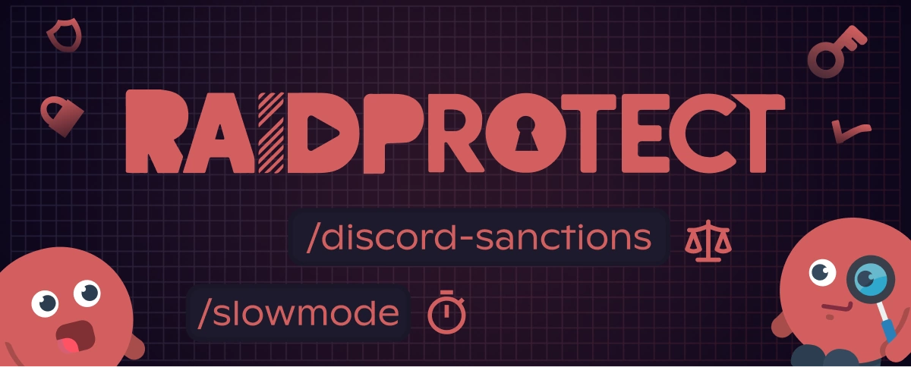

La version **3.2.1** de RaidProtect met l’accent sur la **modération au quotidien** avec de nouvelles commandes utiles et un anti-spam encore plus robuste.

<!--truncate-->

## ⚖️ Visualiser les sanctions émises par Discord {#new}

Grande nouveauté de cette mise à jour : la [commande `/ds`](/docs/features/utilities#discord-sanctions). Elle vous permet de consulter directement les **sanctions officielles émises par Discord** à l’encontre d’un utilisateur.

### 📋 Ce que vous pouvez voir

- **Type de sanction** : contenu supprimé, compte restreint, suspendu ou supprimé.  
- **Date d’émission** et **type de contenu** concerné.  
- **Flags associés** : par exemple, contenu illégal ou détection automatisée. 

---

## 🛡️ Un anti-spam encore plus intelligent {#antispam}

L’anti-spam bénéficie de deux évolutions majeures :

- Blocage du **spam de Commandes Slash**, souvent utilisé pour perturber les salons.
- Nouveau déclencheur dédié : le [**spam de commandes externes**](/docs/features/anti-spam#triggers).

Ces ajouts permettent d’anticiper de nouvelles formes d’abus et d’assurer une expérience plus fluide à vos membres.

---

## ⚙️ Plus d’outils pour vos modérateurs {#changelog}

Cette mise à jour introduit plusieurs commandes très attendues pour simplifier la vie de vos équipes de modération :

- **[`/slowmode`](/docs/features/moderation#slowmode)** : activez ou modifiez plus précisément le mode lent d’un salon en un seul geste.
- **[`/unban`](/docs/features/moderation#unban)** : débannir un utilisateur plus rapidement, en précisant une raison.
- **[`/bypass captcha`](/docs/features/captcha#bypass)** : permet d’autoriser manuellement un utilisateur légitime qui échoue au captcha.

De plus, les commandes [`/lock`](/docs/features/channel-lock#lock) et [`/unlock`](/docs/features/channel-lock#unlock) peuvent désormais inclure une **raison**, améliorant la clarté et le suivi des actions de modération.

---

Pour consulter la liste complète et détaillée, rendez-vous sur [le changelog](/docs/changelog#3-2-1).

:::tip 📚 Ressources utiles
- 🔗 [Ajouter RaidProtect à votre serveur](https://raidprotect.bot/invite)
- 📘 [Consulter la documentation complète](https://docs.raidprotect.bot/)
- 💡 [Soumettre une suggestion ou un retour](https://suggestions.raidprotect.bot/)
- 📣 [Suivre les annonces et rejoindre la communauté](https://raidprotect.bot/discord)
:::