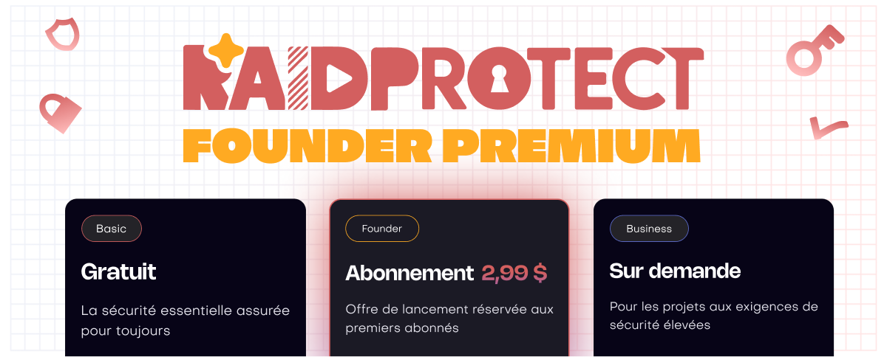

RaidProtect est gratuit depuis le premier jour — et le restera. Aujourd'hui, nous lançons le **Premium RaidProtect** : des capacités étendues pour les serveurs qui en ont besoin, et un moyen concret de faire avancer le projet.

<!--truncate-->

## ❓ Pourquoi un Premium ? {#why}

RaidProtect est développé et maintenu par une entreprise dont les revenus viennent d'autres projets. Depuis le début, c'est elle qui finance l'intégralité du bot : serveurs, bande passante, développement, maintenance. Concrètement, ce sont les revenus générés par d'autres clients, sur d'autres prestations, qui paient le service que vous utilisez gratuitement.

On a fait ce choix parce qu'on croit au projet. Mais un bot financé par un budget qui ne dépend pas de lui, c'est un bot dont le développement avance quand ce budget le permet. L'objectif du Premium est de changer ça : rendre RaidProtect autonome. Un projet qui s'autofinance, c'est un projet qui peut accélérer son développement, renforcer sa stabilité et évoluer sans dépendre de personne.

Ce que ça ne change pas : **la version gratuite reste complète** et continuera d'évoluer au même rythme. Le Premium s'adresse aux serveurs qui ont besoin de plus : limites étendues, personnalisation avancée, accès anticipé et à ceux qui veulent soutenir activement le projet.

---

## 🚀 L'offre Founder {#founder}

Le Premium se lance avec une **offre Founder**, réservée aux premiers abonnés. Le principe : **votre tarif est bloqué à vie**.

À terme, de nouvelles formules seront introduites et l'offre Founder sera retirée de la boutique. Une fois fermée, plus personne ne pourra y accéder.

Les abonnés Founder conservent leur tarif et continuent de bénéficier des évolutions du service. Vous pariez sur RaidProtect dès le début, on s'en souvient. Si une fonctionnalité future s'avère particulièrement coûteuse en ressources, elle pourrait ne pas être incluse — mais les avantages actuels et les ajouts raisonnables à venir restent acquis.

:::tip Activer le Premium
Utilisez `/settings` sur votre serveur Discord et cliquez sur "Premium" ou rendez-vous directement sur la [boutique de RaidProtect dans Discord](https://discord.com/discovery/applications/466578580449525760/store) pour découvrir l'offre.
:::

---

## ✨ Ce que le Premium offre aujourd'hui {#features}

### 🏷️ [Noms de sanctions personnalisables](/features/sanctions#custom-names)

Renommez chaque type de sanction pour correspondre au vocabulaire de votre serveur. Le nom affiché, le verbe utilisé dans les messages et la formulation du message privé envoyé au membre sanctionné sont tous configurables librement.

### 🔐 [Authentication Manager : limites étendues](/features/authentication-manager)

En version gratuite, l'Authentication Manager est limité à 3 rôles protégés, 20 utilisateurs et des sessions de 8 heures maximum. Le Premium repousse ces plafonds :

| | Gratuit | Premium |
| --- | --- | --- |
| Rôles protégés | 3 | 10 |
| Utilisateurs | 20 | 50 |
| Durée de session max. | 8h | 24h |

### 📋 [Panneaux d'informatio : limites étendues](/features/display)

Passez de 2 à 4 panneaux d'information publics (+ le slot réservé au Jail), pour couvrir davantage de contenu sur votre serveur.

### 🔬 Accès Bêta Publique

Accédez en avant-première à certaines fonctionnalités expérimentales avant leur sortie officielle.

---

Pour la liste complète des nouveautés, consultez [le changelog](/changelog).

:::tip Ressources utiles
- [Ajouter RaidProtect à votre serveur](https://raidprotect.bot/invite)
- [Consulter la documentation complète](https://docs.raidprotect.bot/)
- [Soumettre une suggestion ou un retour](https://suggestions.raidprotect.bot/)
- [Suivre les annonces et rejoindre la communauté](https://raidprotect.bot/discord)
:::