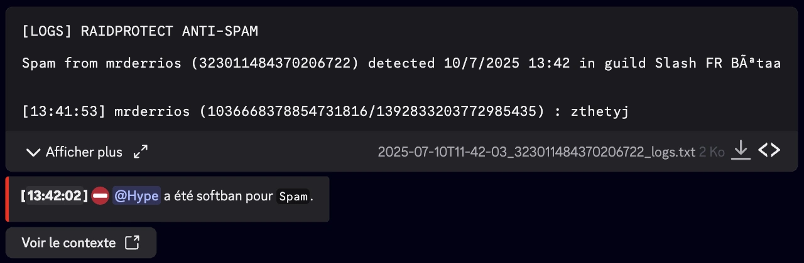
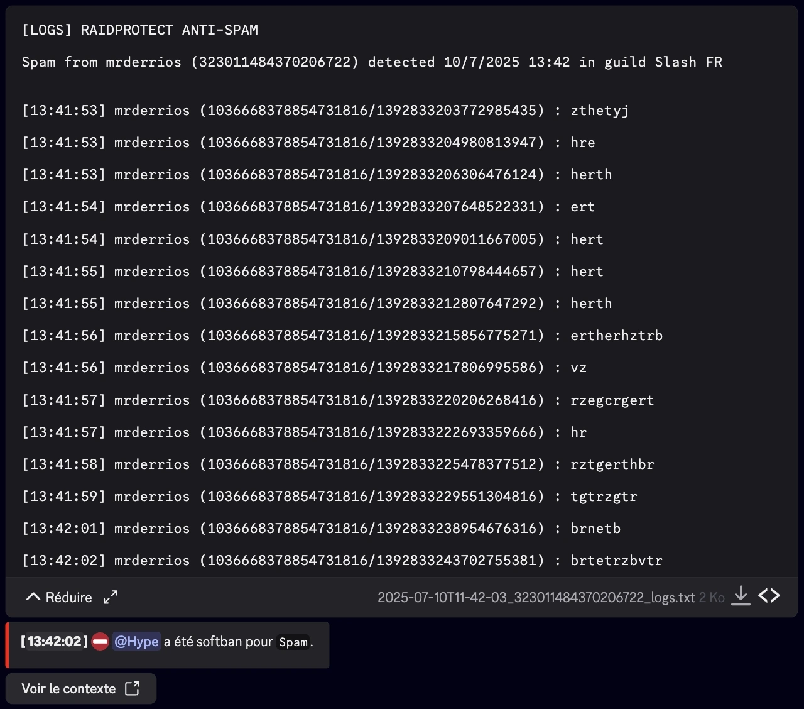

import { AntiSpamSettingsMockup, AntiSpamSanctionsSettingsMockup } from '@site/src/components/DiscordMessage/mockups/settings-menus';

import AntiSpamMockup from '@site/src/components/DiscordMessage/mockups/anti-spam';

<AntiSpamMockup />

import SeparatedBox from '@site/src/components/SeparatedBox';
import Tabs from '@theme/Tabs';
import TabItem from '@theme/TabItem';

L'anti-spam de RaidProtect détecte et sanctionne automatiquement le spam sur votre serveur Discord : messages répétés, mentions massives, flood et envois massifs de liens, sans qu'un modérateur ait à intervenir. Grâce à sa détection automatique, il s'occupe des problèmes tout seul.

## ❓ Comment fonctionne l'anti-spam ? {#working}

L'anti-spam de RaidProtect détecte et bloque automatiquement les comportements suspects. Il différencie deux types de spams.
- **Spam lourd :** Messages contenant des liens d'invitation, des mentions massives ou des images. Ces spams sont souvent utilisés lors de raids.
- **Spam léger :** Messages envoyés fréquemment mais moins intrusifs.

L'anti-spam de RaidProtect agit de deux manières.
- **Sanctions :** Expulsion ou bannissement automatique des spammeurs.
- **Notifications :** Envoi de messages dans le salon de logs pour signaler les spams bloqués avec un aperçu des actions détectées.

## 🛡️ Configuration de l’anti-spam {#config}

L’anti-spam s’active ou se désactive d’un simple interrupteur. Une fois activé, il surveille tout le serveur (hors salons, rôles et membres ignorés) et applique, pour chaque type de spam, la sanction que vous avez définie.

<AntiSpamSettingsMockup />

### Activer ou désactiver l’anti-spam {#toggle}

1. Faites la [commande `/settings`](../setup.md#settings).
2. Cliquez sur le bouton “**Anti-spam**”.
3. Activez ou désactivez l’anti-spam. Toute la finesse se règle ensuite par déclencheur, dans l’onglet “**Sanctions**”.

### Gérer les rôles, utilisateurs et salons ignorés {#ignore}

Vous pouvez exclure certains salons, rôles ou même utilisateurs de la surveillance anti-spam pour plus de flexibilité. 😉
1. Faites la [commande `/settings`](../setup.md#settings).
2. Cliquez sur le bouton “**Anti-spam**”.
3. Sélectionnez les différentes options à ignorer dans les différents sélecteurs :
- Salon(s) à ignorer
- Rôle(s) à ignorer
- Membre(s) à ignorer

:::info
Les salons contenant “**spam**” dans leur nom sont automatiquement ignorés. Les personnes ayant la permission administrateur sont ignorées totalement. 
:::

### Configurer les sanctions par déclencheur {#triggers}

Vous pouvez personnaliser les sanctions appliquées selon le type de spam détecté. Cela permet une réponse adaptée à la gravité de l’infraction.

1. Faites la [commande `/settings`](../setup.md#settings).
2. Cliquez sur le bouton “**Anti-spam**”.
3. Allez dans l’onglet “**Sanctions**”.
4. Pour chaque déclencheur, sélectionnez une sanction spécifique. Vous pouvez modifier ces valeurs à l’aide des menus déroulants :
- **Sélectionner un trigger** : choisissez le type de spam à configurer.
- **Sélectionner une sanction** : choisissez la sanction correspondante.

#### Types de sanctions et déclencheurs {#sanctions}

Voici les différentes **sanctions disponibles** :

- **Warn** : Envoie un avertissement au membre.
- **Timeout** : Rend le membre muet pendant une durée définie.
- **Mute** : Donne le [rôle Mute](./sanctions.mdx#mute) configuré sur votre serveur.
- **Jail** : Donne le [rôle Jail](./sanctions.mdx#jail) configuré sur votre serveur.
- **Kick** : Expulse le membre du serveur.
- **Softban** : Bannit puis débannit immédiatement le membre, supprimant ainsi ses messages.
- **Ban** : Bannit définitivement le membre.
- **Désactiver** : Coupe complètement le déclencheur, aucune sanction ne sera appliquée.

:::note
Pour les déclencheurs "Spam de duplicatas ou spam importants" et "Spam multisalon", la sanction la plus douce sélectionnable est le **Timeout** (pas de Warn) : il s'agit de spam sérieux qui justifie une réponse ferme.
:::

Et les **déclencheurs (triggers)** que RaidProtect peut détecter, avec la sanction appliquée par défaut :

| Déclencheur (Trigger)                  | Description                                              | Sanction par défaut |
|----------------------------------------|----------------------------------------------------------|---------------------|
| Spam                                   | Envoi répété de messages                                 | Warn                |
| Spam avec selfbot                      | Utilisation de selfbots pour spammer                     | Softban             |
| Spam de mentions                       | Mentions massives répétées                               | Softban             |
| Spam de liens                          | Envoi massif de liens                                    | Ban                 |
| Spam de commandes externes             | Utilisation de commandes externes pour spammer           | Ban                 |
| Spam d'attachements                    | Envoi massif de fichiers ou d'images                     | Désactivé           |
| Spam de duplicatas ou spam importants  | Messages copiés-collés ou spams excessifs                | Softban             |
| Images d'arnaques (Crypto Scam)        | Images d'arnaque détectées par [ScamLens](./scam-images.md) | Timeout             |
| Spam multisalon                        | Spam réparti sur plusieurs salons                        | Jail                |

:::info
Le déclencheur **Spam multisalon** est particulier : sa sanction remplace celle du déclencheur d'origine lorsque le spam touche plusieurs salons, uniquement si elle est plus sévère.
:::

<AntiSpamSanctionsSettingsMockup />

:::info Premium : modération discrète
Par défaut, chaque sanction de l'anti-spam est annoncée par un **message public** dans le salon. Les serveurs **Premium** peuvent masquer ce message pour une modération plus discrète.
:::

#### Durée des sanctions {#duration}

Lorsque les sanctions appliquées par l'anti-spam supportent une durée (mute, timeout, jail), vous pouvez définir une **durée unique** appliquée à toutes ces sanctions (1 heure par défaut).

1. Faites la [commande `/settings`](../setup.md#settings).
2. Cliquez sur le bouton "**Anti-spam**".
3. Allez dans l'onglet "**Sanctions**".
4. Sélectionnez une durée prédéfinie dans le sélecteur "**Durée des sanctions**", ou cliquez sur "**Durée personnalisée**" pour saisir la valeur de votre choix (par ex. `30m`, `2h`, `7d`).

:::info
La durée est ignorée pour les sanctions qui n'en supportent pas (kick, softban, ban, warn).
:::

## 📑 Logs de l’anti-spam {#logs}

Des logs détaillés sont générés avec ensemble des messages supprimés par l'anti-spam. Vous pouvez simplement télécharger ou déplier le contenu.

<SeparatedBox>
<Tabs>
  <TabItem value="animator" label="Réduit" default>

  </TabItem>
  <TabItem value="moderator" label="Dépliés">

  </TabItem>
</Tabs>
</SeparatedBox>

## Questions fréquentes {#faq}

### L'anti-spam fonctionne-t-il sans configuration ?

Oui. Il détecte et bloque automatiquement les comportements de spam dès l'installation. Vous pouvez ensuite personnaliser la sanction de chaque type de spam selon vos besoins.

### L’anti-spam a-t-il des niveaux de sécurité (haut, moyen, bas) ?

Non. L’anti-spam s’active ou se désactive simplement. La finesse se règle par déclencheur : chaque type de spam a sa propre sanction, que vous pouvez ajuster ou désactiver complètement.

### Peut-on exclure certains salons ou membres de l'anti-spam ?

Oui, vous pouvez ignorer des salons, des rôles ou des membres précis. Les salons dont le nom contient « spam » sont ignorés automatiquement, et les membres ayant la permission administrateur sont toujours ignorés.

### Peut-on choisir la sanction appliquée au spam ?

Oui. Chaque type de spam (déclencheur) peut recevoir sa propre sanction, du simple Warn au Ban, en passant par Timeout, Mute, Jail, Kick ou Softban. Vous pouvez aussi désactiver complètement un déclencheur.