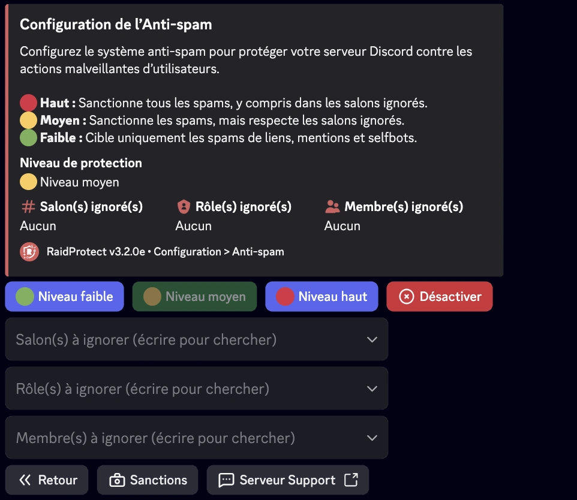
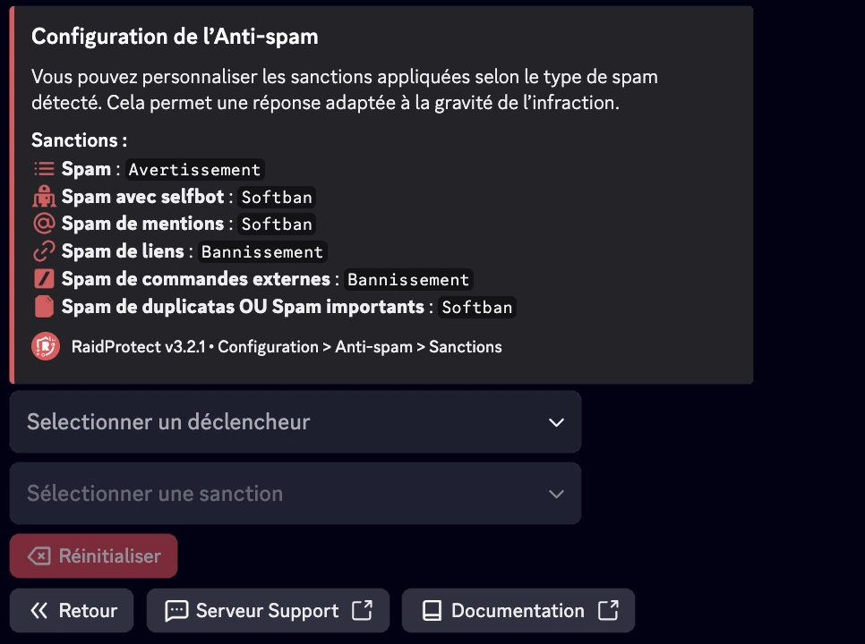
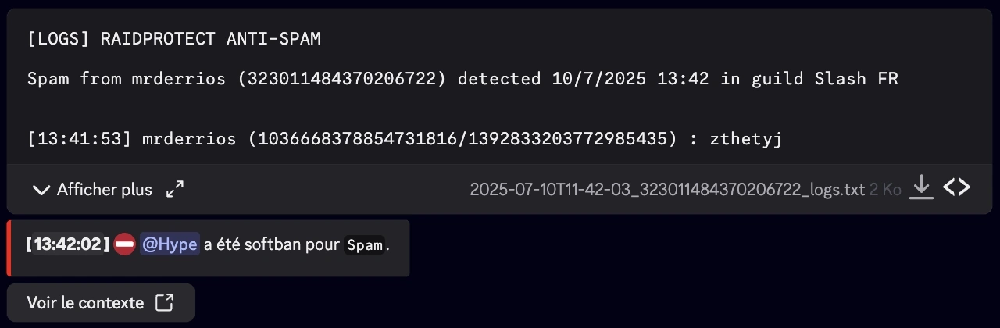
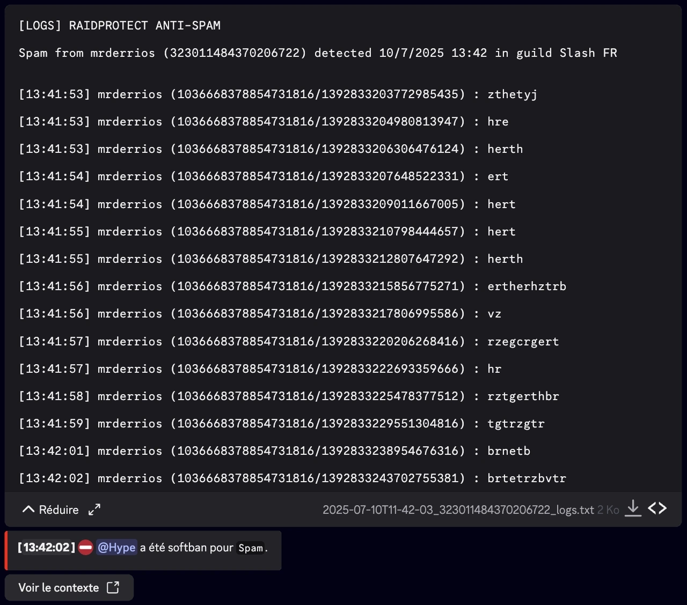

import SeparatedBox from '@site/src/components/SeparatedBox';
import Tabs from '@theme/Tabs';
import TabItem from '@theme/TabItem';

L’Anti-spam de RaidProtect est un outil performant pour empêcher les spams sur votre serveur Discord. Grâce à son système de détection automatique, il s’occupe des problèmes tout seul, sans que vous ayez à intervenir.

## ❓ Fonctionnement de l’anti-spam {#working}

L'anti-spam de RaidProtect détecte et bloque automatiquement les comportements suspects. Il différencie deux types de spams.
- **Spam lourd :** Messages contenant des liens d'invitation, des mentions massives ou des images. Ces spams sont souvent utilisés lors de raids.
- **Spam léger :** Messages envoyés fréquemment mais moins intrusifs.

L'anti-spam de RaidProtect agit de deux manières.
- **Sanctions :** Expulsion ou bannissement automatique des spammeurs.
- **Notifications :** Envoi de messages dans le salon de logs pour signaler les spams bloqués avec un aperçu des actions détectées.

## 🛡️ Configuration de l’anti-spam {#config}

RaidProtect offre trois niveaux de sécurité pour répondre aux besoins de votre serveur.
- 🔴 **Haut :** Sanctionne tous les spams et même le spam lourd dans les salons ignorés.
- 🟠 **Moyen :** Sanctionne tous les spams, mais respecte les salons ignorés.
- 🟢 **Faible :** Sanctionne uniquement les spams lourd.

### Changer le niveau de sécurité {#level}

1. Faites la [commande `/settings`](../setup.md#settings).
2. Cliquez sur le bouton “**Anti-spam**”.
3. Sélectionnez le niveau de l’anti-spam souhaité dans le premier sélecteur.

### Gérer les rôles, utilisateurs et salons ignorés {#ignore}

Vous pouvez exclure certains salons, rôles ou même utilisateurs de la surveillance anti-spam pour plus de flexibilité. 😉
1. Faites la [commande `/settings`](../setup.md#settings).
2. Cliquez sur le bouton “**Anti-spam**”.
3. Sélectionnez les différentes options à ignorer dans les différents sélecteurs :
- Salon(s) à ignorer
- Rôle(s) à ignorer
- Membre(s) à ignorer

:::info
Les salons contenant “**spam**” dans leur nom sont automatiquement ignorés. Les personnes ayant la permission administrateur sont ignorées totalement. 
:::

### Configurer les sanctions par déclencheur {#triggers}

Vous pouvez personnaliser les sanctions appliquées selon le type de spam détecté. Cela permet une réponse adaptée à la gravité de l’infraction.

1. Faites la [commande `/settings`](../setup.md#settings).
2. Cliquez sur le bouton “**Anti-spam**”.
3. Allez dans l’onglet “**Sanctions**”.
4. Pour chaque déclencheur, sélectionnez une sanction spécifique. Vous pouvez modifier ces valeurs à l’aide des menus déroulants :
- **Sélectionner un trigger** : choisissez le type de spam à configurer.
- **Sélectionner une sanction** : choisissez la sanction correspondante.

#### Types de sanctions et déclencheurs {#sanctions}

Voici les différentes **sanctions disponibles** ainsi que les **déclencheurs (triggers)** que RaidProtect peut détecter, avec le **temps de timeout par défaut** si applicable :

- **Warn** : Envoie un avertissement au membre.
- **Kick** : Expulse le membre du serveur.
- **Timeout** : Rend le membre muet pendant une durée définie.
- **Softban** : Bannit puis débannit immédiatement le membre, supprimant ainsi ses messages.
- **Ban** : Bannit définitivement le membre.

| Déclencheur (Trigger)                  | Description                                             | Durée du Timeout   |
|----------------------------------------|---------------------------------------------------------|--------------------|
| Spam                                   | Envoi répété de messages                                | 1 minute           |
| Spam avec selfbot                      | Utilisation de selfbots pour spammer                    | 1 heure            |
| Spam de mentions                       | Mentions massives répétées                              | 30 minutes         |
| Spam de liens                          | Envoi massif de liens                                   | 24 heures          |
| Spam de duplicatas ou spam importants  | Messages copiés-collés ou spams excessifs               | 24 heures          |

## 📑 Logs de l’anti-spam {#logs}

Des logs détaillés sont générés avec ensemble des messages supprimés par l'anti-spam. Vous pouvez simplement télécharger ou déplier le contenu.

<SeparatedBox>
<Tabs>
  <TabItem value="animator" label="Réduit" default>

  </TabItem>
  <TabItem value="moderator" label="Dépliés">

  </TabItem>
</Tabs>
</SeparatedBox>