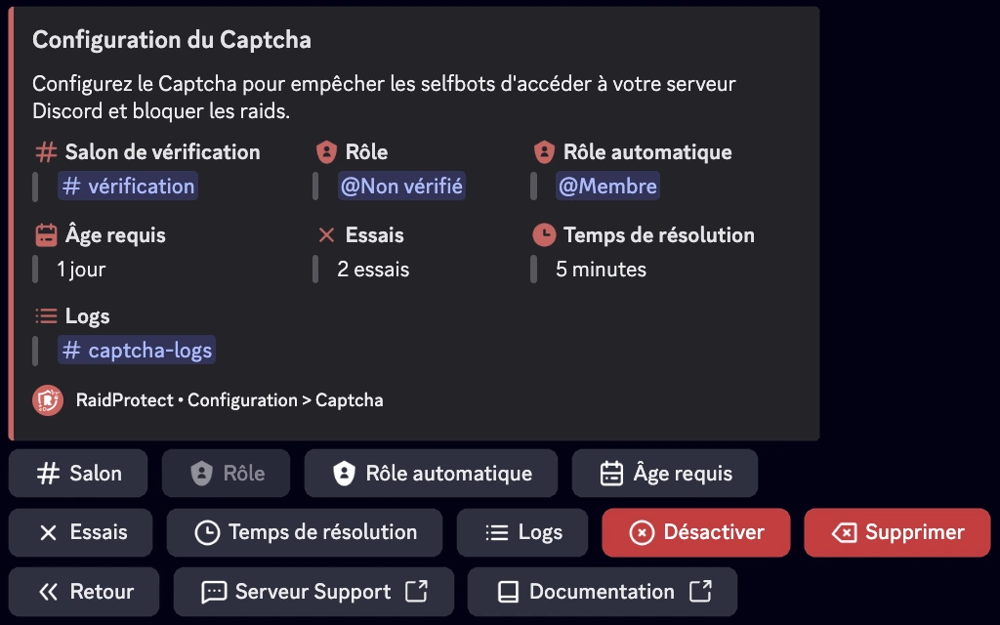

Empêchez les selfbots d'accéder à votre serveur Discord et bloquez les raids grâce au système de captcha de RaidProtect.

Le captcha est l’une des fonctionnalités les plus populaires de RaidProtect, bien qu’il reste entièrement optionnel. Il permet de demander à chaque nouvel utilisateur de relever un défi consistant à saisir un code, afin de vérifier qu’il ne s’agit pas d’un robot (selfbot).

## ❓ Fonctionnement du captcha {#working}

Le captcha repose sur un rôle **@Non vérifié** et un salon nommé **#vérification**. Lorsqu'un utilisateur rejoint votre serveur :
- Le bot attribue automatiquement le rôle **@Non vérifié** à cet utilisateur, limitant son accès uniquement au salon **#vérification**.
- Dans ce salon, une image contenant 6 lettres majuscules est envoyée par le bot. L'utilisateur doit retranscrire les lettres dans le salon pour prouver qu'il est humain.
- Si la réponse est correcte, le rôle **@Non vérifié** est retiré et l'utilisateur accède normalement au serveur. Dans le cas contraire, il est automatiquement expulsé.
- Lorsque le captcha est activé, RaidProtect publie automatiquement un message dans le salon de logs, indiquant la date de création du compte de chaque nouvel utilisateur.
- RaidProtect détecte automatiquement les problèmes de permissions (salon et rôle) ainsi que la visibilité par défaut du salon lors du processus d'accueil Discord.

:::info
**Délai et essais :** Les utilisateurs disposent de **1 à 10 minutes** pour compléter le captcha (**5 minutes par défaut**) et de **1 à 3 essais** (**2 essais par défaut**). Au-delà, ils sont automatiquement expulsés du serveur.
:::
:::warning
**Gestion des permissions :** Les permissions du rôle **@Non vérifié** sont configurées automatiquement par RaidProtect. Vous pouvez renommer le rôle et le salon, mais ne les supprimez pas.
:::

## 🚪 Configuration du captcha {#config}

La mise en place du captcha est simple et rapide.

1. Faites la [commande `/settings`](../setup.md#settings).
2. Cliquez sur le bouton “**Captcha**”.
3. Choisissez le salon dans lequel les captchas seront réalisés ou utilisez le bouton “**En créer un pour moi**”.
4. Le rôle **@Non vérifié** est automatiquement créé et configuré.
5. Configurez le nombre d’essais autorisés (entre 1 et 3) ainsi que le temps de résolution maximal (entre 1 et 10 minutes).

## ✨ Fonctionnalités supplémentaires {#additional-features}

Pour s’adapter aux besoins de votre serveur, le captcha de RaidProtect propose des options personnalisables.

### Logs séparés {#logs}

Si votre serveur est populaire, les logs liés au captcha peuvent encombrer votre salon de logs principal. Vous pouvez les déplacer dans un autre salon.

1. Faites la [commande `/settings`](../setup.md#settings).
2. Cliquez sur le bouton “**Logs**”.
3. Sélectionnez “**Captcha**”.
4. Choisissez le salon dans lequel les logs du captcha seront indexées ou utilisez le bouton “**En créer un pour moi**”.

### Rôle automatique {#autorole}

Si vous utilisez un système de rôle automatique (autorole) autre que RaidProtect, cela peut interférer avec le captcha. Remplacez votre autorole existant par celui de RaidProtect.

1. Faites la [commande `/settings`](../setup.md#settings).
2. Cliquez sur le bouton “**Captcha**”.
3. Sélectionnez “**Rôle automatique**”.
4. Choisissez le rôle qui sera donné aux membres ayant validé le captcha.

### Âge de compte minimum {#minage}

Pour renforcer la sécurité, vous pouvez exiger un âge minimum pour les comptes Discord des nouveaux membres.

1. Faites la [commande `/settings`](../setup.md#settings).
2. Cliquez sur le bouton “**Captcha**”.
3. Appuyez sur le bouton “**Âge minimum**”.
4. Sélectionnez la valeur souhaitée dans le menu de sélection ou choisissez une valeur personnalisée exprimée en format date (m/h/d/y).