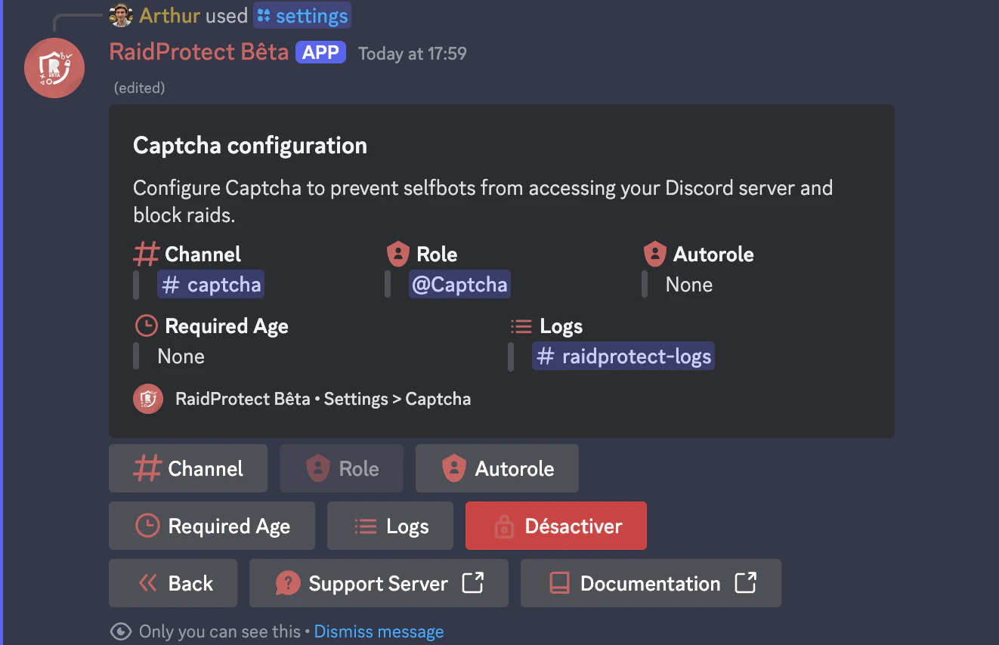

Empêchez les selfbots d'accéder à votre serveur Discord et bloquez les raids grâce au système de captcha de RaidProtect.

Le captcha est une des fonctionnalités les plus populaires de RaidProtect, bien qu'elle reste totalement optionnelle. Il permet de demander à chaque nouvel utilisateur de compléter un challenge sous forme de code à écrire, afin de vérifier qu'il ne s'agit pas d'un robot (selfbot).

## ❓ Fonctionnement du captcha {#working}

Le captcha repose sur un rôle "**@Non vérifié**" et un salon nommé **#verification**. Lorsqu'un utilisateur rejoint votre serveur :
Le bot attribue automatiquement le rôle **@Non vérifié** à cet utilisateur, limitant son accès uniquement au salon **#verification**.
Dans ce salon, une image contenant 6 lettres est envoyée par le bot. L'utilisateur doit retranscrire les lettres dans le salon pour prouver qu'il est humain. Une erreur d'une lettre est tolérée.
Si la réponse est correcte, le rôle "**@Non vérifié**" est retiré et l'utilisateur accède normalement au serveur.

:::note
**Délai :** Les utilisateurs disposent de **5 minutes** pour compléter le captcha. Passé ce délai, ils sont automatiquement expulsés.
**Gestion des permissions :** Les permissions du rôle **@Non vérifié** sont configurées automatiquement par RaidProtect. Vous pouvez renommer le rôle et le salon, mais ne les supprimez pas.
:::

### 📍 Suivi des nouveaux utilisateurs

Lorsque le captcha est activé, RaidProtect publie automatiquement un message dans le salon de logs, indiquant la date de création du compte de chaque nouvel utilisateur.

## ⛽ Mise en place du captcha {#setup}

La mise en place du captcha est simple et rapide ! Voici comment faire :
1. Faites la commande `/settings`
2. Cliquez sur le bouton “**Captcha**”.
3. Sélectionnez les différentes options à ignorer dans les différents sélecteurs 
4. Le rôle et le salon nécessaires sont automatiquement créés et configurés.

## ✨ Fonctionnalités supplémentaires {#additional-features}

Pour s’adapter aux besoins de votre serveur, le captcha de RaidProtect propose des options personnalisables.

### Logs séparés {#logs}

Si votre serveur est populaire, les logs liés au captcha peuvent encombrer votre salon de logs principal. Vous pouvez les déplacer dans un autre salon :
1. Faites la commande /settings
2. Cliquez sur le bouton “**Logs**”.
3. Sélectionnez “**Captcha**”
4. Choisissez le salon dans lequel les logs du captcha seront indexées.
Bien entendu, si vous n’avez pas encore de salon dédié, vous pouvez cliquer sur “**En créer un pour moi**”

### Rôle automatique {#autorole}

Si vous utilisez un système de rôle automatique (autorole) autre que RaidProtect, cela peut interférer avec le captcha. Remplacez votre autorole existant par celui de RaidProtect.

1. Faites la commande `/settings`
2. Cliquez sur le bouton “**Captcha**”.
3. Sélectionnez “**Rôle automatique**”
4. Choisissez le rôle qui sera donné aux membres ayant validé le captcha

## Âge de compte minimum {#minage}

Pour renforcer la sécurité, vous pouvez exiger un âge minimum pour les comptes Discord des nouveaux membres.

### Définir un âge minimum :

1. Faites la commande `/settings`
2. Cliquez sur le bouton “**Captcha**”.
3. Appuyez sur le bouton “**Âge minimum**”
4. Sélectionnez la valeur souhaitée dans le menu de sélection ou choisissez une valeur personnalisée exprimée en format date (h/d/m/y)