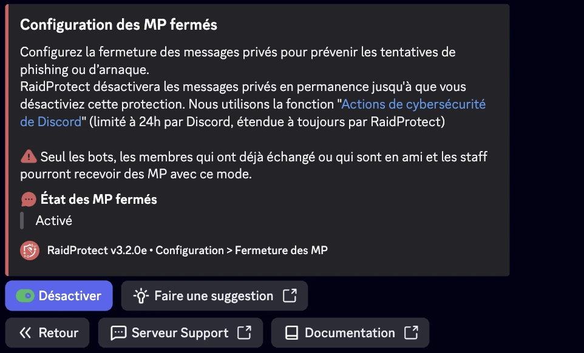

La fonctionnalité DM Lock de RaidProtect permet de fermer l’accès aux messages privés (DM) envoyés depuis le serveur de façon permanente, surpassant ainsi la limitation native de Discord qui ne permet ce blocage que pour 24 heures via l’interface.

## ❓ Fonctionnent du DM Lock {#working}

Le bot RaidProtect vérifie régulièrement l’état du paramètre de blocage des DM serveur et, si nécessaire, le réactive automatiquement afin d’éviter toute période de vulnérabilité entre deux renouvellements manuels. Cette tâche s’exécute de manière transparente pour les administrateurs et les membres du serveur.

## 🚦 Cas d’usage et recommandations {#recommendations}

- **Serveurs exposés au spam ou au harcèlement :** DM Lock est particulièrement recommandé pour les communautés publiques ou à forte audience, où les risques d’abus par DM sont accrus.
- **Événements temporaires ou périodes sensibles :** Lors de lancements, annonces importantes, ou périodes de forte affluence (ex. : concours, promotions), activer DM Lock permet de prévenir les tentatives de phishing ou d’arnaque.
- **Communautés avec un jeune public :** Pour les serveurs comptant un grand nombre de mineurs, limiter les DMs peut renforcer la sécurité et prévenir les comportements inappropriés.
- **Protection continue :** Grâce à l’automatisation, il n’y a pas de fenêtre de vulnérabilité liée à l’oubli du renouvellement manuel.

## 🚩 Configuration du DM Lock {#config}

:::warning
Les fonctions communautaires de Discord sont indispensables au bon fonctionnement du DM Lock. [Suivez notre guide pour vérifier l'activation de la communauté sur votre serveur.](../guides/community.md)
:::

1. Faites la [commande `/settings`](../setup.md#settings).
2. Cliquez sur le bouton “**DM Lock**”.
3. Activez ou désactivez la fermeture automatique des messages privés.

