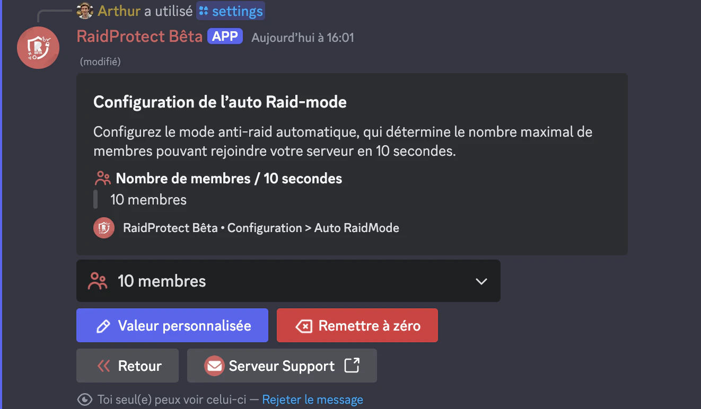

Le mode raid est une fonctionnalité d'urgence conçue pour bloquer instantanément tous les nouveaux utilisateurs tentant de rejoindre votre serveur. Il est radical mais efficace pour empêcher les raids massifs.

## ❓ Fonctionnement du mode raid {#working}

RaidProtect active automatiquement le mode raid si un grand nombre d’utilisateurs rejoint votre serveur en un court laps de temps. Par défaut, le mode raid s'active si plus de 10 utilisateurs rejoignent votre serveur en moins de 10 secondes. Lorsque le mode raid est activé, aucun utilisateur ne peut rejoindre le serveur. Ils sont bloqués au niveau de l’invitation.

### Activation {#activation}

- Pour activer manuellement ce mode, un utilisateur disposant des permissions d'expulsion doit exécuter la commande `/raidmode`.
- Un message sera automatiquement posté dans le salon de logs pour signaler l'activation.

### Désactivation {#deactivation}

Le mode raid ne se désactive pas automatiquement. Pensez à l’arrêter avec la même commande lorsque la menace est écartée. 😇

## 🚨 Configuration du mode raid automatique {#config}

Si votre serveur accueille souvent beaucoup de nouveaux membres simultanément, il est judicieux de modifier ce seuil pour éviter les faux-positifs.

:::note
Nous recommandons d’entrer une valeur comprise entre 10 et 20 membres en 10 secondes pour une bonne efficacité du système.
:::

1. Faites la [commande `/settings`](../setup.md#settings).
2. Cliquez sur le bouton “**Auto RaidMode**”.
3. Sélectionnez le nombre de membres pouvant rejoindre sous 10 secondes.

Vous pouvez laisser à la valeur par défaut (10) ou ajuster selon la valeur souhaitée en cliquant sur le bouton “**Valeur personnalisée**”.

:::warning
Si le mode raid s’active automatiquement, pensez à le désactiver une fois la menace passée. Rappelez-vous, il ne se désactive pas tout seul. 😖
:::

Avec le mode raid de RaidProtect, vous disposez d'un bouclier efficace contre les attaques massives sur votre serveur. 🌟