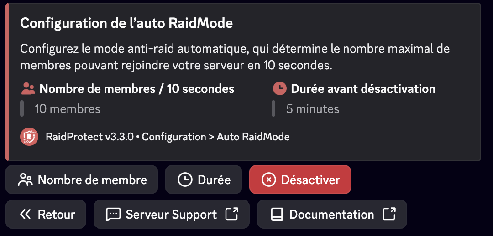

## Mode raid {#raid-mode}

Le mode raid est une fonctionnalité d'urgence conçue pour bloquer instantanément tous les nouveaux utilisateurs tentant de rejoindre votre serveur, avec une durée maximale de 24 heures. Pour bloquer définitivement les nouveaux membres, utilisez la [commande `/joinlock`](./join-lock.mdx).

### ❓ Fonctionnement du mode raid {#working}

RaidProtect active automatiquement le mode raid si un grand nombre d’utilisateurs rejoint votre serveur en un court laps de temps. Par défaut, le mode raid s'active si plus de 10 utilisateurs rejoignent votre serveur en moins de 10 secondes. Lorsque le mode raid est activé, aucun utilisateur ne peut rejoindre le serveur. Ils sont bloqués au niveau de l’invitation.

:::warning
Les fonctions communautaires de Discord sont indispensables au bon fonctionnement du Mode raid. [Suivez notre guide pour vérifier l'activation de la communauté sur votre serveur.](../guides/community.md)
:::

#### Activation {#enable}

- Pour activer manuellement ce mode, un utilisateur disposant des permissions d'expulsion doit exécuter la commande `/raidmode`.
- Un message sera automatiquement posté dans le salon de logs pour signaler l'activation.

#### Désactivation {#disable}

Le mode raid ne se désactive pas automatiquement. Pensez à l’arrêter avec la même commande lorsque la menace est écartée. 😇

:::info
La commande `raidmode` est [utilisable par préfixe](../guides/prefix.md).
:::

### 🚨 Configuration du mode raid automatique {#config}

Si votre serveur accueille souvent beaucoup de nouveaux membres simultanément, il est judicieux de modifier ce seuil pour éviter les faux-positifs.



#### Seuil de membres {#threshold}

1. Faites la [commande `/settings`](../setup.md#settings).
2. Cliquez sur le bouton “**Auto RaidMode**”.
3. Sélectionnez “**Nombre de membres**”.
4. Choisissez le nombre de membres pouvant rejoindre sous 10 secondes.

Vous pouvez laisser à la valeur par défaut (10) ou ajuster selon la valeur souhaitée en cliquant sur le bouton “**Valeur personnalisée**”.

:::note
Nous recommandons d’entrer une valeur comprise entre 10 et 20 membres en 10 secondes pour une bonne efficacité du système.
:::

#### Durée du raidmode {#duration}

1. Faites la [commande `/settings`](../setup.md#settings).
2. Cliquez sur le bouton “**Auto RaidMode**”.
3. Sélectionnez “**Durée**”.
4. Choisissez la durée du raidmode (24h maximum).

Vous pouvez laisser à la valeur par défaut (5 minutes) ou ajuster selon la valeur souhaitée en cliquant sur le bouton “**Valeur personnalisée**”.

#### Fermer les MP automatiquement {#close-dm}

Vous pouvez configurer l'**auto raid mode** pour qu'il **ferme automatiquement les MP du serveur** dès qu'il s'active. Cela ajoute une couche de protection supplémentaire pendant un raid : les nouveaux comptes ne peuvent plus contacter vos membres en privé pour les phisher ou les arnaquer.

1. Faites la [commande `/settings`](../setup.md#settings).
2. Cliquez sur le bouton “**Auto RaidMode**”.
3. Activez l'option “**Fermer les MP**”.

Lorsque l'auto raid mode se désactive (manuellement ou automatiquement après la durée configurée), les MP reprennent leur configuration précédente.

:::info
Cette option est complémentaire de la [Fermeture des MP permanente](./dm-lock.mdx) : si vous l'activez sans avoir la fermeture permanente, les MP ne sont fermés que pendant un raid actif.
:::

## Âge Minimum {#minage}

Pour renforcer la sécurité, vous pouvez exiger un âge minimum pour les comptes Discord des nouveaux membres.

1. Faites la [commande `/settings`](../setup.md#settings).
2. Cliquez sur le bouton “**Âge Minimum**”.
3. Sélectionnez la valeur souhaitée dans le menu de sélection ou choisissez une valeur personnalisée exprimée en format date (m/h/d/y).

### 🎂 Bypass de l'âge de compte minimum {#bypass-minage}

Utilisez la commande : ```/bypass minage [utilisateur]```

Remplacez `[utilisateur]` par l’identifiant souhaité, ce dernier disposera de 10 minutes pour rejoindre le serveur sans être expulsé par l'âge requis. Vous pouvez aussi utiliser la commande sans spécifier d'utilisateur pour connaître la liste actuelle des utilisateurs bypass.