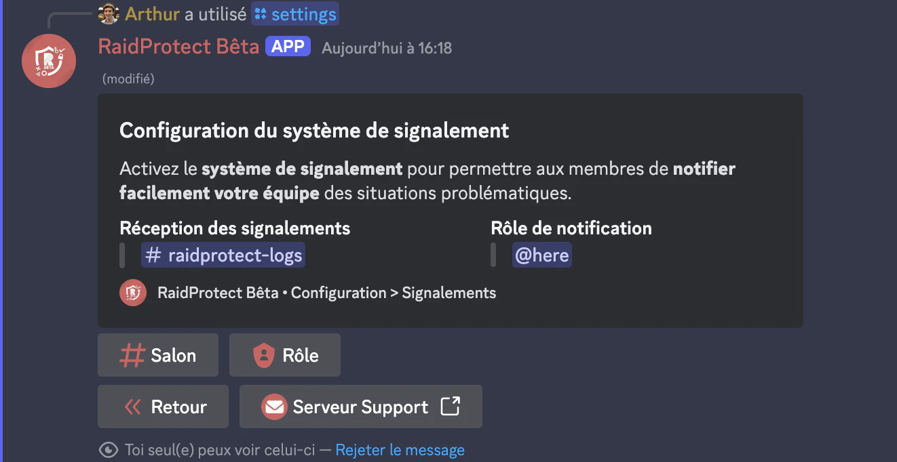

Le système de signalement de RaidProtect permet à votre communauté de signaler rapidement tout contenu problématique ou utilisateur suspect. Il fonctionne de deux manières différentes, et peut être configuré pour optimiser le processus de gestion des signalements.

## ❓ Fonctionnent des signalements {#working}
Les membres peuvent signaler un contenu via 3 méthodes principales.

1. **Clic droit sur un message** 
Un membre peut faire un clic droit sur un message qu’il estime enfreindre le règlement, sélectionner **`Applications`**, puis cliquer sur **`Signaler le message`**. Une fenêtre contextuelle s’ouvrira, permettant à l’utilisateur d’ajouter une explication.

2. **Clic droit sur un profil** 
De la même manière, un membre peut faire un clic droit sur un profil qu’il juge problématique, choisir **`Applications`**, puis cliquer sur **`Signaler le membre`**. Une fenêtre contextuelle s’ouvrira alors pour permettre à l’utilisateur de fournir des détails supplémentaires sur la situation.

3. **Commande Slash** 
Les membres peuvent également signaler un message ou un utilisateur via la commande **`/report`** dans n’importe quel salon du serveur.

Utilisez la commande : ```/report [@utilisateur] [raison]```

Remplacez `[@utilisateur]` par l’utilisateur souhaité et `[raison]` par le motif de l’infraction.

## 🚩 Configuration des signalements {#config}

Avant que le système de signalement ne soit pleinement fonctionnel, il est impératif de configurer un **salon de signalement** où tous les signalements seront envoyés. Vous devez définir un salon de logs ou de notifications pour recevoir les alertes concernant les signalements.

### Configurer le salon {#config-channel}

1. Faites la [commande `/settings`](../setup.md#settings).
2. Sélectionnez le bouton **Signalements**”.
3. Cliquez sur le bouton “**Salon**”.
4. Sélectionnez le salon souhaité (_ex : #signalements ou #reports_). 
Si vous ne disposez pas de salon adapté, vous pouvez choisir d’en créer en un automatiquement depuis le bouton “**En créer un pour moi**".



### Configurer le rôle de notification {#config-role}

1. Faites la [commande `/settings`](../setup.md#settings).
2. électionnez le bouton “**Signalements**”.
3. Cliquez sur le bouton “**Rôle**”.
4. Sélectionnez le rôle souhaité (_ex: @Modérateur ou @Notifs reports_). 
Si vous ne disposez pas de rôle adapté, vous pouvez choisir d’en créer en un automatiquement depuis le bouton “**En créer un pour moi**".

:::warning
Le salon doit être réservé aux modérateurs et administrateurs afin d’assurer une gestion correcte des signalements.
:::

## Gérer les signalements {#manage}

En tant que modérateur de la communauté, vous pouvez choisir d’accepter ou de refuser un signalement.

- **✅ Accepter un signalement :** Si le signalement est valide, cliquez sur le bouton “Accepter” sous l’alerte. Ce bouton n’entraîne aucune action particulière, mais permet de signaler aux autres modérateurs que vous considérez ce signalement comme traité, dans un esprit de coordination et d’organisation.

- **👁️ Voir le contexte :** Pour consulter le message signalé et voir le contexte, cliquez sur “Voir le message” sous l’alerte.

- **❌ Refuser un signalement :** Si le signalement n’est pas légitime, cliquez sur le bouton “Refuser” sous l’alerte. Comme pour le bouton “Accepter”, aucune action spécifique n’est associée à ce bouton ; il sert uniquement à informer les autres modérateurs de votre décision.

:::note
Assurez-vous que vos modérateurs sont bien formés à l’utilisation de cette fonctionnalité et encouragez vos membres actifs à l’utiliser de manière responsable ! 
:::