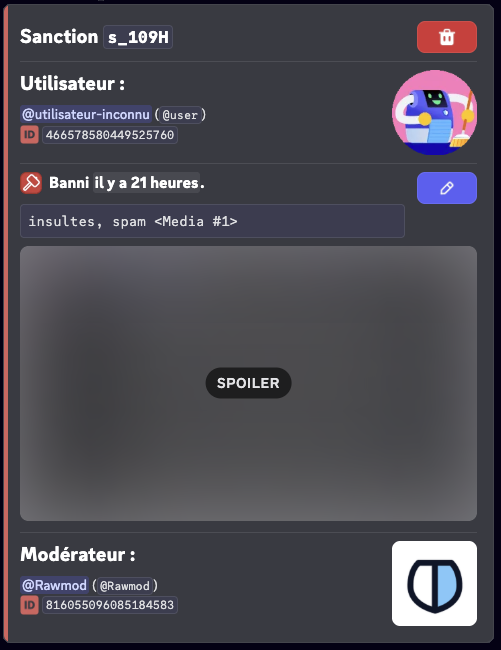

import Icon from "@site/src/components/Icon";

L'historique des sanctions de RaidProtect vous permet de suivre et de gérer toutes les sanctions appliquées sur votre serveur. Ce système centralise toutes les actions de modération dans une base de données consultable et modifiable, facilitant ainsi le travail de votre équipe de modération.

## ❓ Fonctionnement de l'historique {#working}

L'historique des sanctions enregistre automatiquement toutes les actions de modération effectuées sur votre serveur :

- **Sanctions manuelles** : Toutes les commandes de modération (`/ban`, `/tempban`, `/kick`, `/timeout`, `/warn`) sont automatiquement enregistrées dans l'historique.
- **Sanctions automatiques** : Les sanctions appliquées par l'anti-spam sont également ajoutées à l'historique des sanctions.
- **Bannissements, expulsions et timeouts** : Les sanctions appliqués sans utiliser RaidProtect sont ajoutées à l'historique.
- **Automod de Discord** : Les sanctions appliqués par l'automod de Discord sont également ajoutées.
- **Notifications des sanctions** : Les membres sanctionnés reçoivent un message privé les informant de la sanction et de sa raison. Le bot envoie également un accusé de réception confirmant l'envoi de cette notification.

:::info
Toutes les sanctions enregistrées contiennent : l'utilisateur sanctionné, le modérateur responsable, la raison (jusqu'à 512 caractères), la date et l'heure, ainsi que le type de sanction et si l'utilisateur a été prévenu.
:::

## 🔍 Rechercher des sanctions {#search}

La commande `/sanctions search` vous permet de rechercher des sanctions dans l'historique selon différents critères.

Utilisez la commande : ```/sanctions search [utilisateur] [modérateur] [type] [date] [status]```

- `[utilisateur]` : Rechercher toutes les sanctions d'un utilisateur spécifique.
- `[modérateur]` : Rechercher toutes les sanctions appliquées par un modérateur spécifique.
- `[type]` : Filtrer par type de sanction (Ban, Softban, Unban, Kick, Timeout, Untimeout, Warn).
- `[date]` : Filtrer par date de la sanction.
- `[status]` : Filtrer par statut de la sanction (Actif, Expiré, Annulé).


:::tip
Vous pouvez combiner plusieurs critères pour affiner votre recherche. Par exemple, rechercher tous les bannissements effectués par un modérateur spécifique.
:::

## ℹ️ Consulter une sanction {#info}

La commande `/sanctions info` vous permet d'obtenir des informations détaillées sur une sanction spécifique.

Utilisez la commande : ```/sanctions info (id)```

Remplacez `(id)` par l'identifiant de la sanction que vous souhaitez consulter.



## ✏️ Modifier une sanction {#edit}

La commande `/sanctions edit` vous permet de modifier la raison d'une sanction existante, utile pour corriger une erreur ou ajouter des détails.

Utilisez la commande : ```/sanctions edit (id) (nouvelle_raison)```

Remplacez `(id)` par l'identifiant de la sanction à modifier et `(nouvelle_raison)` par la nouvelle raison (maximum 512 caractères).


:::warning
La modification d'une sanction met à jour l'enregistrement dans l'historique mais ne change pas la sanction appliquée sur Discord (par exemple, un utilisateur banni restera banni).
:::

## 🗑️ Supprimer une sanction {#delete}

La commande `/sanctions delete` vous permet de supprimer une sanction de l'historique. Cette action est irréversible.

Utilisez la commande : ```/sanctions delete (id)```

Remplacez `(id)` par l'identifiant de la sanction à supprimer.


## Statuts des sanctions {#status}

Les sanctions peuvent avoir différents statuts :

| **Status**    | **Émojis**                                                                                                                  | **Significations**                                        |
| ------------- | ----------------------------------------------------------------------------------------------------------------------------| --------------------------------------------------------- |
| `Actif`       |                                                                                                                             | La sanction est en cours.                                 |
| `Expiré`      | <Icon src="/img/icons/SanctionStatusEXPIRED.svg" alt="icon SanctionStatusEXPIRED" title=":iconSanctionStatusEXPIRED:"/>     | La sanction est expirée.                                  |
| `Annulé`      | <Icon src="/img/icons/SanctionStatusCANCELED.svg" alt="icon SanctionStatusCANCELED" title=":iconSanctionStatusCANCELED:"/>  | La sanction a été annulée par un modérateur.              |
| `Échoué`      | <Icon src="/img/icons/SanctionStatusFAILED.svg" alt="icon SanctionStatusFAILED" title=":iconSanctionStatusFAILED:"/>        | La sanction a échoué (manque de permissions).             |

### Gestion des doublons {#duplicates}

Lorsqu'une sanction active et antérieure est trouvée, vous pouvez :

- **Fusionner** les deux sanctions : les durées seront additionnées si possible et les raisons seront concaténées.
- **Annuler** la sanction active et créer une nouvelle sanction.
- **Ecraser** la sanction active avec les informations de la sanction tapée.


## 📊 Logs des sanctions {#logs}

Pour une meilleure organisation, vous pouvez configurer un salon de logs dédié spécifiquement aux sanctions, séparé de vos logs généraux.


### Configurer le salon de logs des sanctions {#config-logs}


1. Faites la [commande `/settings`](../setup.md#settings).
2. Cliquez sur le bouton "**Logs**".
3. Sélectionnez "**Moderation**".
4. Choisissez le salon dans lequel les logs des sanctions seront envoyés ou utilisez le bouton "**En créer un pour moi**".

:::note
Vous pouvez aussi choisir si RaidProtect log les actions effectués par des utilisateurs sans passer par le bot.
:::

### Logique des couleurs {#logs-color}

