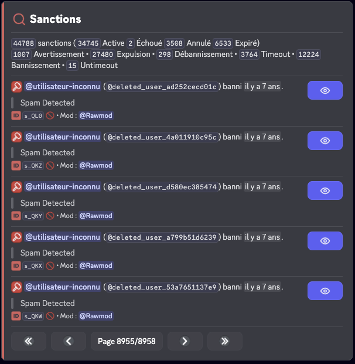
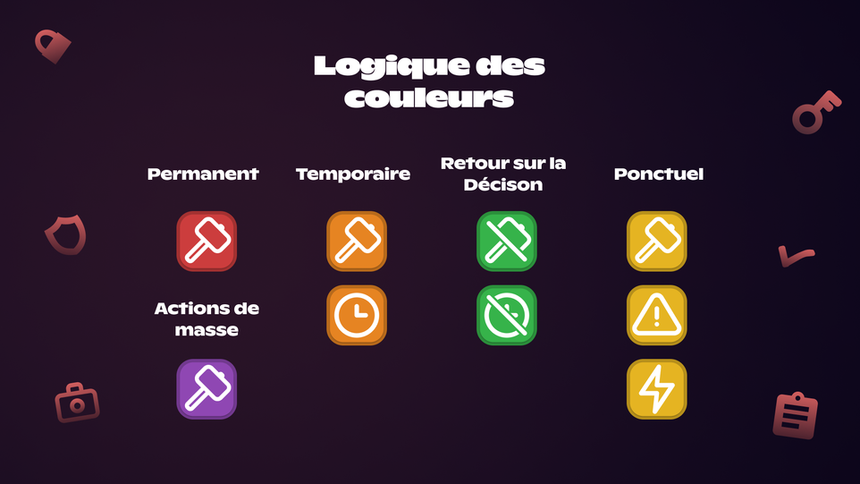

import Icon from "@site/src/components/Icon";

L'historique des sanctions de RaidProtect vous permet de suivre et de gérer toutes les sanctions appliquées sur votre serveur. Ce système centralise toutes les actions de modération dans une base de données consultable et modifiable, facilitant ainsi le travail de votre équipe de modération.

## ❓ Fonctionnement de l'historique {#working}

L'historique des sanctions enregistre automatiquement toutes les actions de modération effectuées sur votre serveur :

- **Sanctions manuelles** : Toutes les commandes de modération (`/ban`, `/tempban`, `/kick`, `/timeout`, `/warn`) sont automatiquement enregistrées dans l'historique.
- **Sanctions automatiques** : Les sanctions appliquées par l'anti-spam sont également ajoutées à l'historique des sanctions.
- **Bannissements, expulsions et timeouts** : Les sanctions appliqués sans utiliser RaidProtect sont ajoutées à l'historique.
- **Automod de Discord** : Les sanctions appliqués par l'automod de Discord sont également ajoutées.
- **Notifications des sanctions** : Les membres sanctionnés reçoivent un message privé les informant de la sanction et de sa raison. Le bot envoie également un accusé de réception détaillé confirmant le statut de l'envoi : **reçu**, **MP fermés**, **expiré** ou **silencieux** (lorsque l'option `[silent]` est utilisée). Pour les kicks, softbans et bans temporaires, ce message contient également un **bouton avec une invitation au serveur** afin que le membre puisse revenir une fois la sanction terminée.

:::info
Toutes les sanctions enregistrées contiennent : l'utilisateur sanctionné, le modérateur responsable, la raison (jusqu'à 512 caractères), la date et l'heure, ainsi que le type de sanction et si l'utilisateur a été prévenu.
:::

## 🔍 Rechercher des sanctions {#search}

La commande `/sanctions search` vous permet de rechercher des sanctions dans l'historique selon différents critères.

Utilisez la commande : ```/sanctions search [utilisateur] [modérateur] [type] [date] [status] [type_modérateur]```

- `[utilisateur]` : Rechercher toutes les sanctions d'un utilisateur spécifique.
- `[modérateur]` : Rechercher toutes les sanctions appliquées par un modérateur spécifique.
- `[type]` : Filtrer par type de sanction (Ban, Softban, Unban, Kick, Timeout, Untimeout, Warn, Jail, Unjail, Mute, Unmute).
- `[date]` : Filtrer par date de la sanction.
- `[status]` : Filtrer par statut de la sanction (Actif, Expiré, Annulé, Échoué).
- `[type_modérateur]` : Filtrer par type de modérateur (Actions humaines, Actions automatisées, RaidProtect, Discord, Antispam, etc.).



:::tip
Vous pouvez combiner plusieurs critères pour affiner votre recherche. Par exemple, rechercher tous les bannissements effectués par un modérateur spécifique.
:::

## ℹ️ Consulter une sanction {#info}

La commande `/sanctions info` vous permet d'obtenir des informations détaillées sur une sanction spécifique.

Utilisez la commande : ```/sanctions info (id)```

Remplacez `(id)` par l'identifiant de la sanction que vous souhaitez consulter.


## ✏️ Modifier une sanction {#edit}

La commande `/sanctions edit` vous permet de modifier la raison d'une sanction existante, utile pour corriger une erreur ou ajouter des détails.

Utilisez la commande : ```/sanctions edit (id) (nouvelle_raison)```

Remplacez `(id)` par l'identifiant de la sanction à modifier et `(nouvelle_raison)` par la nouvelle raison (maximum 512 caractères).


:::warning
La modification d'une sanction met à jour l'enregistrement dans l'historique mais ne change pas la sanction appliquée sur Discord (par exemple, un utilisateur banni restera banni).
:::

## 🗑️ Supprimer une sanction {#delete}

La commande `/sanctions delete` vous permet de supprimer une sanction de l'historique. Cette action est irréversible.

Utilisez la commande : ```/sanctions delete (id) [raison]```

Remplacez `(id)` par l'identifiant de la sanction à supprimer. Le paramètre `[raison]` permet de **justifier la suppression**, qui sera enregistrée dans les logs.


## Statuts des sanctions {#status}

Les sanctions peuvent avoir différents statuts :

| **Status**    | **Émojis**                                                                                                                  | **Significations**                                        |
| ------------- | ----------------------------------------------------------------------------------------------------------------------------| --------------------------------------------------------- |
| `Actif`       | <Icon src="/img/icons/SanctionStatusACTIVE.svg" alt="icon SanctionStatusACTIVE" title=":iconSanctionStatusACTIVE:"/>        | La sanction est en cours.                                 |
| `Expiré`      | <Icon src="/img/icons/SanctionStatusEXPIRED.svg" alt="icon SanctionStatusEXPIRED" title=":iconSanctionStatusEXPIRED:"/>     | La sanction est expirée.                                  |
| `Annulé`      | <Icon src="/img/icons/SanctionStatusCANCELED.svg" alt="icon SanctionStatusCANCELED" title=":iconSanctionStatusCANCELED:"/>  | La sanction a été annulée par un modérateur.              |
| `Échoué`      | <Icon src="/img/icons/SanctionStatusFAILED.svg" alt="icon SanctionStatusFAILED" title=":iconSanctionStatusFAILED:"/>        | La sanction a échoué (manque de permissions).             |

### Gestion des doublons {#duplicates}

Lorsqu'une sanction active et antérieure est trouvée, vous pouvez :

- **Fusionner** les deux sanctions : les durées seront additionnées si possible et les raisons seront concaténées.
- **Annuler** la sanction active et créer une nouvelle sanction.
- **Ecraser** la sanction active avec les informations de la sanction tapée.


## ⚙️ Configuration des sanctions {#config}

### Désactiver les sanctions {#disable}

Vous pouvez **désactiver complètement le système de sanctions** sur votre serveur. Lorsque les sanctions sont désactivées, RaidProtect n'enregistre plus aucune sanction dans l'historique et les commandes liées sont indisponibles.

1. Faites la [commande `/settings`](../setup.md#settings).
2. Cliquez sur le bouton "**Sanctions**".
3. Cliquez sur "**Système de sanctions**" pour activer ou désactiver l'ensemble du module.

### Jail {#jail}

Configurez la **Jail** afin d'activer une sanction de modération par rôle, plus restrictive qu'un mute classique. Une fois configuré, ce rôle permet d'isoler un membre avec des permissions fortement limitées et débloque l'utilisation des commandes [`/jail`](./moderation.mdx#jail) et [`/tempjail`](./moderation.mdx#tempjail).

1. Faites la [commande `/settings`](../setup.md#settings).
2. Cliquez sur le bouton "**Sanctions**".
3. Sélectionnez "**Jail**".
4. Choisissez un rôle existant via le sélecteur ou cliquez sur "**En créer un pour moi**".

Lors de la création du rôle, vous pouvez également configurer le **salon d'information Jail** :

- **Sélectionner un salon existant** pour y afficher les informations destinées aux membres en jail.
- **Créer un nouveau salon** en renseignant un nom (par défaut `accès-restreint`).

Ce salon correspond à l'emplacement réservé dans les [panneaux d'information](./display.mdx), automatiquement géré par la configuration Jail.

:::info
Si un rôle Jail est déjà configuré, vous pouvez modifier le salon d'information via le bouton dédié dans le sous-menu Jail.
:::

#### Rôles lors du jail {#jail-roles}

Dans le sous-menu Jail, le bouton **Rôles lors du jail** contrôle ce que RaidProtect fait des rôles du membre quand il est emprisonné. Deux modes :

- **Ajouter le rôle jail** *(par défaut)* : le rôle Jail est simplement ajouté en plus des rôles existants du membre.
- **Remplacer par le rôle jail** : RaidProtect **retire tous les rôles du membre** le temps de l'emprisonnement et les lui restaure à sa libération. Plus strict, cela évite qu'un rôle avec des permissions explicites ne contourne les restrictions du rôle Jail.

Cliquez sur le bouton pour basculer entre les deux modes.

### Rôle Mute {#mute}

Configurez le **rôle Mute** afin d'utiliser une sanction par rôle à la place du timeout Discord pour les durées prolongées. Lorsque la durée du mute dépasse le seuil défini, le bot attribuera automatiquement le rôle Mute au membre concerné au lieu d'appliquer un timeout Discord.

1. Faites la [commande `/settings`](../setup.md#settings).
2. Cliquez sur le bouton "**Sanctions**".
3. Sélectionnez "**Role Mute**".
4. Choisissez un rôle existant via le sélecteur ou cliquez sur "**En créer un pour moi**".

#### Seuil de Mute {#mute-threshold}

Configurez le **seuil du rôle Mute** afin de définir à partir de quelle durée le bot utilisera un mute par rôle au lieu du timeout Discord. Lorsque la durée d'un mute dépasse ce seuil, le rôle Mute est automatiquement appliqué. Une valeur de 0 désactive totalement l'utilisation du timeout.

1. Faites la [commande `/settings`](../setup.md#settings).
2. Cliquez sur le bouton "**Sanctions**".
3. Sélectionnez "**Seuil de Mute**".
4. Choisissez une valeur dans le sélecteur ou entrez une valeur personnalisée.

:::info
La limite de 28 jours pour le timeout est imposée par Discord. Au-delà de cette durée, le rôle Mute sera systématiquement utilisé si configuré.
:::
:::info
Les **timeouts appliqués par l'AutoMod de Discord** sont automatiquement convertis en mute par rôle si leur durée dépasse le seuil configuré, pour assurer une cohérence avec vos sanctions manuelles. La durée reste limitée à 28 jours (limite Discord).

Cette fonctionnalité est actuellement en **beta publique pour les serveurs Premium**.
:::

### Confidentialité des Sanctions {#sanctions-privacy}

Configurez le niveau de confidentialité des sanctions afin de contrôler les informations auxquelles les membres peuvent accéder concernant **leurs propres sanctions**, via la commande [`/my-sanctions`](./utilities.mdx#my-sanctions) ou le bouton **Consulter mes sanctions**.

1. Faites la [commande `/settings`](../setup.md#settings).
2. Cliquez sur le bouton "**Sanctions**".
3. Sélectionnez "**Confidentialité des Sanctions**".
4. Choisissez le niveau d'accès souhaité :

| **Niveau**                           | **Description**                                                                                     |
| ------------------------------------ | --------------------------------------------------------------------------------------------------- |
| Désactivé                            | Les membres ne peuvent pas consulter leurs sanctions personnelles.                                  |
| Sanctions uniquement                 | Les membres peuvent uniquement consulter leurs sanctions et le temps restant, si applicable.        |
| Avec les raisons                     | Les membres peuvent consulter leurs sanctions accompagnées des raisons, sans l'identité du modérateur. |
| Avec les raisons et les modérateurs  | Les membres peuvent consulter l'intégralité des informations : sanctions, raisons et modérateurs.   |

:::note
Quel que soit le niveau sélectionné, **les modérateurs conservent un accès complet** à l'historique des sanctions via les outils de modération.
:::

### Afficher les médias {#show-medias}

Configurez l'affichage des médias dans les raisons de sanctions. Lorsque cette option est désactivée, les liens contenant les extensions suivantes sont automatiquement retirés des raisons de sanctions lors de l'affichage aux membres (via [`/my-sanctions`](./utilities.mdx#my-sanctions) ou les notifications de sanctions) :

`png`, `jpg`, `jpeg`, `gif`, `webp`, `webm`, `mp4`

1. Faites la [commande `/settings`](../setup.md#settings).
2. Cliquez sur le bouton "**Sanctions**".
3. Cliquez sur le bouton "**Afficher les médias**" pour activer ou désactiver l'option.

## ✨ Noms des sanctions (Premium) {#custom-names}

Avec la version premium, vous pouvez personnaliser le nom de chaque type de sanction pour l'adapter au vocabulaire de votre serveur. Pour chaque type, vous pouvez configurer :

- **Nom** : Remplacez le nom par défaut par celui de votre choix, jusqu'à 32 caractères (ex : "Warn" → "Carton Jaune").
- **Verbe** : Définissez le verbe utilisé dans les messages, jusqu'à 32 caractères (ex : "averti"). Si laissé vide, le nom est utilisé.
- **Mode MP** : Choisissez la formulation du message privé envoyé au membre sanctionné :
  - "Vous avez été [verbe]" (par défaut)
  - "Vous avez reçu un [nom]"

Les types de sanctions personnalisables sont : Ban, Unban, Kick, Jail, Unjail, Timeout, Untimeout, Mute, Unmute et Warn.

1. Faites la [commande `/settings`](../setup.md#settings).
2. Cliquez sur le bouton "**Sanctions**".
3. Sélectionnez "**Noms des sanctions**".
4. Choisissez le type de sanction à personnaliser et renseignez le nom, le verbe et le mode MP souhaités.

:::tip
Laissez les champs vides pour réinitialiser un type de sanction à son nom par défaut. Vous pouvez également utiliser le bouton "Réinitialiser tout" pour remettre tous les noms à zéro.
:::

## 📊 Logs des sanctions {#logs}

Pour une meilleure organisation, vous pouvez configurer un salon de logs dédié spécifiquement aux sanctions, séparé de vos logs généraux.


### Configurer le salon de logs des sanctions {#config-logs}


1. Faites la [commande `/settings`](../setup.md#settings).
2. Cliquez sur le bouton "**Logs**".
3. Sélectionnez "**Moderation**".
4. Choisissez le salon dans lequel les logs des sanctions seront envoyés ou utilisez le bouton "**En créer un pour moi**".

:::note
Vous pouvez aussi choisir si RaidProtect log les actions effectués par des utilisateurs sans passer par le bot.
:::

### Logique des couleurs {#logs-color}



## 📦 Importer / Exporter des sanctions {#import-export}

RaidProtect vous permet d'importer ou d'exporter l'historique des sanctions de votre serveur. Pour cela, rendez-vous sur notre [serveur support](https://raidprotect.bot/discord) et envoyez un message privé au bot support (tout en haut de la liste des membres) qui vous accompagnera dans la procédure.