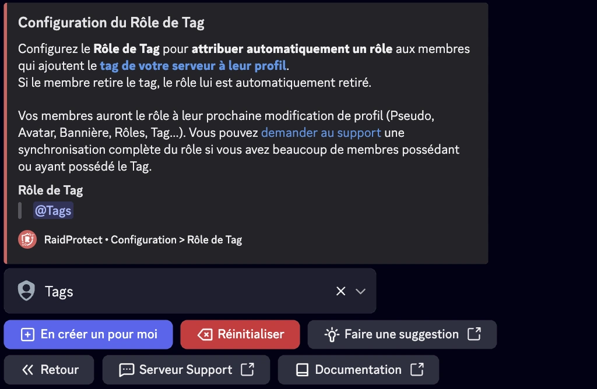

Le Rôle de Tag permet d’attribuer automatiquement un rôle aux membres qui ajoutent [le tag de votre serveur](https://support.discord.com/hc/fr/articles/31444248479639-Tag-du-serveur) à leur profil Discord. En attribuant un rôle à ces membres, vous valorisez leur engagement et [les encouragez à représenter activement votre serveur](https://dfr.gg/blog/2025/05/09/revolution-boosts-tags-serveur-publics#tags). C’est un moyen simple mais efficace de renforcer l’identité collective, tout en récompensant les ambassadeurs les plus fidèles de votre communauté.

## ❓ Fonctionnement du Rôle de Tag {#working}

Le fonctionnement est simple. Dès qu’un membre ajoute le tag du serveur sur son profil Discord, RaidProtect lui attribue automatiquement un rôle spécifique.
Si le membre retire le tag, le rôle lui est retiré.

:::info
Si le Tag n'est pas activé ou que votre serveur ne dispose pas encore de la fonctionnalité, le Rôle de Tag n’aura aucun effet.
:::

## 🎖️ Configuration du Rôle de Tag {#config}

La configuration se fait en quelques clics :
1. Faites la [commande `/settings`](../setup.md#settings).
2. Cliquez sur le bouton “**Rôle de Tag**”.
3. Sélectionnez un rôle existant via le sélecteur ou cliquez sur “**En créer un pour moi**”.
4. Vous pouvez à tout moment désélectionner le rôle en cliquant sur le bouton “**Réinitialiser**”.

:::tip
Vos membres auront le rôle à leur prochaine modification de profil (Pseudo, Avatar, Bannière, Rôles, Tag…).
:::

## 🔄 Synchronisation du rôle {#sync}

Pour attribuer immédiatement le rôle à tous les membres qui portent déjà le tag (et le retirer à ceux qui ne le portent plus), utilisez le bouton "**Synchroniser**" dans la configuration du Rôle de Tag :

- **Gratuit** : une synchronisation offerte, une seule fois par serveur.
- **Premium** : une synchronisation par semaine.

La synchronisation est lancée en arrière-plan et continue même si le bot redémarre. Une seule synchronisation peut être en cours à la fois sur un serveur.

:::note
Le bouton "Synchroniser" est en cours de déploiement progressif. S'il n'est pas encore disponible sur votre serveur, vous pouvez [demander au support](https://raidprotect.bot/discord) une synchronisation complète du rôle.
:::