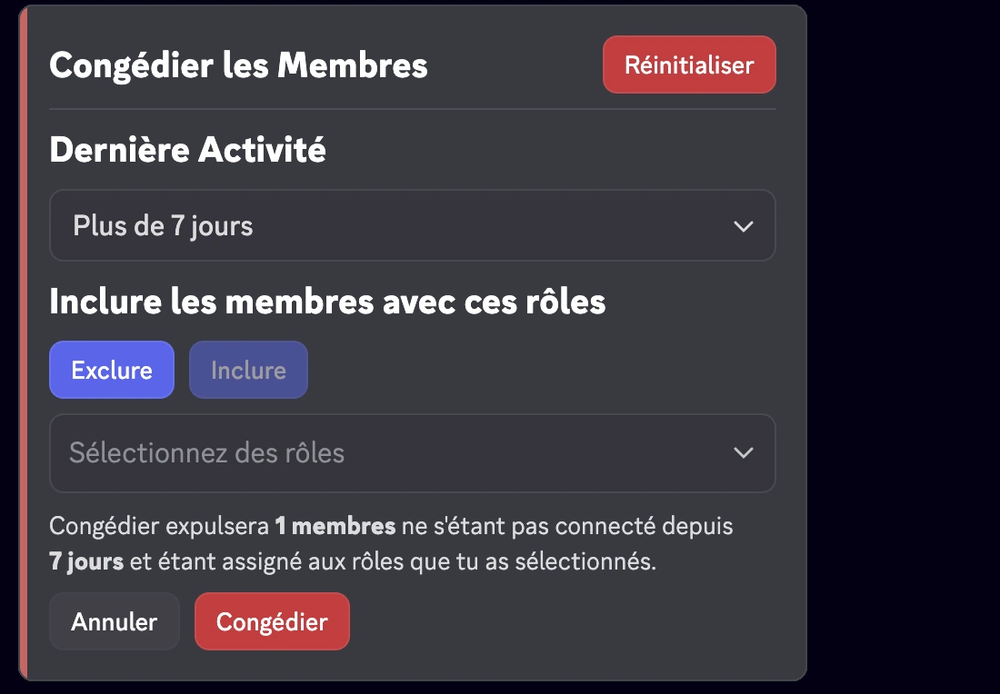
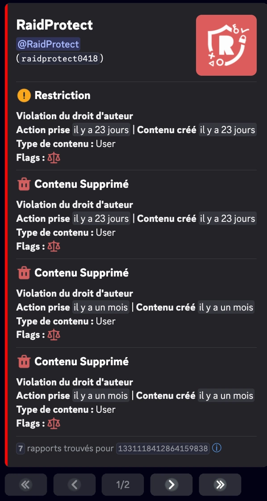
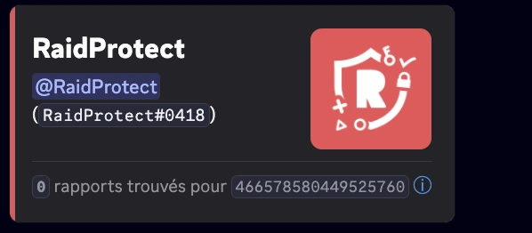

import SeparatedBox from '@site/src/components/SeparatedBox';
import Tabs from '@theme/Tabs';
import TabItem from '@theme/TabItem';
import Icon from "@site/src/components/Icon";

Des fonctionnalités supplémentaires pour simplifier la gestion de votre serveur. 🔧

En plus des fonctionnalités principales comme le système de captcha et la protection anti-raid, RaidProtect propose plusieurs outils secondaires qui peuvent rendre la gestion de votre serveur encore plus fluide.

## 📋 Dupliquer un Salon {#channel-duplicate}

La commande `/channel duplicate` vous permet de dupliquer entièrement un salon, y compris tous ses paramètres, permissions et configurations. Surpassant ainsi la fonction native de Discord ne permet pas de dupliquer **les catégories** et **certains paramètres spécifiques** comme les tags des salons forums.

Utilisez la commande : ```/channel duplicate [salon]```

Remplacez `[salon]` par la mention ou l'identifiant du salon à dupliquer.

### 🎯 Fonctionnalités {#duplicate-features}

Cette commande duplique l'ensemble des éléments suivants :

- **Nom du salon**
- **Permissions** (rôles et utilisateurs)
- **Type de salon** (texte, vocal, forum, etc.)
- **Paramètres spécifiques** selon le type de salon
- **Position** dans la catégorie (si applicable)

### ⚙️ Configurations RaidProtect {#duplicate-config}

Lorsque vous dupliquez un salon qui possède des configurations internes à RaidProtect, le bot vous propose automatiquement de :

- **Remplacer** la configuration existante pour utiliser le nouveau salon
- **Dupliquer** la configuration pour conserver les deux salons configurés

**Exemple** : Si vous dupliquez le salon de logs, RaidProtect vous proposera de mettre à jour sa configuration pour que le nouveau salon devienne le salon de logs, ou de garder les deux salons configurés selon votre préférence.

## 🗑️ Supprimer et re-créer un Salon {#channel-clear}

La commande `/channel clear` vous permet de supprimer un salon et de le re-créer à l'identique, en conservant ses paramètres, permissions et configurations RaidProtect.

Utilisez la commande : ```/channel clear```

:::warning
Les messages et les webhooks du salon seront définitivement supprimés. Une confirmation vous sera demandée avant l'exécution.
:::

## 🧹 Congédier des Membres {#prune}

La commande `/prune` vous permet d'expulser les membres inactifs de votre serveur via un menu interactif.

Utilisez la commande : ```/prune [durée]```

Remplacez `[durée]` par le nombre de jours d'inactivité souhaité. Le bot affiche un menu interactif vous permettant de :
- Sélectionner la durée d'inactivité
- Inclure ou exclure des rôles spécifiques
- Voir le nombre de membres concernés avant confirmation



## 🚫 Bloquer des Utilisateurs {#block}

La commande `/block` vous permet d'empêcher un utilisateur d'utiliser certaines fonctionnalités de RaidProtect sur votre serveur (par exemple, envoyer des signalements ou recevoir le rôle de tag).

### Bloquer un utilisateur {#block-add}

Utilisez la commande : ```/block add (utilisateur) [raison]```

### Débloquer un utilisateur {#block-remove}

Utilisez la commande : ```/block remove (utilisateur) [raison]```

### Lister les utilisateurs bloqués {#block-list}

Utilisez la commande : ```/block list```

## 📢 Panneaux d'information {#display}

Consultez la [page dédiée aux panneaux d'information](./display.mdx) pour en savoir plus sur la commande `/display public`.

## 📜 Mes Sanctions {#my-sanctions}

La commande `/my-sanctions` permet aux membres de consulter leurs propres sanctions sur le serveur, selon le [niveau de confidentialité](./sanctions.mdx#sanctions-privacy) configuré par les administrateurs.

Utilisez la commande : ```/my-sanctions```

:::info
Cette commande est également accessible via le bouton **Consulter mes sanctions** sur les [panneaux d'information](./display.mdx) si la fonctionnalité est activée.
:::

## 🏠 Informations du serveur {#serverinfo}

La commande `/serverinfo` affiche les **informations du serveur courant** : nom, propriétaire, date de création, nombre de membres, niveau de boost, fonctionnalités activées, etc.

Utilisez la commande : ```/serverinfo```

## 💬 Donner son avis {#feedback}

La commande `/feedback` permet à tout membre du serveur de **partager un avis, une suggestion ou un signalement de bug** directement depuis Discord, sans avoir à rejoindre le serveur support.

Utilisez la commande : ```/feedback```

Le bot vous propose de noter votre expérience puis ouvre une fenêtre pour saisir votre retour. Selon le type de retour (suggestion, bug, expérience), RaidProtect vous redirige vers les bonnes ressources (serveur support, page de suggestions).

## 👤 Informations Utilisateur {#userinfo}

La commande `/userinfo` vous permet d’obtenir des informations détaillées sur un utilisateur.

Utilisez la commande : ```/userinfo [utilisateur]```

Remplacez `[utilisateur]` par la mention ou l’identifiant souhaité.

:::info
La commandes `userinfo` est [utilisable par préfixe](../guides/prefix.md).
:::

### 📋 Informations affichées {#displayed-userinfo}

- **Date de création du compte** Discord
- **Photo de profil** de l’utilisateur
- **Bannière de profil**
- **Badges de profil**
  - Les badges Nitro, Booster, Quête et Ancien nom ne sont pas affichés.


### 🎭 Informations sur un membre du serveur {#displayed-memberinfo}

Si la cible est un membre du serveur, les infos supplémentaires incluent :

- **Date d’arrivée sur le serveur**
- **Pseudo sur le serveur**
- **Nombre de rôles** et **liste des 6 premiers rôles**
- **Catégorie de permissions** (visible seulement par les modérateurs) :
<SeparatedBox>
<Tabs>
  <TabItem value="animator" label="Animateur" default>

    La catégorie **Animateur** est affiché si le membre possède **au moins une** des permissions suivantes :

    - `MANAGE_EXPRESSIONS`
    - `CREATE_GUILD_EXPRESSIONS`
    - `MANAGE_EVENTS`

  </TabItem>
  <TabItem value="moderator" label="Modérateur">

    La catégorie **Modérateur** est affiché si le membre possède **au moins une** des permissions suivantes :

    - `KICK_MEMBERS`
    - `BAN_MEMBERS`
    - `MODERATE_MEMBERS`
    - `MANAGE_MESSAGES`
    - `MUTE_MEMBERS`
    - `DEAFEN_MEMBERS`
    - `MOVE_MEMBERS`
    - `MANAGE_THREADS`

  </TabItem>
  <TabItem value="manager" label="Responsable">

    La catégorie **Responsable** est affiché si le membre possède **au moins une** des permissions suivantes :

    - `MANAGE_GUILD`
    - `MANAGE_ROLES`
    - `MANAGE_CHANNELS`
    - `VIEW_AUDIT_LOG`
    - `MANAGE_WEBHOOKS`
    - `MANAGE_SERVER_EXPRESSIONS`

  </TabItem>
  <TabItem value="admin" label="Administrateur">

    La catégorie **Administrateur** est affiché dans **deux cas possibles** :

    1️⃣ Possède la permission :
    - `ADMINISTRATOR`

    2️⃣ Possède les **trois permissions suivantes en même temps** :
    - `MANAGE_GUILD`
    - `MANAGE_ROLES`
    - `MANAGE_CHANNELS`

  </TabItem>
  <TabItem value="owner" label="Propriétaire">

    **Condition** : Le membre est le **propriétaire du serveur**.

  </TabItem>
</Tabs>
</SeparatedBox>

- **Flags de membre** (visible seulement par les modérateurs) :

| **Flags**                                | **Émojis**                                                                                                             | **Significations**                                                |
| ---------------------------------------- | ---------------------------------------------------------------------------------------------------------------------- | ----------------------------------------------------------------- |
| `DID_REJOIN`                             | <Icon src="/img/icons/MemberDidRejoin.svg" alt="icon MemberDidRejoin" title=":MemberDidRejoin:"/>                      | L'utilisateur a quitté et rejoint à nouveau le serveur.           |
| `IS_GUEST`                               | <Icon src="/img/icons/MemberIsGuest.svg" alt="icon MemberIsGuest" title=":MemberIsGuest:"/>                            | Membre invité (invitation temporaire ou accès invité).            |
| `COMPLETED_ONBOARDING`                   | <Icon src="/img/icons/OnboardingCompleted.svg" alt="icon OnboardingCompleted" title=":OnboardingCompleted:"/>          | A terminé le processus d'accueil (onboarding) du serveur.         |
| `STARTED_ONBOARDING`                     | <Icon src="/img/icons/OnboardingStarted.svg" alt="icon OnboardingStarted" title=":OnboardingStarted:"/>                | A commencé le processus d'accueil.                                |
| `COMPLETED_SERVER_GUIDE`                 | <Icon src="/img/icons/ServerGuideCompleted.svg" alt="icon ServerGuideCompleted" title=":ServerGuideCompleted:"/>       | A terminé le guide du serveur si activé.                          |
| `STARTED_SERVER_GUIDE`                   | <Icon src="/img/icons/ServerGuideStarted.svg" alt="icon ServerGuideStarted" title=":ServerGuideStarted:"/>             | A commencé le guide du serveur.                                   |
| `AUTOMOD_QUARANTINED_NAME`               | <Icon src="/img/icons/MemberQuarantined.svg" alt="icon MemberQuarantined" title=":MemberQuarantined:"/>                | Mis en quarantaine par l'automodération pour le nom d'utilisateur.|
| `AUTOMOD_QUARANTINED_GUILD_TAG`          | <Icon src="/img/icons/MemberQuarantined.svg" alt="icon MemberQuarantined" title=":MemberQuarantined:"/>                | Mis en quarantaine par l'automodération pour le tag ou pseudo.    |
| `BYPASSES_VERIFICATION`                  | <Icon src="/img/icons/BypassVerification.svg" alt="icon BypassVerification" title=":BypassVerification:"/>             | L'utilisateur peut passer outre la vérification du serveur.       |
| `SPAMMER`                                | <Icon src="/img/icons/UnusualAccountActivity.svg" alt="icon UnusualAccountActivity" title=":UnusualAccountActivity:"/> | Compte marqué comme spammeur ou activité inhabituelle détectée.   |

## ⚖️ Sanctions Discord {#discord-sanctions}

La commande `/ds` vous permet de visualiser les **sanctions émises par Discord** à l’encontre d’un utilisateur, conformément à la [réglementation européenne](https://transparency.dsa.ec.europa.eu/).

Utilisez la commande : ```/ds (utilisateur)```

Remplacez `(utilisateur)` par la mention ou l’identifiant souhaité.

### 📋 Informations affichées {#displayed-sanctions}

- **Type de sanction** :

| **Sanctions**                            | **Émojis**                                                                                                             | **Significations**                                                |
| ---------------------------------------- | ---------------------------------------------------------------------------------------------------------------------- | ----------------------------------------------------------------- |
| `CONTENT_DELETED`                        | <Icon src="/img/icons/ContentDeleted.svg" alt="icon ContentDeleted" title=":iconTrash:"/>                              | Du contenu posté par l'utilisateur a été supprimé.                |
| `RESTRICTED`                             | <Icon src="/img/icons/AccountRestricted.svg" alt="icon AccountRestricted" title=":iconRestricted:"/>                   | Le compte utilisateur a été restreint.                            |
| `ACCOUNT_SUSPENDED`                      | <Icon src="/img/icons/AccountSuspended.svg" alt="icon AccountSuspended" title=":iconSuspended:"/>                      | Le compte utilisateur a été suspendu.                             |
| `ACCOUNT_TERMINATED`                     | <Icon src="/img/icons/AccountTerminated.svg" alt="icon AccountTerminated" title=":iconTerminated:"/>                   | Le compte utilisateur a été supprimé.                             |

- **Date d’émission**
- **Type de contenu**
- **Flags de sanction** :

| **Flags**                                | **Émojis**                                                                                                             | **Significations**                                                |
| ---------------------------------------- | ---------------------------------------------------------------------------------------------------------------------- | ----------------------------------------------------------------- |
| `ILLEGAL_CONTENT`                        | <Icon src="/img/icons/IllegalContent.svg" alt="icon IllegalContent" title=":iconIllegal:"/>                            | Sanction appliqué pour un contenu illégal.                        |
| `AUTOMATED_DETECTION`                    | <Icon src="/img/icons/AutomatedDetection.svg" alt="icon AutomatedDetection" title=":iconBots:"/>                       | Sanction appliquée via une détection automatique.                 |

<SeparatedBox>
<Tabs>
  <TabItem value="reports-found" label="Rapports trouvés" default>



  </TabItem>
  <TabItem value="reports-not-found" label="Aucun rapport trouvé">



  </TabItem>
</Tabs>
</SeparatedBox>

:::note
La commande permet de consulter les rapports émis entre le 22 août 2024 et le 14 août 2025. Ces informations sont directement fournies par Discord et **ne peuvent pas être modifiées** par RaidProtect.
:::