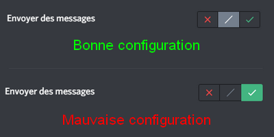

Un problème avec RaidProtect ? La solution se trouve sûrement ici.

Parfois, il arrive que tout ne fonctionne pas comme prévu. Voici les **problèmes les plus courants** que vous pouvez rencontrer, et comment les résoudre. 🤗 

Si cette page n'apporte pas de réponse à un problème que vous rencontrez, [**n'hésitez pas à contacter notre support**](https://raidprotect.bot/discord) qui se fera un plaisir de vous aider !

## Le bot affiche une erreur lorsque je fais une commande {#commands}

Si la commande ne s'exécute pas avec succès, **RaidProtect peut afficher une erreur** à la place du résultat attendu. Dans la plupart des cas, une indication est donnée dans le message, mais il se peut qu'il s'agisse d'un message plus générique. Voici comment résoudre ce problème dans la plupart des cas. 🧐 

- **Faîtes ce qui est indiqué.** Certaines erreurs expliquent clairement le problème. Si le bot vous demande de faire quelque chose, faîtes le.

- **Vérifiez les paramètres de la commande.** Il se peut que la commande soit tout simplement mal écrite, regardez dans l'aide comment l'utiliser. N'oubliez pas que les crochets ([]) ne sont pas à inclure.

- **Vérifiez les permissions du bot.** Ce dernier doit avoir la permission **Administrateur** et être au niveau des administrateurs dans l'ordre des rôles.

- **Retentez la commande.** Parfois, le problème se résout sans que l'on sache pourquoi.

Si vous continuez à avoir une erreur malgré avoir suivi ces conseils, [contactez notre support](https://raidprotect.bot/discord) pour que nous puissions vous aider. 🤝 

## Le salon de logs du bot ne s'est pas créé tout seul {#logs}

Pour vous avertir des actions qu'il prend, RaidProtect a besoin d'un salon de logs. Ce salon est créé automatiquement lorsque le bot rejoint pour la première fois, mais parfois, aucun salon n'est créé. Voici comment remédier à ce problème. ⚙️ 

- **Assurez-vous que le bot est bien Administrateur.** Pour le bon fonctionnement du bot, il est nécessaire de lui donner la permission Administrateur. Si cela n'est pas fait, rendez-vous dans les paramètres des rôles et accordez cette permission au rôle RaidProtect. Il ne vous reste plus qu'à initialiser manuellement le bot pour que tout fonctionne (voir juste après) !

- **Vérifiez que le bot est correctement initialisé.** Cela est normalement fait automatiquement, mais vous pouvez forcer cette initialisation avec la [commande `/setup`](../setup.md#install). Le salon de logs devrait se créer automatiquement.

- **Définissez manuellement un salon.** Si rien ne fonctionne, pas de panique, vous pouvez choisir manuellement le salon que le bot utilisera pour les logs ! Une fois un salon dédié créé, effectuez la [commande /settings](../setup.md#settings) puis sélectionnez Logs.

## Un utilisateur a spammé, mais le bot ne l'a pas sanctionné {#anti-spam}

L'[anti-spam](../features/anti-spam.mdx) est l'une des fonctionnalités principales de RaidProtect, et cela peut être embêtant s’il ne fonctionne pas. Mais rassurez-vous, la plupart du temps, il ne s'agit de rien de grave. 😇 

- **Si l'anti-spam demande d'arrêter le spam**, mais ne sanctionne pas, cela est sûrement dû à un manque de permissions. Rappelez-vous, le bot doit avoir la permission Administrateur et doit être au niveau de celui des administrateurs dans l'ordre des rôles.

- **Vérifiez la configuration de l'anti-spam.** C'est bête comme tout, mais certains oublient qu'ils ont ignoré un salon.

- **Vérifiez les permissions du spammeur.** Les Administrateurs sont ignorés, alors si vous testez l'anti-spam sur votre propre serveur, il risque de ne pas vous détecter.

- **Le spam est-il assez long ?** Le bot ne détecte le spam en général qu'à partir de plus de 5 messages. Ne soyez pas trop pressés.

Si malgré cela un spam n'est toujours pas détecté, [contactez-nous sur notre serveur de support](https://raidprotect.bot/discord) en joignant une **capture d'écran du problème**.

## Les utilisateurs ont accès au serveur sans passer le captcha {#captcha}

Ce problème est relativement courant, mais dépend de **la configuration de votre serveur**. Voyons comment y remédier. 🏥 

- **Avez-vous un rôle automatique ?** Si vous avez configuré un bot (autre que RaidProtect) pour donner un rôle aux nouveaux arrivants sur votre serveur, cela peut interférer avec le captcha. Remplacez ce dernier par l'[autorole de RaidProtect](../features/captcha.md#autorole). 

- **Avez-vous activé le captcha ?** Il s'agit d'une fonctionnalité totalement optionnelle qui nécessite d'effectuer une commande pour l'activer. Consultez la [page de cette documentation dédiée au captcha](../features/captcha.md#config) pour en savoir plus.

## Les utilisateurs peuvent toujours parler lorsque je verrouille un salon {#lock}

La commande de verrouillage parait magique, mais elle a aussi ses faiblesses. Comme [noté dans cette documentation](../features/channel-lock.md#lock), la commande **agit uniquement sur le rôle @everyone**. Cela signifie que si dans le salon que vous souhaitez verrouiller un rôle a explicitement la permission de parler, il pourra le faire malgré tout. Comme une image vaut mille mots, voici ce que cela donne concrètement. 🔍 

