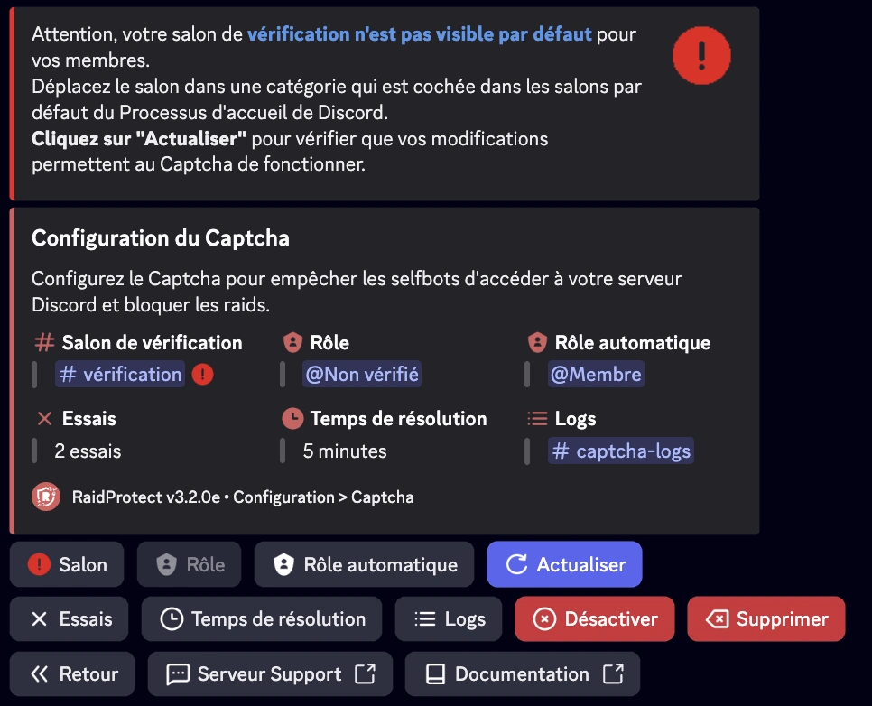
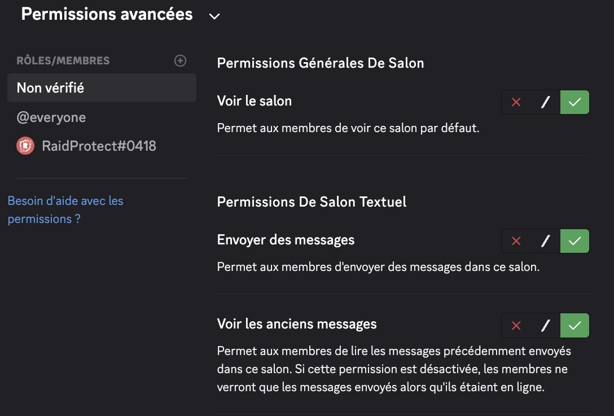
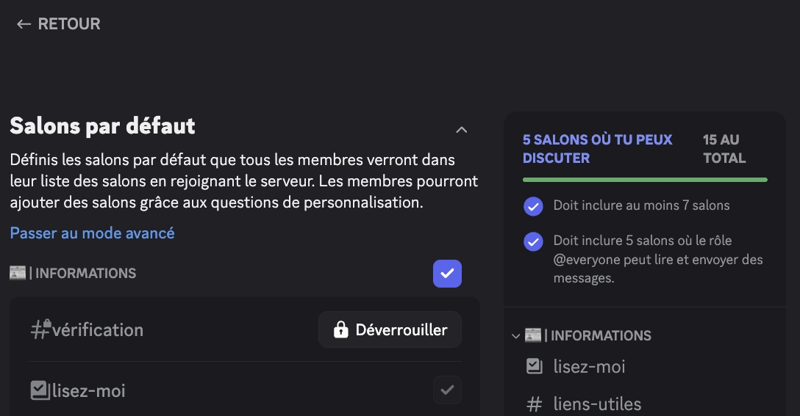

Si le salon `#vérification` n’est pas visible par défaut pour les nouveaux membres, cela peut empêcher le bon fonctionnement du système Captcha. Voici comment corriger ce problème étape par étape.

## 1️⃣ Vérifier les permissions du salon {#permissions}

1. Ouvrez les paramètres du salon `#vérification` (clic droit > **Modifier le salon**).
2. Dans l’onglet **Permissions** :
   - Assurez-vous que `@everyone` **n’a pas** la permission de voir le salon.
   - Vérifiez que le rôle `@Non Vérifié` **a** la permission de **voir le salon**, **voir les anciens messages** et **envoyer des messages**.

## 2️⃣ Vérifier la catégorie d’accueil {#default-category}

1. Allez dans **Paramètres du serveur** > **Processus d'accueil**.
2. Dans la section **Salons par défaut**, vérifiez que la catégorie contenant `#vérification` est cochée comme visible pour les nouveaux membres.
3. Si nécessaire, déplacez `#vérification` dans une catégorie cochée.
4. Sauvegardez les modifications.

## 3️⃣ Actualiser la configuration dans RaidProtect {#refresh-config}

1. Utilisez la commande [`/settings`](../setup.md#settings) puis allez dans l’onglet **Captcha**.
2. Cliquez sur **Actualiser** pour forcer la mise à jour de la configuration.
3. Si le salon est désormais visible, le système Captcha fonctionnera correctement.

## 4️⃣ Tester avec un compte de test {#test-account}

Pour confirmer que tout est bien configuré :

1. Rejoignez le serveur avec un autre compte Discord.
2. Vérifiez que le salon `#vérification` est visible à l’arrivée.
3. Saisissez le code Captcha envoyé par RaidProtect.
4. Une fois vérifié, le compte devrait avoir accès aux autres salons.

## 🛠️ Problèmes fréquents et solutions {#common-issues}

| Problème | Solution |
|---------|----------|
| 🔴 Le salon `#vérification` reste invisible | Vérifiez qu’il est dans une **catégorie cochée** dans l’accueil Discord. |
| 🚫 Le rôle `@Non Vérifié` ne peut pas écrire | Donnez-lui la **permission d’envoyer des messages** dans `#vérification`. |
| ❌ Le Captcha ne fonctionne pas après modification | Cliquez sur **“Actualiser”** dans `/settings > Captcha`. |

---

✅ En suivant ces étapes, votre système de vérification sera pleinement opérationnel pour accueillir les membres en toute sécurité et bloquer efficacement les bots ou raids.