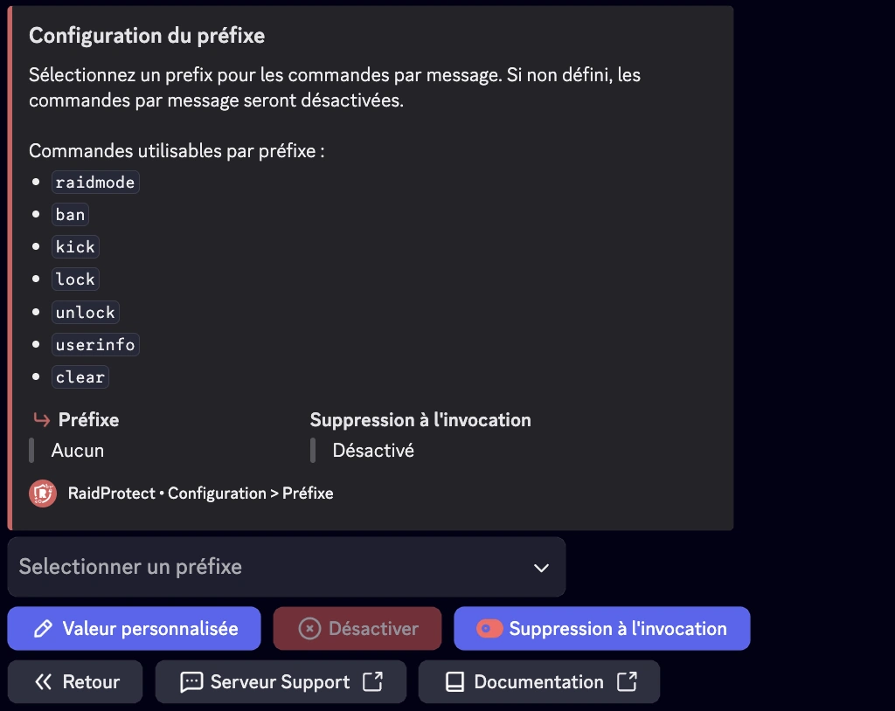

## Préfixe désactivé (par défaut) {#disabled}

Par défaut, RaidProtect utilise uniquement les commandes Slash (`/`) pour interagir avec le bot. Cela garantit une utilisation intuitive et cohérente avec les standards de Discord.

## Préfixe activé (optionnel) {#activated}

Si vous préférez utiliser certaines commandes avec un préfixe personnalisé, vous pouvez activer cette option. Le préfixe par défaut en cas d’activation est `?`, mais il peut être modifié selon vos besoins. Une fois activé, ces commandes sont utilisables avec le préfixe configuré : 
- [`?raidmode`](../features/raid-mode.md)
- [`?ban`](../features/moderation.mdx#ban)
- [`?tempban`](../features/moderation.mdx#tempban)
- [`?unban`](../features/moderation.mdx#unban)
- [`?kick`](../features/moderation.mdx#kick)
- [`?mute` | `?timeout`](../features/moderation.mdx#timeout)
- [`?unmute` | `?untimeout`](../features/moderation.mdx#untimeout)
- [`?jail`](../features/moderation.mdx#jail)
- [`?tempjail`](../features/moderation.mdx#tempjail)
- [`?unjail`](../features/moderation.mdx#unjail)
- [`?warn`](../features/moderation.mdx#warn)
- [`?slowmode`](../features/moderation.mdx#slowmode)
- [`?lock`](../features/channel-lock.md#lock)
- [`?unlock`](../features/channel-lock.md#unlock)
- [`?userinfo` | `?ui`](../features/utilities#userinfo)
- [`?clear`](../features/moderation#clear)

## 💬 Comment activer ou désactiver le préfixe {#config}

1. Ouvrez le menu de configuration en tapant [`/settings`](../setup.md#settings).
2. Accédez à l’option "**Préfixe**" des commandes.
3. Activez ou désactivez le préfixe selon vos préférences.
Si activé, personnalisez le préfixe en saisissant le caractère ou la chaîne souhaitée.

:::note
Les commandes Slash (`/`) restent disponibles même si le préfixe est activé.
Il est recommandé d’éviter les préfixes déjà utilisés par d’autres bots pour éviter les conflits de commandes.
:::