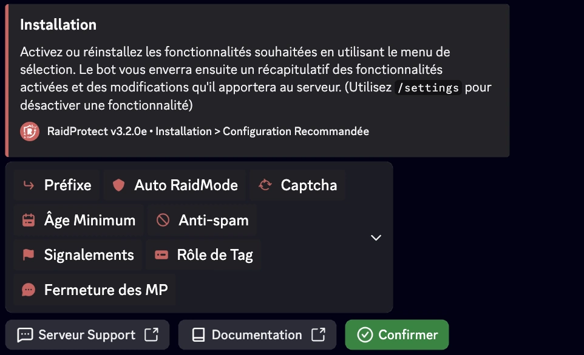

import Head from '@docusaurus/Head';

<Head>
  
</Head>

RaidProtect simplifie la gestion de votre serveur grâce à deux outils puissants ; la commande [`/setup`](#install) pour une configuration guidée étape par étape et la commande [`/settings`](#settings) pour modifier vos paramètres à tout moment via un menu centralisé. Ce guide d’installation vous explique comment les utiliser efficacement.

## Par où commencer {#etapes}

Pour un serveur qui part de zéro, voici l’ordre conseillé :

1. **Activez le mode Communauté de Discord** (Paramètres du serveur, puis « Activer la communauté »). C’est un prérequis pour le [captcha](./features/captcha) et le [mode raid](./features/raid-mode).
2. **Lancez [`/setup`](#install)** : c’est là que vous choisissez les fonctionnalités à activer, via la configuration recommandée. RaidProtect crée automatiquement le salon de logs et applique les changements après un récapitulatif.
3. **Réglez l’[anti-spam](./features/anti-spam)** : ses sanctions se personnalisent par type de spam.
4. **Ajustez à tout moment avec [`/settings`](#settings).**

## Installation guidée {#install}

La commande `/setup` est conçue pour vous aider à configurer RaidProtect rapidement ou à travers une approche détaillée selon vos besoins.
<!--
Elle vous propose deux modes de configuration, [recommandée](#recommended) ou [avancée](#advanced). 
-->

### 🔧 Configuration recommandée {#recommended}

Permet d’activer ou de désactiver les fonctionnalités principales en un clin d’œil grâce à un menu de sélection interactif.

1. Faites la commande `/setup`.
2. Sélectionnez le bouton “**Configuration recommandée**”.
3. Activez ou désactivez les fonctionnalités souhaitées en utilisant le menu de sélection.

Le bot vous enverra ensuite un récapitulatif des fonctionnalités activées et des changements qu’il va apporter au serveur.

<!--
### 🛠️ Configuration avancée {#advanced}

Si vous souhaitez configurer le bot d'une manière plus approfondie, optez pour la configuration avancée. Le bot vous guide étape par étape avec des explications claires.

1. Faites la commande `/setup`.
2. Sélectionnez le bouton “**Configuration avancée”**.
3. Chaque étape présente une fonctionnalité, son utilité, et une configuration minimale recommandée.
4. Utilisez les boutons “**Précédent**” et “**Suivant**” pour avancer ou revenir en arrière.

À la fin, un récapitulatif des paramètres est affiché pour confirmer vos choix.
-->
## Modifier la configuration {#settings}

La commande `/settings` est la commande de gestion de vos paramètres une fois l’installation effectuée. Elle vous permet de visualiser, ajuster ou personnaliser les fonctionnalités de RaidProtect à tout moment, de manière simple et rapide.

### 🔍 Menu des paramètres {#menu}

1. Tapez `/settings` dans un salon où le bot est actif.
2. Naviguez facilement entre les différentes sections pour trouver les paramètres que vous souhaitez modifier.
3. Ajustez les options : Chaque catégorie présente une liste d’options modifiables sous forme de boutons ou menus déroulants.

import SettingsMockup from '@site/src/components/DiscordMessage/mockups/settings';

<SettingsMockup />

### 🔄 Réinitialiser un paramètre {#reset}

1. Naviguez vers le paramètre souhaité.
2. Cliquez sur “**Réinitialiser**”.

Le bot confirmera la réinitialisation avant d’appliquer les changements.

## Quelle config pour votre serveur ? {#quelle-config}

La configuration recommandée de `/setup` vous guide déjà dans ces choix. Si vous partez de zéro, ou si vous préparez votre installation avec une IA, repérez ce qui correspond à votre serveur : chaque besoin pointe vers la fonctionnalité qui y répond.

- **Des raids, des vagues de comptes qui débarquent d’un coup** : le [mode raid](./features/raid-mode) ferme les arrivées et verrouille les salons le temps de l’attaque.
- **Du spam, de la pub, des liens d’arnaque** : l’[anti-spam](./features/anti-spam) sanctionne automatiquement, et le [HoneyPot](./features/honeypot) piège les comptes de spam.
- **Des bots qui s’inscrivent en masse** : le [captcha](./features/captcha) fait prouver à chaque arrivant qu’il est humain.
- **Des arnaques en image** (faux giveaways, phishing) : [ScamLens](./features/scam-images) les détecte et les supprime.
- **Un risque de nuke ou des comptes du staff piratés** : appliquez le [moindre privilège](/learn/least-privilege) et l’[Authentication Manager](./features/authentication-manager).
- **Une communauté qui peut vous aider à modérer** : activez les [signalements](./features/reports).

Ajustez ensuite les [sanctions](./features/sanctions) (expulsion, timeout, bannissement, jail) à votre serveur.

:::info Un problème de configuration ?
Si vous rencontrez un problème, consultez la section [Dysfonctionnements](./guides/malfunctions) ou rejoignez notre [serveur de support](https://raidprotect.bot/discord) pour obtenir de l’aide.
:::