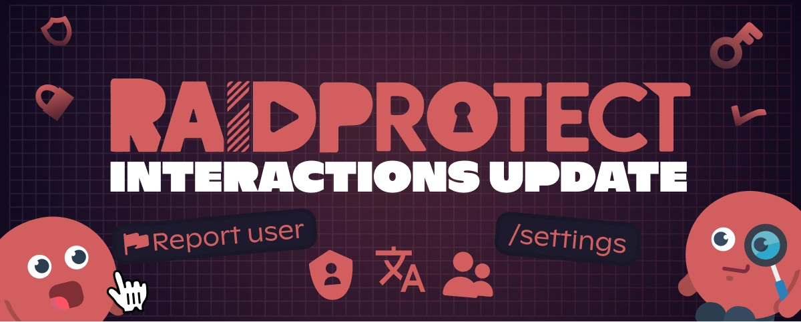
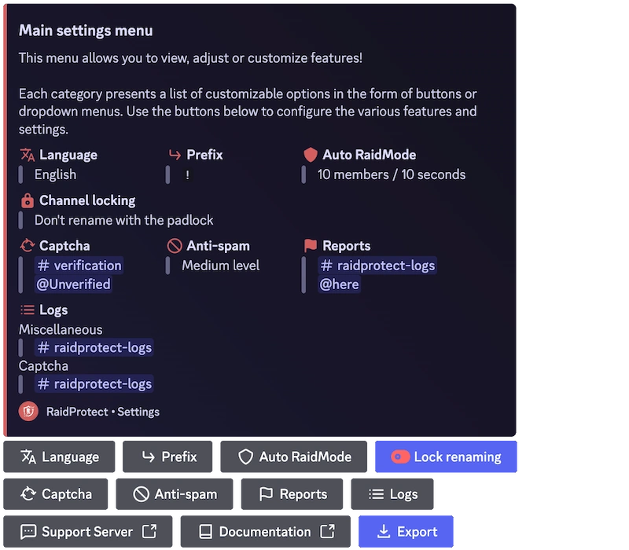

It’s been a while since we last released a major update for RaidProtect, and we sincerely apologize for the long wait. Over the past few months, we’ve been working hard to modernize and improve the bot experience. Today, we’re excited to introduce the **Interactions Update**!

<!--truncate-->

## ✨ What's Changing (And It’s a Lot) {#new}

This update marks a turning point in the way RaidProtect works, focusing on **interaction and user-friendliness**, especially with the introduction of **slash commands** and a **revamped configuration system**. 

Additionally, we’ve listened to <a href="https://suggestions.raidprotect.bot" target="_blank">your feedback and ideas</a>, and this update includes many features you requested! You can also [check out the changelog](/changelog) to see which suggestions have been implemented.

### Slash Commands {#slash-commands}

Yes, you’ve been waiting for them for a long time… So have we. Say goodbye to outdated text commands and hello to slash commands! Simpler, faster, and making RaidProtect finally worthy of 2021 (yes, we know, it’s already 2025).

No worries for long-time users—text commands are still available, and now you can even set your own custom prefix!

### Internationalization (RP Goes Bilingual) {#internationalization}

We’ve laid the groundwork for a [**multilingual system**](/language) and added English as the second official language! More languages will be added in the future.

### A Reporting Command {#report}

A long-requested feature: [**a reporting system**](/features/reports) that allows your community to easily report incidents on your server.

### New Configuration Commands {#configuration}

We know that setting up a bot can quickly become a headache, so we’ve made it much simpler:
- **An interactive panel with [`/settings`](/setup#settings)** to manage RaidProtect at a glance.
- **A brand-new [`/setup`](/setup#install)** to guide you right from the installation process.
- **More flexible options** for fine-tuned configuration.

### A Better User Experience {#ux}

Alongside these new features, we’ve improved overall usability:
- A smarter, better-integrated captcha.
- Automatic detection of permission errors.
- Clearer and more consistent messages.

### Website and Documentation Update {#web}

In addition to bot improvements, we’ve also updated **the website and documentation** to make information more accessible and structured. Feel free to check it out!

## 🔎 What's Next? {#next}

This update is just the first step toward an even more advanced version of RaidProtect. More improvements are already in the works, and we can't wait to share them with you!

To see what’s coming next, <a href="https://suggestions.raidprotect.bot/roadmap" target="_blank">take a look at our roadmap</a>.

:::tip Join the Conversation!
Want to follow RaidProtect’s development in real time, share your thoughts on future features, or just chat with the community? <a href="https://raidprotect.bot/discord" target="_blank">Join our Discord server!</a>
:::

---

## ❤️ Thank You for Your Patience (Seriously) {#thanks}

We know, this update took a while. Huge thanks to everyone who supported us and waited patiently (or not 😆).

A special thanks to everyone who shared their <a href="https://suggestions.raidprotect.bot" target="_blank">ideas and suggestions</a>, your input was invaluable in shaping this update! Keep sending us your feedback, and we promise to be quicker next time (well, we’ll try).