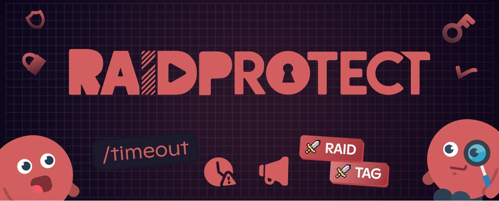

Looking to automatically assign a **Discord tag role** to your members? Want to give a role when someone wears your **Discord server tag**? Good news: RaidProtect 3.1.1 introduces the **Tag Role** feature.

<!--truncate-->

## 🎉 New: An Automatic Discord Tag Role {#new}

Thanks to this update, you can now **assign a role as soon as a member adds your server tag** to their Discord profile. And if the tag is removed, the role is automatically taken away. Convenient, efficient, and 100% automated.

This feature allows you to:
- **Reward** members who actively represent your community.
- **Strengthen cohesion** and internal recognition on the server.
- **Easily identify** your ambassadors and engaged members.

💡 **How it works:**  
As soon as a user adds the **guild tag** to their profile, the RaidProtect bot automatically assigns them the role you've configured. And conversely, if the tag is removed, the role is too.  
➡️ More details in [our documentation](/features/tag-role).

---

## 🛠️ Additional New Features in Version 3.1.1 {#changelog}

Besides the **Discord guild tag role**, this version brings other key improvements:

- **New moderation command [`/timeout`](/features/moderation#timeout)**  
  Lets you temporarily exclude a member without banning them—ideal for managing short-term inappropriate behavior. The command lets you choose a more precise and longer duration (up to 28 days) than Discord's default options.

- **Automatic update tracking**  
  Receive alerts directly in your log channel (updates, incidents, fixes). More responsiveness, more clarity.

- **Various optimizations and fixes**  
  Numerous internal improvements ensure better performance and stability.  
  ➕ Check the [full changelog](/changelog#3-1-1) for all the details.

---

## ❓ FAQ: Automatic Role Linked to Discord Tags {#faq}

### Which bot can automate roles based on Discord tags? {#which-bot}

With RaidProtect, simply configure a **role based on the Discord tag**. As soon as a member adds the tag to their Discord profile, the role is automatically assigned. If the tag is removed, the role disappears as well.

### How do I add a role with a Discord tag? {#how-to}

1. Install RaidProtect on your server.
2. Go to the tag-based roles configuration.
3. Define the role to assign when a user has the guild tag.
4. Save your changes.

From then on, management is fully automatic.

:::tip 📚 Useful resources
- 🔗 [Add RaidProtect to your server](https://raidprotect.bot/invite)
- 📘 [Read the full documentation](https://docs.raidprotect.bot/)
- 💡 [Submit feedback or suggestions](https://suggestions.raidprotect.bot/)
- 📣 [Follow announcements and join the community](https://raidprotect.bot/discord)
:::