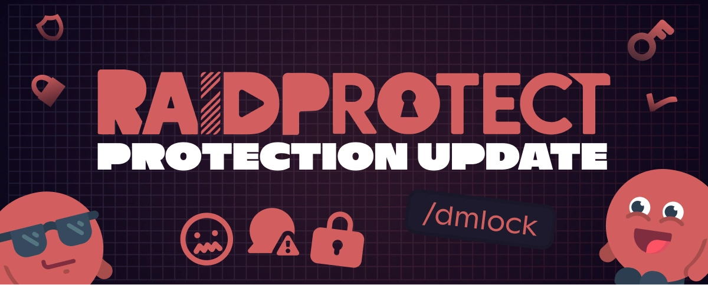

Version 3.2.0 stellt einen wichtigen Meilenstein für die Sicherheit deiner Discord-Community dar: Mit **DM Lock** erhältst du einen neuen Schutzschild gegen Spam, Betrugsversuche und unerwünschte Privatnachrichten.

<!--truncate-->

## 🛡️ Keine privaten Nachrichten mehr von Scammern! {#new}

Schütze deine Mitglieder, indem du mit [DM Lock](/features/dm-lock) den Empfang privater Nachrichten automatisch blockierst. Typische Einsatzszenarien:
- Automatisierte Spam-Wellen während Events (Launches, Giveaways, Hochbetrieb).
- Betrugsversuche, besonders auf großen öffentlichen Servern.
- Unangemessenes Verhalten gegenüber Minderjährigen oder sensiblen Communitys.
- Koordinierte Angriffe bei größeren Ereignissen (Raids, Phishing-Kampagnen).

Alles vollautomatisch, ohne manuelle Schritte zu vergessen – so bleibt dein Server dauerhaft geschützt.

---

## ✨ Weitere Neuerungen in 3.2.0 {#changelog}

- **Auswahl der [Anti-Spam-Sanktionen](/features/anti-spam#triggers)**: Lege genau fest, wie RaidProtect auf unterschiedliche Spam-Arten reagiert (Kick, Ban ...), um die Moderation optimal an deine Community anzupassen.
- **Neue [Anti-Spam-Logs](/features/anti-spam#logs)**: Mehr Überblick darüber, was wann erkannt wurde – so behältst du die Kontrolle.
- **[Mindestaccountalter](/features/raid-mode#minage) ohne Captcha**: Sortiere brandneue Accounts direkt aus, auch wenn kein Captcha aktiviert ist.
- **[`/bypass minage`](/features/raid-mode#bypass-minage) Befehl**: Lässt dich Mitglieder manuell zulassen, die das geforderte Alter nicht erfüllen – praktisch für Ausnahmen.
- **Kompletter Neuentwurf von [`/userinfo`](/features/utilities#userinfo)**: Verbesserte Oberfläche, klarere und umfassendere Informationen.
- **Konfigurations-Logs**: Bessere Nachverfolgbarkeit aller wichtigen Änderungen an den Bot-Einstellungen.

---

Die vollständige Liste aller Neuerungen, Fehlerbehebungen und technischen Details findest du im [offiziellen Changelog](/changelog#3-2-0).

:::tip 📚 Nützliche Ressourcen
- 🔗 [RaidProtect zu deinem Server hinzufügen](https://raidprotect.bot/invite)
- 📘 [Komplette Dokumentation lesen](https://docs.raidprotect.bot/)
- 💡 [Eine Idee oder Feedback einreichen](https://suggestions.raidprotect.bot/)
- 📣 [Ankündigungen verfolgen und Community beitreten](https://raidprotect.bot/discord)
:::
