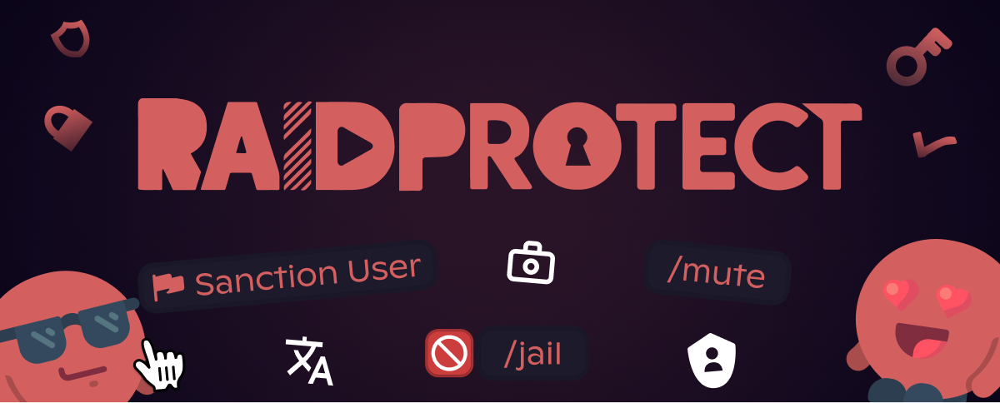

Version 3.3.1 bietet mehr Granularität in der Moderation mit **Jail**, **rollenbasiertem Mute**, der Möglichkeit für Mitglieder, ihre eigenen Sanktionen einzusehen, und der Einführung von **3 neuen Sprachen**.

<!--truncate-->

## 🔒 Neue Sanktion "Jail" {#jail}

Isoliere ein störendes Mitglied, ohne es zu bannen, mit dem neuen [Jail-"Gefängnis"-System](/features/sanctions#jail). Das Mitglied wird in einen dedizierten Kanal eingesperrt, ohne Zugang zum Rest des Servers:

- **[`/jail`](/features/moderation#jail)** : Sperre ein Mitglied sofort ein.
- **[`/tempjail`](/features/moderation#tempjail)** : Sperre ein Mitglied vorübergehend für eine bestimmte Dauer ein.
- **[`/unjail`](/features/moderation#unjail)** : Lasse ein Mitglied jederzeit frei.
- **Flexible Konfiguration** : Lege die Jail-Rolle und den Informationskanal direkt über `/settings` fest.

Jail ermöglicht es, heikle Situationen zu bewältigen und gleichzeitig mit dem betroffenen Mitglied zu kommunizieren, bevor eine endgültige Entscheidung getroffen wird.

---

## 🔇 Rollenbasiertes Mute: Über das Discord-Timeout hinaus {#mute}

Das Discord-Timeout ist praktisch, aber einschränkend: Es **blockiert alle Interaktionen** des Mitglieds, einschließlich Buttons und Menüs. Ein Mitglied im Timeout kann seine Sanktionen nicht einsehen, kein Ticket öffnen oder mit irgendeinem Element des Servers interagieren. Und die Dauer ist auf 28 Tage begrenzt.

Das neue [rollenbasierte Mute](/features/sanctions#mute) löst diese Probleme:

- Über einem [konfigurierbaren Schwellenwert](/features/sanctions#mute-threshold) weist der Bot automatisch eine **Mute-Rolle** anstelle des Discord-Timeouts zu. Das Mitglied kann nicht mehr schreiben, behält aber die Möglichkeit, Buttons und Menüs zu verwenden.
- Die Befehle `/timeout` und `/untimeout` werden zu [`/mute`](/features/moderation#timeout) und [`/unmute`](/features/moderation#untimeout) mit intelligentem Verhalten: **Unterhalb des Schwellenwerts wird das klassische Discord-Timeout verwendet**.
- Neuer Parameter `[force_timeout]`, um das Discord-Timeout unabhängig von der Dauer zu erzwingen.

---

## ⚡ Erweiterte Moderation {#moderation}

Dieses Update bringt neue Werkzeuge für den Alltag deiner Moderatoren und Mitglieder:

- **[Kontextmenü](/features/moderation#context-menu)** : Sanktioniere ein Mitglied mit einem einfachen Rechtsklick auf sein Profil, ohne einen Befehl einzugeben.
- **[`/my-sanctions`](/features/utilities#my-sanctions)** : Ermögliche deinen Mitgliedern, ihre eigenen Sanktionen einzusehen, mit einer [Datenschutz-Einstellung](/features/sanctions#sanctions-privacy) zur Zugriffskontrolle.
- **[Medienanzeige](/features/sanctions#show-medias)** in Sanktionsbegründungen: visuelle Beweise sind direkt sichtbar.
- **Überarbeitete Filter** in [`/sanctions search`](/features/sanctions#search) mit einem neuen Filter nach [Moderatortyp](/features/sanctions#search).
- **[Import / Export](/features/sanctions#import-export)** von Sanktionen über den Support-Bot.

---

## 🌍 RaidProtect spricht 3 neue Sprachen {#i18n}

Der Bot und seine Dokumentation sind jetzt in **[5 Sprachen](/language)** verfügbar:

- Deutsch
- Spanisch
- Portugiesisch

Diese Sprachen ergänzen Französisch und Englisch, die bereits verfügbar waren.

---

## 📰 Informationstafeln {#display}

Zeige [Informationstafeln](/features/display) in deinen Kanälen mit `/display public` an. RaidProtect generiert Nachrichten, die in alle von Discord unterstützten Sprachen übersetzt sind, um deinen Mitgliedern seine Funktionsweise zu erklären: Meldungen, Zugang zu Sanktionen, Gefängnis...

---

## ✨ Weitere Neuerungen in 3.3.1 {#changelog}

- **[Mitgliedersperrung](/features/utilities#block)** : Sperre bestimmten Mitgliedern den Zugang zu bestimmten RaidProtect-Funktionen mit [`/block add`](/features/utilities#block-add), [`/block remove`](/features/utilities#block-remove) und [`/block list`](/features/utilities#block-list).
- **[`/prune`](/features/utilities#prune)** : Entlasse inaktive Mitglieder mit präziseren Bedingungen.
- **[`/channel clear`](/features/utilities#channel-clear)** : Lösche und erstelle einen Kanal in einem Befehl neu.
- **Logs für `/bypass`** : Vollständige Nachverfolgung der `/bypass`-Befehle.
- **Anti-Scam** : Neues Modul zur Erkennung von Scam-Versuchen.

---

Für die vollständige Liste der Neuerungen, Bugfixes und technischen Details siehe [Changelog](/changelog#3-3-1).

:::tip 📚 Nützliche Ressourcen
- 🔗 [RaidProtect auf deinem Server hinzufügen](https://raidprotect.bot/invite)
- 📘 [Vollständige Dokumentation einsehen](https://docs.raidprotect.bot/)
- 💡 [Vorschlag oder Feedback einreichen](https://suggestions.raidprotect.bot/)
- 📣 [Ankündigungen folgen und Community beitreten](https://raidprotect.bot/discord)
:::
