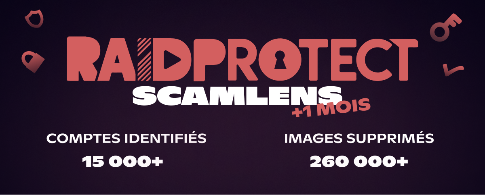
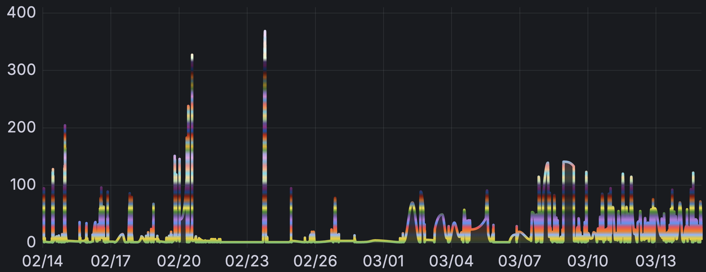

import Timestamp from '@site/src/components/Timestamp';

Einen Monat nach der [vorzeitigen Aktivierung von ScamLens](/de/blog/scamlens-early-activation), hier die ersten Erkennungsstatistiken für betrügerische Bilder auf Discord und einige Neuigkeiten.

{/* truncate */}

## 🔎 Was ist ScamLens? {#what-is-scamlens}

ScamLens ist **RaidProtects Anti-Scam-Modul**. Es analysiert automatisch Bilder, die auf eurem Discord-Server gesendet werden, und **entfernt solche, die als betrügerisch identifiziert wurden** — ohne Konfiguration. Es richtet sich hauptsächlich gegen **Kryptowährungs**-, **Krypto-Casino**- und **Fake-Investment**-Betrug, der massenhaft über gehackte Discord-Konten verbreitet wird.

So sehen diese Bilder aus:

  
  
  
  

## 📊 Bilanz nach 1 Monat {#stats}

Seit dem <Timestamp value={1771023600} format="D" /> analysiert ScamLens kontinuierlich Bilder auf allen 340.000 von RaidProtect geschützten Discord-Servern. Hier sind die Zahlen:

| **Kennzahl** | **Wert** |
|---|---|
| Analysierte Bilder (einzigartig) | **162.000** |
| Erkannte Scam-Bilder (einzigartig) | **62.000** |
| Entfernte betrügerische Bilder | **260.000** |
| Identifizierte Konten | **15.000** |

**Mehr als eines von drei analysierten Bildern ist betrügerisch.**

Im Gegensatz zu den [anfänglichen Wellen](/de/blog/scamlens-early-activation#threat), die sich als **massive, konzentrierte Spitzen** über 1-Stunden-Fenster manifestierten, ist die Aktivität über einen Monat hinweg viel gleichmäßiger verteilt. Die Erkennungen bleiben zahlreich, aber kontinuierlich verteilt statt in wenigen intensiven Schüben gebündelt.

---

## 🆕 Neuigkeiten {#updates}

### 🪵 Erkennungs-Logs {#logs}

ScamLens hat nun einen **dedizierten Log**: Jede Erkennung eines betrügerischen Bildes erzeugt eine Nachricht in eurem Logs-Kanal, mit dem betroffenen Mitglied und dem Zielkanal. Ihr wisst genau, was der Bot abgefangen hat — ohne zusätzliche Konfiguration.

### 🔍 Erweiterte Abdeckung {#coverage}

Einige Bilder entgingen bisher der Analyse, weil sie vom Discord-CDN anders ausgeliefert wurden. ScamLens deckt diese Fälle nun ebenfalls ab.

---

## ❓ FAQ {#faq}

#### Warum erscheinen Bild-Scams auf meinem Discord-Server? {#pourquoi-scam-images}
Diese Bilder werden von **gehackten Discord-Konten** gesendet. Betrüger kompromittieren Konten und nutzen sie dann, um so viele Server wie möglich gleichzeitig zu spammen. Euer Server ist **nicht gezielt ausgewählt** — er ist Teil der Masse. Ein einziges gehacktes Konto kann **Dutzende von Servern in Sekunden** erreichen, weshalb automatisches Entfernen so wichtig ist.

#### Wie schütze ich meinen Discord-Server vor Scams? {#proteger-serveur-scam-discord}
[Fügt RaidProtect](https://raidprotect.bot/invite) zu eurem Server hinzu. ScamLens ist standardmäßig aktiv und entfernt automatisch als betrügerisch erkannte Bilder, ohne Konfiguration.

#### Entwickeln sich Scam-Bilder, um die Erkennung zu umgehen? {#evolution-scam}
Ja, die Techniken ändern sich regelmäßig. ScamLens wird kontinuierlich aktualisiert, um mit diesen Entwicklungen Schritt zu halten.

---

:::tip 📚 Nützliche Links
- 🔗 [RaidProtect zu eurem Server hinzufügen](https://raidprotect.bot/invite)
- 📘 [Die vollständige Dokumentation einsehen](https://docs.raidprotect.bot/)
- 💡 [Einen Vorschlag oder Feedback einreichen](https://suggestions.raidprotect.bot/)
- 📣 [Ankündigungen folgen und der Community beitreten](https://raidprotect.bot/discord)
:::
