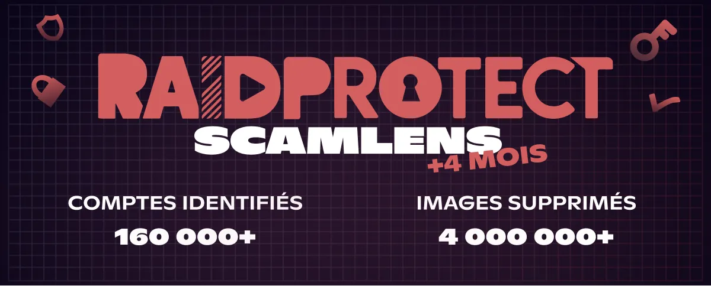

import Timestamp from '@site/src/components/Timestamp';
import Head from '@docusaurus/Head';

Bilanz Juni 2026 auf den **375.000 Discord-Servern**, die von RaidProtect geschützt werden (vom 1. Juni bis 1. Juli 2026): **4 Millionen Scam-Bilder entfernt** durch ScamLens und **160.000 gehackte Discord-Konten** identifiziert. Diese Scams **missbrauchen das Image von Prominenten** wie MrBeast, Elon Musk oder Andrew Tate, die natürlich nichts mit diesen Nachrichten zu tun haben. Neu in diesem Monat: ScamLens **sanktioniert jetzt bereits beim ersten erkannten Bild**, statt erst die ganze Welle zu bereinigen, um ein gehacktes Konto abzuschneiden, bevor es weitere Bilder posten kann.

{/* truncate */}

## 🛰️ Erinnerung: ScamLens, der Bild-Anti-Scam von RaidProtect {#what-is-scamlens}

Für Server, die RaidProtect gerade erst entdecken: ScamLens ist das Modul, das **Scam-Bilder** verarbeitet. Sobald ein Bild gepostet wird, gleicht es dieses mit seinem Katalog ab und **entfernt** automatisch die betrügerischen: **Krypto-Scams**, **gefälschte Promi-Giveaways** (MrBeast, Elon Musk, Andrew Tate, Kick, Stake…), **falsche Online-Casino-Werbung**. Nichts einzurichten oder zu pflegen auf Ihrer Seite: ScamLens läuft **standardmäßig**, sobald Sie [RaidProtect hinzufügen](https://raidprotect.bot/de/invite).

  
  
  
  

## 📊 ScamLens-Bilanz seit dem 14. Februar 2026 {#stats}

Kumulierte Daten seit der [vorzeitigen Aktivierung von ScamLens](/de/blog/scamlens-early-activation) am <Timestamp value={1771023600} format="D" />:

| **Kennzahl (kumuliert seit dem 14. Februar)** | **1. Juni 2026** | **1. Juli 2026** | **Entwicklung** |
|---|---|---|---|
| Analysierte Bilder (einzigartig) | 1.800.000 | **3.000.000** | **+67 %** |
| Erkannte Scam-Bilder (einzigartig) | 141.000 | **275.000** | **+95 %** |
| Entfernte betrügerische Bilder | 2.300.000 | **4.000.000** | **+74 %** |
| Identifizierte gehackte Discord-Konten | 80.000 | **160.000** | **+100 %** |

Die Zahl der **identifizierten gehackten Konten hat sich erneut verdoppelt** in einem Monat (80.000 → 160.000), und das Volumen der entfernten Bilder erreicht nun **4 Millionen**. Der Katalog einzigartiger Bilder wächst ebenfalls stark (+95 %): **neue visuelle Cluster** tauchen weiterhin massenhaft auf. Ein visuelles Cluster ist ein und dasselbe Scam-Bild **plus all seine Mikro-Varianten** (Zuschnitte, Filter, Retuschen); wenn die Zahl der einzigartigen Bilder so stark steigt, werden **neue Visuals** gestartet, nicht nur Ableger der alten (siehe den [„3-Bilder"-Combo](/de/blog/threat-weather-may-2026#updates) vom Mai).

---

## 🆕 Neu: Sanktion ab dem ersten Bild {#updates}

Bisher hat ScamLens, wenn ein gehacktes Konto eine Bilderwelle ausschüttete, **zuerst alle Nachrichten entfernt** und dann die Sanktion angewandt (24-Std.-Timeout). Der Haken: Während dieser Bereinigung konnte das Konto noch **einige Sekunden weiter posten**.

Jetzt **drehen wir die Reihenfolge um**: Sobald ScamLens **das erste Scam-Bild** erkennt, **sanktioniert es das Konto sofort** (24-Std.-Timeout) und bereinigt *danach* den Rest der Welle. Der Zugang des gehackten Kontos wird **schon beim ersten Bild** gekappt, ohne ihm Zeit zu lassen, weitere zu senden.

Bei großen Spitzen (über 2.000 Bilder in wenigen Minuten) reduziert das die Zahl der Bilder, die vor der Sanktion die Kanäle erreichen, deutlich. Jedes Bild wird weiterhin in **~400 ms** verarbeitet, und der rechtmäßige Besitzer erhält nach Ablauf des Timeouts wieder die Kontrolle: Denken Sie daran, es ist **fast immer ein Hacking-Opfer**, kein böswilliges Mitglied.

---

## ❓ FAQ {#faq}

<Head>
  
</Head>

#### Was ist ScamLens auf Discord? {#quest-ce-que-scamlens}
ScamLens ist das **Bild-Anti-Scam**-Modul von RaidProtect, dem **Schutz-Bot für Discord**. Es analysiert jedes gepostete Bild in Echtzeit und **entfernt automatisch** diejenigen, die es als betrügerisch einstuft (Krypto-Scams, gefälschte Promi-Giveaways, falsche Online-Casino-Werbung), **ganz ohne Konfiguration**.

#### Löscht ScamLens die Bilder oder sanktioniert es zuerst das Konto? {#suppression-ou-sanction}
Seit Juni 2026 **sanktioniert ScamLens das Konto bereits beim ersten** erkannten Scam-Bild (24-Std.-Timeout) und bereinigt *danach* den Rest der Welle. Zuvor wurden erst alle Nachrichten gelöscht, bevor sanktioniert wurde, was ein gehacktes Konto noch einige Bilder mehr posten ließ.

#### Warum sendet mein Discord-Konto von selbst Scam-Nachrichten? {#compte-discord-envoie-messages-seul}
Ihr Konto wurde höchstwahrscheinlich **gehackt**. Betrüger stehlen Ihr **Authentifizierungs-Token** (gefälschte Seite, infizierte Software, bösartige Erweiterung) und nutzen es, um Scam-Bilder auf **allen Servern zu spammen, in denen Sie sind**, ohne dass Sie es wissen.

#### Was soll ich tun, wenn ein Mitglied meines Discord-Servers einen Krypto-Scam verbreitet? {#membre-diffuse-scam-crypto}
**Bannen Sie es nicht**: Es ist fast immer ein **gehacktes Konto**, kein böswilliger Nutzer. Kontaktieren Sie die Person privat, damit sie ihr Konto absichert. ScamLens entfernt das Bild bereits im Flug, ohne den rechtmäßigen Besitzer zu bestrafen.

#### Wie erkenne ich ein gefälschtes Giveaway oder eine falsche Krypto-Werbung auf Discord? {#reconnaitre-fausse-promo-crypto}
Jedes **Krypto-"Geschenk"**, **Online-Casino** mit Promi-Logo (MrBeast, Elon Musk, Andrew Tate, Kick, Stake) oder **"garantierte" Investment** ist ein Scam. **Diese Persönlichkeiten stecken nicht hinter diesen Nachrichten**: Die Betrüger missbrauchen einfach ihr Image und ihre Bekanntheit. Discord verteilt niemals Kryptowährungen, und keine seriöse Marke spammt über mehrere Server.

---

:::tip 📚 Nützliche Ressourcen
- 🔗 [RaidProtect zu deinem Server hinzufügen](https://raidprotect.bot/de/invite)
- 📘 [HoneyPot-Dokumentation](https://docs.raidprotect.bot/de/features/honeypot)
- 💡 [Einen Vorschlag einreichen](https://suggestions.raidprotect.bot/)
- 📣 [Tritt unserem Discord-Server bei](https://raidprotect.bot/discord)
:::
