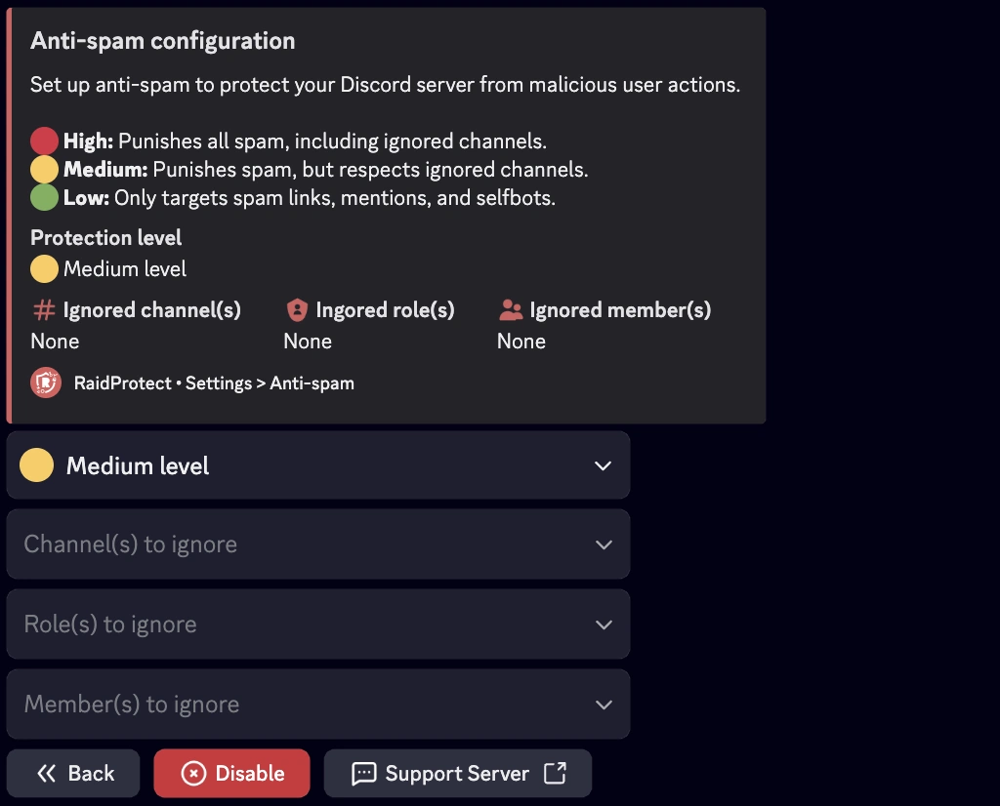
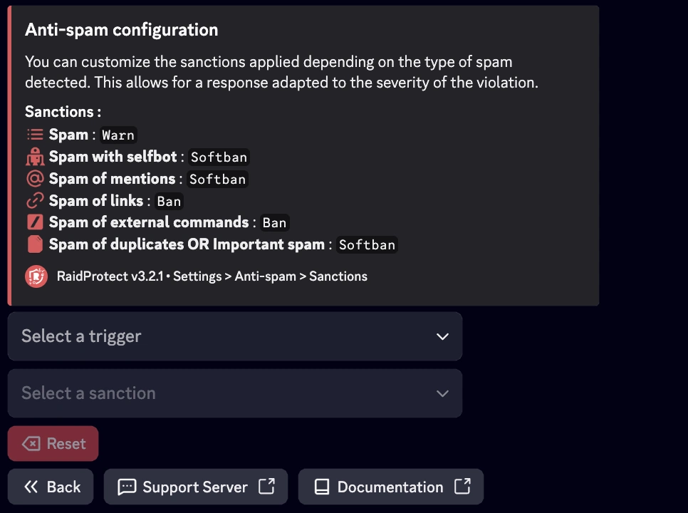
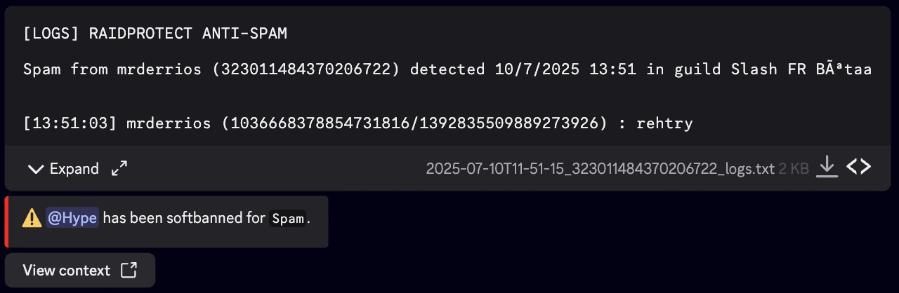
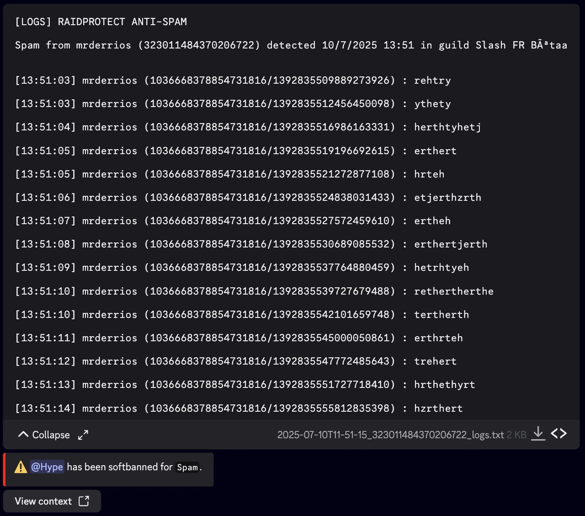

import SeparatedBox from '@site/src/components/SeparatedBox';
import Tabs from '@theme/Tabs';
import TabItem from '@theme/TabItem';

Der Anti-Spam von RaidProtect ist ein leistungsstarkes Werkzeug, um Spam auf Ihrem Discord-Server zu verhindern. Dank seines automatischen Erkennungssystems kümmert er sich selbstständig um Probleme, ohne dass Sie eingreifen müssen.

## ❓ Funktionsweise des Anti-Spam {#working}

Der Anti-Spam von RaidProtect erkennt und blockiert automatisch verdächtiges Verhalten. Er unterscheidet zwischen zwei Arten von Spam.
- **Schwerer Spam:** Nachrichten mit Einladungslinks, Massen-Erwähnungen oder Bildern. Diese Spams werden häufig bei Raids verwendet.
- **Leichter Spam:** Häufig gesendete, aber weniger aufdringliche Nachrichten.

Der Anti-Spam von RaidProtect handelt auf zwei Arten.
- **Sanktionen:** Automatisches Kicken oder Bannen von Spammern.
- **Benachrichtigungen:** Senden von Nachrichten an den Log-Kanal, um blockierten Spam mit einer Vorschau der erkannten Aktionen zu melden.

## 🛡️ Anti-Spam-Konfiguration {#config}

RaidProtect bietet drei Sicherheitsstufen, um den Bedürfnissen Ihres Servers gerecht zu werden.
- 🔴 **Hoch:** Sanktioniert allen Spam und sogar schweren Spam in ignorierten Kanälen.
- 🟠 **Mittel:** Sanktioniert allen Spam, respektiert aber ignorierte Kanäle.
- 🟢 **Niedrig:** Sanktioniert nur schweren Spam.

### Sicherheitsstufe ändern {#level}

1. Führen Sie den [`/settings`-Befehl](../setup.md#settings) aus.
2. Klicken Sie auf die Schaltfläche "**Anti-spam**".
3. Wählen Sie die gewünschte Anti-Spam-Stufe im ersten Selektor.

### Ignorierte Rollen, Benutzer und Kanäle verwalten {#ignore}

Sie können bestimmte Kanäle, Rollen oder sogar Benutzer von der Anti-Spam-Überwachung ausschließen, um mehr Flexibilität zu erhalten. 😉
1. Führen Sie den [`/settings`-Befehl](../setup.md#settings) aus.
2. Klicken Sie auf die Schaltfläche "**Anti-spam**".
3. Wählen Sie die verschiedenen Optionen zum Ignorieren in den jeweiligen Selektoren:
- Zu ignorierende(r) Kanal/Kanäle
- Zu ignorierende Rolle(n)
- Zu ignorierende(s) Mitglied(er)

:::info
Kanäle, die "**spam**" in ihrem Namen enthalten, werden automatisch ignoriert. Benutzer mit Administratorberechtigung werden vollständig ignoriert.
:::

### Sanktionen nach Auslöser konfigurieren {#triggers}

Sie können die angewendeten Sanktionen je nach Art des erkannten Spams anpassen. Dies ermöglicht eine der Schwere des Verstoßes angemessene Reaktion.

1. Führen Sie den [`/settings`-Befehl](../setup.md#settings) aus.
2. Klicken Sie auf die Schaltfläche "**Anti-spam**".
3. Gehen Sie zum Tab "**Sanktionen**".
4. Wählen Sie für jeden Auslöser eine bestimmte Sanktion. Sie können diese Werte über die Dropdown-Menüs ändern:
- **Einen Trigger auswählen**: Wählen Sie die Art des zu konfigurierenden Spams.
- **Eine Sanktion auswählen**: Wählen Sie die entsprechende Sanktion.

#### Sanktionsarten und Auslöser {#sanctions}

Hier sind die verschiedenen **verfügbaren Sanktionen** sowie die **Auslöser (Triggers)**, die RaidProtect erkennen kann, mit der **Standard-Timeout-Dauer** falls zutreffend:

- **Warn**: Sendet eine Verwarnung an das Mitglied.
- **Kick**: Kickt das Mitglied vom Server.
- **Timeout**: Stummschaltung des Mitglieds für eine festgelegte Dauer.
- **Softban**: Bannt und entbannt das Mitglied sofort, wodurch seine Nachrichten gelöscht werden.
- **Ban**: Bannt das Mitglied dauerhaft.

| Auslöser (Trigger)                    | Beschreibung                                            | Timeout-Dauer      |
|----------------------------------------|---------------------------------------------------------|--------------------|
| Spam                                   | Wiederholtes Senden von Nachrichten                     | 1 Minute           |
| Selfbot-Spam                           | Verwendung von Selfbots zum Spammen                     | 1 Stunde           |
| Erwähnungs-Spam                        | Wiederholte Massen-Erwähnungen                          | 30 Minuten         |
| Link-Spam                              | Massenhaftes Senden von Links                           | 24 Stunden         |
| Externer Befehls-Spam                  | Verwendung externer Befehle zum Spammen                 | 1 Stunde           |
| Duplikat-Spam oder schwerer Spam       | Kopierte Nachrichten oder übermäßiger Spam              | 24 Stunden         |

#### Dauer der Sanktionen {#duration}

Wenn die vom Anti-Spam verhängten Sanktionen eine Dauer unterstützen (Mute, Timeout, Jail), können Sie eine **einheitliche Dauer** definieren, die auf alle diese Sanktionen angewendet wird, anstatt die Standarddauer jedes Auslösers beizubehalten.

1. Führen Sie den [`/settings`-Befehl](../setup.md#settings) aus.
2. Klicken Sie auf die Schaltfläche "**Anti-spam**".
3. Gehen Sie zum Tab "**Sanktionen**".
4. Wählen Sie eine vordefinierte Dauer im Selektor "**Dauer der Sanktionen**" oder klicken Sie auf "**Benutzerdefinierte Dauer**", um den gewünschten Wert einzugeben (z. B. `30m`, `2h`, `7d`).

:::info
Die Dauer wird für Sanktionen ignoriert, die keine unterstützen (Kick, Softban, Ban, Warn).
:::

## 📑 Anti-Spam-Logs {#logs}

Detaillierte Logs werden mit allen vom Anti-Spam gelöschten Nachrichten generiert. Sie können den Inhalt einfach herunterladen oder ausklappen.

<SeparatedBox>
<Tabs>
  <TabItem value="animator" label="Eingeklappt" default>

  </TabItem>
  <TabItem value="moderator" label="Ausgeklappt">

  </TabItem>
</Tabs>
</SeparatedBox>
