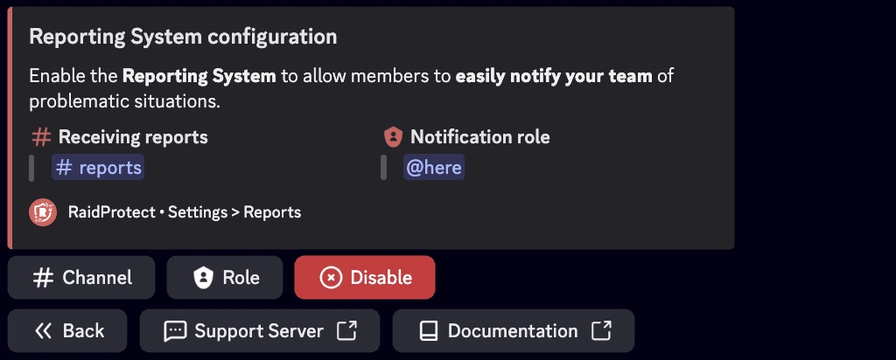

Das Meldesystem von RaidProtect ermöglicht deiner Community, problematische Inhalte oder verdächtige Nutzer schnell zu melden. Es funktioniert auf zwei Arten und lässt sich konfigurieren, um die Bearbeitung der Meldungen zu optimieren.

## ❓ Wie das Melden funktioniert {#working}
Mitglieder können auf drei Hauptwegen Meldungen abgeben.

1. **Rechtsklick auf eine Nachricht**
Ein Mitglied kann eine Nachricht, die gegen die Regeln verstößt, mit Rechtsklick auswählen, **`Anwendungen`** wählen und dann auf **`Nachricht melden`** klicken. Daraufhin erscheint ein Popup, in dem eine Erklärung hinzugefügt werden kann.

2. **Rechtsklick auf ein Profil**
Ebenso kann ein Mitglied ein problematisches Profil mit Rechtsklick auswählen, **`Anwendungen`** wählen und dann auf **`Mitglied melden`** klicken. Ein Popup öffnet sich, damit der Nutzer weitere Details zur Situation angeben kann.

3. **Slash-Befehl**
Mitglieder können auch eine Nachricht oder einen Nutzer über den Befehl **`/report`** in einem beliebigen Serverkanal melden.

Verwende den Befehl: ```/report [@user] [reason]```

Ersetze `[@user]` durch den gewünschten Nutzer und `[reason]` durch den Grund des Verstoßes.

## 🚩 Meldungen konfigurieren {#config}

Bevor das Meldesystem vollständig funktioniert, muss ein **Meldekanal** eingerichtet werden, in dem alle Meldungen eingehen. Außerdem solltest du einen Log- oder Benachrichtigungskanal festlegen, um über Meldungen informiert zu werden.



### Den Kanal einrichten {#config-channel}

1. Nutze den [Befehl `/settings`](../setup.md#settings).
2. Wähle die Schaltfläche **Reports**.
3. Klicke auf **Channel**.
4. Wähle den gewünschten Kanal (z. B. #reports).
   Wenn du keinen passenden Kanal hast, kannst du über **Create one for me** automatisch einen erstellen lassen.

### Die Benachrichtigungsrolle festlegen {#config-role}

1. Nutze den [Befehl `/settings`](../setup.md#settings).
2. Wähle die Schaltfläche **Reports**.
3. Klicke auf **Role**.
4. Wähle die gewünschte Rolle (z. B. @Moderator oder @Report Ping).
   Wenn du keine passende Rolle hast, kannst du sie über **Create one for me** automatisch erstellen lassen.

:::warning
Der Kanal sollte auf Moderatoren und Administratoren beschränkt sein, um eine ordnungsgemäße Bearbeitung der Meldungen zu gewährleisten.
:::

## Meldungen verwalten {#manage}

Als Community-Moderator kannst du eine Meldung annehmen oder ablehnen.

- **✅ Meldung annehmen:** Wenn die Meldung berechtigt ist, klicke unter der Benachrichtigung auf „Accept“. Dieser Button löst keine spezielle Aktion aus, zeigt aber anderen Moderatoren, dass du die Meldung bearbeitest und fördert so die Koordination.

- **👁️ Kontext anzeigen:** Um die gemeldete Nachricht im Zusammenhang zu sehen, klicke unter der Benachrichtigung auf „View Message“.

- **❌ Meldung ablehnen:** Wenn die Meldung unbegründet ist, klicke unter der Benachrichtigung auf „Reject“. Auch hier ist keine spezielle Aktion hinterlegt; andere Moderatoren sehen lediglich deine Entscheidung.

:::note
Stelle sicher, dass deine Moderatoren im Umgang mit dieser Funktion geschult sind, und ermutige deine aktiven Mitglieder, sie verantwortungsvoll zu nutzen!
:::
