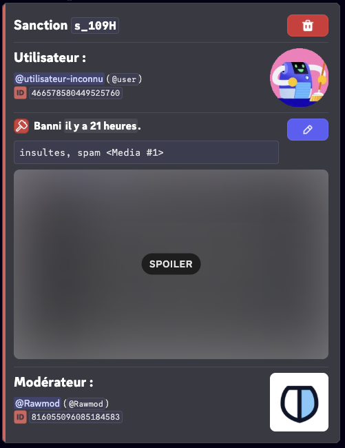
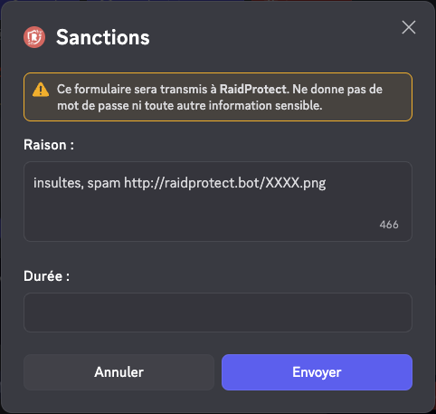
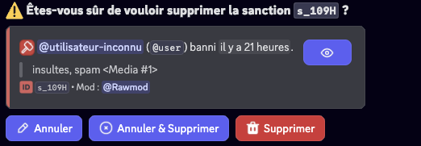
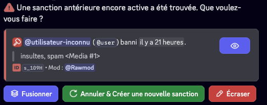
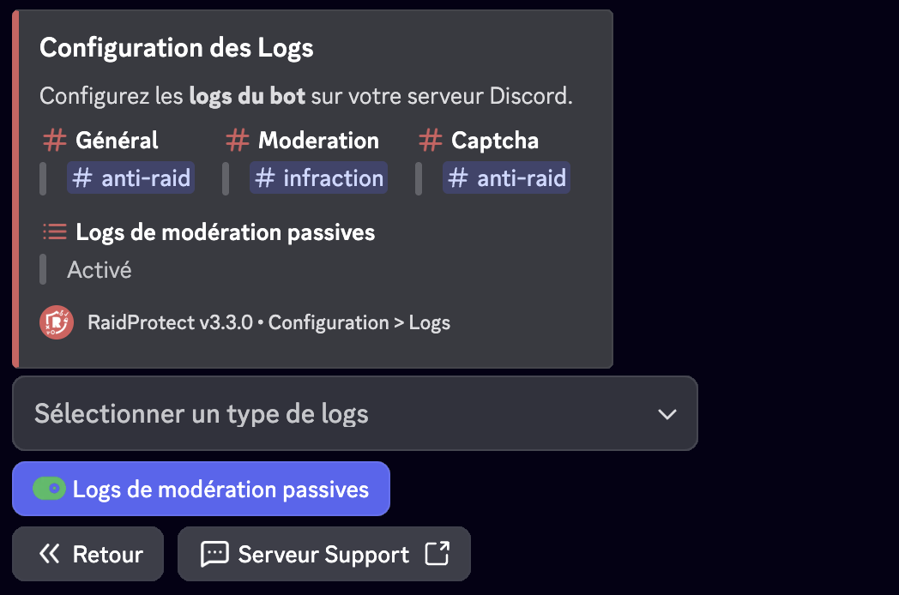
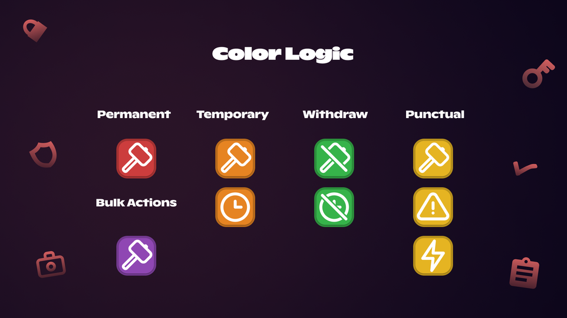

import Icon from "@site/src/components/Icon";

Der Sanktionsverlauf von RaidProtect ermöglicht es dir, alle auf deinem Server verhängten Sanktionen zu verfolgen und zu verwalten. Dieses System zentralisiert alle Moderationsaktionen in einer durchsuchbaren und bearbeitbaren Datenbank und erleichtert so die Arbeit deines Moderationsteams.

## ❓ Funktionsweise des Verlaufs {#working}

Der Sanktionsverlauf zeichnet automatisch alle auf deinem Server durchgeführten Moderationsaktionen auf:

- **Manuelle Sanktionen**: Alle Moderationsbefehle (`/ban`, `/tempban`, `/kick`, `/timeout`, `/warn`) werden automatisch im Verlauf gespeichert.
- **Automatische Sanktionen**: Von Anti-Spam verhängte Sanktionen werden ebenfalls dem Sanktionsverlauf hinzugefügt.
- **Verbannungen, Kicks und Timeouts**: Sanktionen, die ohne RaidProtect verhängt wurden, werden dem Verlauf hinzugefügt.
- **Discord Automod**: Sanktionen, die von Discords Automod verhängt wurden, werden ebenfalls hinzugefügt.
- **Sanktionsbenachrichtigungen**: Sanktionierte Mitglieder erhalten eine private Nachricht, die sie über die Sanktion und deren Grund informiert. Der Bot sendet außerdem eine detaillierte Empfangsbestätigung, die den Versandstatus bestätigt: **empfangen**, **DMs geschlossen**, **abgelaufen** oder **silent** (wenn die Option `[silent]` verwendet wird). Bei Kicks, Softbans und temporären Bans enthält diese Nachricht zudem eine **Schaltfläche mit einer Server-Einladung**, damit das Mitglied nach Ablauf der Sanktion zurückkehren kann.

:::info
Alle aufgezeichneten Sanktionen enthalten: den sanktionierten Benutzer, den verantwortlichen Moderator, den Grund (bis zu 512 Zeichen), Datum und Uhrzeit sowie die Art der Sanktion und ob der Benutzer benachrichtigt wurde.
:::

## 🔍 Sanktionen suchen {#search}

Der Befehl `/sanctions search` ermöglicht es dir, Sanktionen im Verlauf nach verschiedenen Kriterien zu suchen.

Verwende den Befehl: ```/sanctions search [benutzer] [moderator] [typ] [datum] [status] [moderator_typ]```

- `[benutzer]`: Alle Sanktionen eines bestimmten Benutzers suchen.
- `[moderator]`: Alle Sanktionen suchen, die von einem bestimmten Moderator verhängt wurden.
- `[typ]`: Nach Sanktionstyp filtern (Ban, Softban, Unban, Kick, Timeout, Untimeout, Warn, Jail, Unjail, Mute, Unmute).
- `[datum]`: Nach Sanktionsdatum filtern.
- `[status]`: Nach Sanktionsstatus filtern (Aktiv, Abgelaufen, Abgebrochen, Fehlgeschlagen).
- `[moderator_typ]`: Nach Moderator-Typ filtern (Menschliche Aktionen, Automatisierte Aktionen, RaidProtect, Discord, Antispam usw.).


:::tip
Du kannst mehrere Kriterien kombinieren, um deine Suche zu verfeinern. Suche beispielsweise nach allen Verbannungen, die von einem bestimmten Moderator durchgeführt wurden.
:::

## ℹ️ Eine Sanktion anzeigen {#info}

Der Befehl `/sanctions info` ermöglicht es dir, detaillierte Informationen über eine bestimmte Sanktion zu erhalten.

Verwende den Befehl: ```/sanctions info (id)```

Ersetze `(id)` durch die Kennung der Sanktion, die du anzeigen möchtest.



## ✏️ Eine Sanktion bearbeiten {#edit}

Der Befehl `/sanctions edit` ermöglicht es dir, den Grund einer bestehenden Sanktion zu ändern, nützlich zur Korrektur eines Fehlers oder zum Hinzufügen von Details.

Verwende den Befehl: ```/sanctions edit (id) (neuer_grund)```

Ersetze `(id)` durch die Kennung der zu ändernden Sanktion und `(neuer_grund)` durch den neuen Grund (maximal 512 Zeichen).



:::warning
Das Bearbeiten einer Sanktion aktualisiert den Eintrag im Verlauf, ändert jedoch nicht die auf Discord verhängte Sanktion (zum Beispiel bleibt ein verbannter Benutzer verbannt).
:::

## 🗑️ Eine Sanktion löschen {#delete}

Der Befehl `/sanctions delete` ermöglicht es dir, eine Sanktion aus dem Verlauf zu löschen. Diese Aktion ist unwiderruflich.

Verwende den Befehl: ```/sanctions delete (id) [grund]```

Ersetze `(id)` durch die Kennung der zu löschenden Sanktion. Der Parameter `[grund]` ermöglicht es, **die Löschung zu rechtfertigen**, was in den Logs gespeichert wird.



## Sanktionsstatus {#status}

Sanktionen können unterschiedliche Status haben:

| **Status**       | **Emojis**                                                                                                                  | **Bedeutungen**                                              |
| ---------------- | ----------------------------------------------------------------------------------------------------------------------------| ------------------------------------------------------------ |
| `Aktiv`          | <Icon src="/img/icons/SanctionStatusACTIVE.svg" alt="icon SanctionStatusACTIVE" title=":iconSanctionStatusACTIVE:"/>        | Die Sanktion ist aktiv.                                      |
| `Abgelaufen`     | <Icon src="/img/icons/SanctionStatusEXPIRED.svg" alt="icon SanctionStatusEXPIRED" title=":iconSanctionStatusEXPIRED:"/>     | Die Sanktion ist abgelaufen.                                 |
| `Abgebrochen`    | <Icon src="/img/icons/SanctionStatusCANCELED.svg" alt="icon SanctionStatusCANCELED" title=":iconSanctionStatusCANCELED:"/>  | Die Sanktion wurde von einem Moderator aufgehoben.           |
| `Fehlgeschlagen` | <Icon src="/img/icons/SanctionStatusFAILED.svg" alt="icon SanctionStatusFAILED" title=":iconSanctionStatusFAILED:"/>        | Die Sanktion ist fehlgeschlagen (fehlende Berechtigungen).   |

### Verwaltung von Duplikaten {#duplicates}

Wird eine aktive, bereits bestehende Sanktion gefunden, kannst du:

- **Zusammenführen** der beiden Sanktionen: Die Dauer wird -- sofern möglich -- addiert und die Gründe werden zusammengeführt.
- **Abbrechen** der aktiven Sanktion und Erstellen einer neuen Sanktion.
- **Überschreiben** der aktiven Sanktion mit den Informationen der neu eingegebenen Sanktion.



## ⚙️ Konfiguration der Sanktionen {#config}

### Sanktionen deaktivieren {#disable}

Du kannst das **Sanktionssystem auf deinem Server vollständig deaktivieren**. Wenn die Sanktionen deaktiviert sind, zeichnet RaidProtect keine Sanktionen mehr im Verlauf auf, und die zugehörigen Befehle sind nicht verfügbar.

1. Nutze den [Befehl `/settings`](../setup.md#settings).
2. Klicke auf die Schaltfläche "**Sanktionen**".
3. Klicke auf "**Sanktionssystem**", um das gesamte Modul zu aktivieren oder zu deaktivieren.

### Jail {#jail}

Konfiguriere die **Jail**, um eine rollenbasierte Moderationssanktion zu aktivieren, die restriktiver ist als ein herkömmlicher Mute. Einmal konfiguriert, ermöglicht diese Rolle, ein Mitglied mit stark eingeschränkten Berechtigungen zu isolieren, und schaltet die Verwendung der Befehle [`/jail`](./moderation.mdx#jail) und [`/tempjail`](./moderation.mdx#tempjail) frei.

1. Nutze den [Befehl `/settings`](../setup.md#settings).
2. Klicke auf die Schaltfläche "**Sanktionen**".
3. Wähle "**Jail**".
4. Wähle eine bestehende Rolle im Auswahlmenü oder klicke auf "**Einen für mich erstellen**".

Bei der Erstellung der Rolle kannst du auch den **Jail-Informationskanal** konfigurieren:

- **Einen bestehenden Kanal auswählen**, um dort Informationen für Mitglieder in der Jail anzuzeigen.
- **Einen neuen Kanal erstellen**, indem du einen Namen angibst (Standard: `eingeschränkter-zugang`).

Dieser Kanal entspricht dem reservierten Platz in den [Informationspanels](./display.mdx), der automatisch durch die Jail-Konfiguration verwaltet wird.

:::info
Wenn bereits eine Jail-Rolle konfiguriert ist, kannst du den Informationskanal über die entsprechende Schaltfläche im Jail-Untermenü ändern.
:::

#### Rollen während der Jail {#jail-roles}

Im Jail-Untermenü steuert die Schaltfläche **Rollen während der Jail**, was RaidProtect mit den Rollen des Mitglieds tut, wenn es eingesperrt ist. Zwei Modi:

- **Jail-Rolle hinzufügen** *(Standard)*: Die Jail-Rolle wird einfach zusätzlich zu den vorhandenen Rollen des Mitglieds hinzugefügt.
- **Durch die Jail-Rolle ersetzen**: RaidProtect **entfernt während der Inhaftierung alle Rollen des Mitglieds** und stellt sie ihm bei der Freilassung wieder her. Strenger; das verhindert, dass eine Rolle mit expliziten Berechtigungen die Einschränkungen der Jail-Rolle umgeht.

Klicke auf die Schaltfläche, um zwischen den beiden Modi zu wechseln.

### Mute-Rolle {#mute}

Konfiguriere die **Mute-Rolle**, um eine rollenbasierte Sanktion anstelle des Discord-Timeouts für längere Zeiträume zu verwenden. Wenn die Mute-Dauer den definierten Schwellenwert überschreitet, weist der Bot dem betroffenen Mitglied automatisch die Mute-Rolle zu, anstatt ein Discord-Timeout anzuwenden.

1. Nutze den [Befehl `/settings`](../setup.md#settings).
2. Klicke auf die Schaltfläche "**Sanktionen**".
3. Wähle "**Mute-Rolle**".
4. Wähle eine bestehende Rolle im Auswahlmenü oder klicke auf "**Einen für mich erstellen**".

#### Mute-Schwellenwert {#mute-threshold}

Konfiguriere den **Mute-Rollen-Schwellenwert**, um festzulegen, ab welcher Dauer der Bot einen rollenbasierten Mute anstelle des Discord-Timeouts verwendet. Wenn die Mute-Dauer diesen Schwellenwert überschreitet, wird die Mute-Rolle automatisch angewendet. Ein Wert von 0 deaktiviert die Verwendung des Timeouts vollständig.

1. Nutze den [Befehl `/settings`](../setup.md#settings).
2. Klicke auf die Schaltfläche "**Sanktionen**".
3. Wähle "**Mute-Schwellenwert**".
4. Wähle einen Wert im Auswahlmenü oder gib einen benutzerdefinierten Wert ein.

:::info
Die 28-Tage-Grenze für das Timeout wird von Discord vorgegeben. Über diese Dauer hinaus wird die Mute-Rolle systematisch verwendet, sofern konfiguriert.
:::
:::info
Die **von Discords AutoMod verhängten Timeouts** werden automatisch in rollenbasiertes Mute umgewandelt, wenn ihre Dauer den konfigurierten Schwellenwert überschreitet, um Konsistenz mit deinen manuellen Sanktionen zu gewährleisten. Die Dauer bleibt auf 28 Tage beschränkt (Discord-Limit).

Diese Funktion befindet sich derzeit in **öffentlicher Beta für Premium-Server**.
:::

### Vertraulichkeit der Sanktionen {#sanctions-privacy}

Konfiguriere die Vertraulichkeitsstufe der Sanktionen, um zu steuern, auf welche Informationen Mitglieder bezüglich **ihrer eigenen Sanktionen** zugreifen können, über den Befehl [`/my-sanctions`](./utilities.mdx#my-sanctions) oder die Schaltfläche **Meine Sanktionen einsehen**.

1. Nutze den [Befehl `/settings`](../setup.md#settings).
2. Klicke auf die Schaltfläche "**Sanktionen**".
3. Wähle "**Vertraulichkeit der Sanktionen**".
4. Wähle die gewünschte Zugangsstufe:

| **Stufe**                             | **Beschreibung**                                                                                    |
| ------------------------------------- | --------------------------------------------------------------------------------------------------- |
| Deaktiviert                           | Mitglieder können ihre persönlichen Sanktionen nicht einsehen.                                      |
| Nur Sanktionen                        | Mitglieder können nur ihre Sanktionen und die verbleibende Zeit einsehen, falls zutreffend.         |
| Mit Gründen                           | Mitglieder können ihre Sanktionen mit Gründen einsehen, ohne die Identität des Moderators.          |
| Mit Gründen und Moderatoren           | Mitglieder können alle Informationen einsehen: Sanktionen, Gründe und Moderatoren.                  |

:::note
Unabhängig von der gewählten Stufe behalten **Moderatoren vollen Zugriff** auf den Sanktionsverlauf über die Moderationswerkzeuge.
:::

### Medien anzeigen {#show-medias}

Konfiguriere die Anzeige von Medien in Sanktionsgründen. Wenn diese Option deaktiviert ist, werden Links mit den folgenden Endungen automatisch aus den Sanktionsgründen entfernt, wenn sie Mitgliedern angezeigt werden (über [`/my-sanctions`](./utilities.mdx#my-sanctions) oder Sanktionsbenachrichtigungen):

`png`, `jpg`, `jpeg`, `gif`, `webp`, `webm`, `mp4`

1. Nutze den [Befehl `/settings`](../setup.md#settings).
2. Klicke auf die Schaltfläche "**Sanktionen**".
3. Klicke auf die Schaltfläche "**Medien anzeigen**", um die Option zu aktivieren oder zu deaktivieren.

## ✨ Benutzerdefinierte Sanktionsnamen (Premium) {#custom-names}

Mit der Premium-Version kannst du den Namen jedes Sanktionstyps an das Vokabular deines Servers anpassen. Für jeden Typ kannst du konfigurieren:

- **Name**: Ersetze den Standardnamen durch einen eigenen, bis zu 32 Zeichen (z. B. "Warn" → "Gelbe Karte").
- **Verb**: Definiere das in den Nachrichten verwendete Verb, bis zu 32 Zeichen (z. B. "verwarnt"). Wenn leer gelassen, wird der Name verwendet.
- **DM-Modus**: Wähle die Formulierung der privaten Nachricht an das sanktionierte Mitglied:
  - "Du wurdest [Verb]" (Standard)
  - "Du hast einen [Name] erhalten"

Die anpassbaren Sanktionstypen sind: Ban, Unban, Kick, Jail, Unjail, Timeout, Untimeout, Mute, Unmute und Warn.

1. Nutze den [Befehl `/settings`](../setup.md#settings).
2. Klicke auf die Schaltfläche "**Sanktionen**".
3. Wähle "**Sanktionsnamen**".
4. Wähle den anzupassenden Sanktionstyp aus und gib den gewünschten Namen, das Verb und den DM-Modus ein.

:::tip
Lasse die Felder leer, um einen Sanktionstyp auf seinen Standardnamen zurückzusetzen. Du kannst auch die Schaltfläche "Alles zurücksetzen" verwenden, um alle Namen zurückzusetzen.
:::

## 📊 Sanktionsprotokolle {#logs}

Für eine bessere Organisation kannst du einen Protokollkanal konfigurieren, der speziell für Sanktionen vorgesehen ist, getrennt von deinen allgemeinen Protokollen.


### Sanktionsprotokoll-Kanal konfigurieren {#config-logs}



1. Nutze den [Befehl `/settings`](../setup.md#settings).
2. Klicke auf die Schaltfläche "**Logs**".
3. Wähle "**Moderation**".
4. Wähle den Kanal aus, in dem die Sanktionsprotokolle gesendet werden sollen, oder verwende die Schaltfläche "**Einen für mich erstellen**".

:::note
Du kannst auch wählen, ob RaidProtect Aktionen protokolliert, die von Benutzern ohne den Bot durchgeführt werden.
:::

### Farblogik {#logs-color}



## 📦 Sanktionen importieren / exportieren {#import-export}

RaidProtect ermöglicht es dir, den Sanktionsverlauf deines Servers zu importieren oder zu exportieren. Besuche dazu unseren [Support-Server](https://raidprotect.bot/discord) und sende eine private Nachricht an den Support-Bot (ganz oben in der Mitgliederliste), der dich durch den Vorgang begleiten wird.
