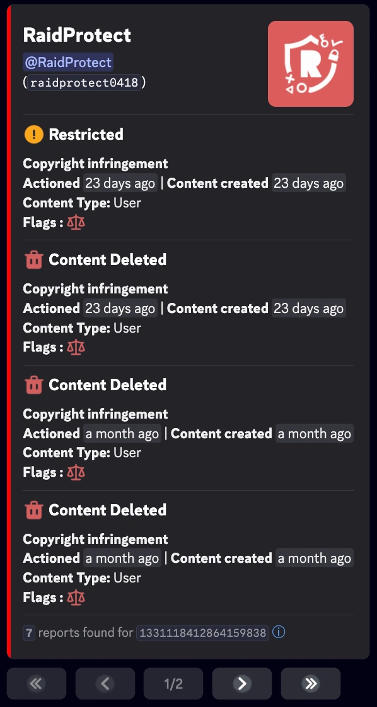
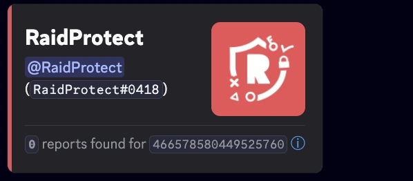

import SeparatedBox from '@site/src/components/SeparatedBox';
import Tabs from '@theme/Tabs';
import TabItem from '@theme/TabItem';
import Icon from "@site/src/components/Icon";

Zusätzliche Funktionen, die dir die Verwaltung deines Servers erleichtern. 🔧

Neben Kernfunktionen wie dem Captcha-System und dem Anti-Raid-Schutz bietet RaidProtect mehrere Hilfswerkzeuge, die die Administration deines Servers noch reibungsloser machen.

## 📋 Einen Kanal duplizieren {#channel-duplicate}

Der Befehl `/channel duplicate` ermöglicht es dir, einen Kanal vollständig zu duplizieren, einschließlich aller Einstellungen, Berechtigungen und Konfigurationen. Damit übertrifft er die native Discord-Funktion, die **Kategorien** und **bestimmte spezifische Einstellungen** wie Tags von Forum-Kanälen nicht duplizieren kann.

Verwende den Befehl: ```/channel duplicate [channel]```

Ersetze `[channel]` durch die Erwähnung oder die ID des zu duplizierenden Kanals.

### 🎯 Funktionen {#duplicate-features}

Dieser Befehl dupliziert alle folgenden Elemente:

- **Kanalname**
- **Berechtigungen** (Rollen und Benutzer)
- **Kanaltyp** (Text, Sprache, Forum usw.)
- **Spezifische Einstellungen** je nach Kanaltyp
- **Position** in der Kategorie (falls zutreffend)

### ⚙️ RaidProtect-Konfigurationen {#duplicate-config}

Wenn du einen Kanal duplizierst, der interne RaidProtect-Konfigurationen besitzt, bietet dir der Bot automatisch an:

- Die bestehende Konfiguration zu **ersetzen**, um den neuen Kanal zu verwenden
- Die Konfiguration zu **duplizieren**, um beide Kanäle konfiguriert zu behalten

**Beispiel**: Wenn du den Log-Kanal duplizierst, schlägt RaidProtect vor, seine Konfiguration so zu aktualisieren, dass der neue Kanal zum Log-Kanal wird, oder beide Kanäle je nach deiner Präferenz konfiguriert zu behalten.

## 🗑️ Einen Kanal löschen und neu erstellen {#channel-clear}

Der Befehl `/channel clear` ermöglicht es dir, einen Kanal zu löschen und ihn identisch neu zu erstellen, wobei seine Einstellungen, Berechtigungen und RaidProtect-Konfigurationen beibehalten werden.

Verwende den Befehl: ```/channel clear```

:::warning
Die Nachrichten und Webhooks des Kanals werden unwiderruflich gelöscht. Vor der Ausführung wird eine Bestätigung angefordert.
:::

## 🧹 Mitglieder bereinigen {#prune}

Der Befehl `/prune` ermöglicht es dir, inaktive Mitglieder über ein interaktives Menü von deinem Server zu entfernen.

Verwende den Befehl: ```/prune [duration]```

Ersetze `[duration]` durch die gewünschte Anzahl an Tagen der Inaktivität. Der Bot zeigt ein interaktives Menü an, mit dem du:
- Die Inaktivitätsdauer auswählen kannst
- Bestimmte Rollen ein- oder ausschließen kannst
- Die Anzahl der betroffenen Mitglieder vor der Bestätigung sehen kannst


## 🚫 Nutzer blockieren {#block}

Der Befehl `/block` ermöglicht es dir, einen Nutzer daran zu hindern, bestimmte RaidProtect-Funktionen auf deinem Server zu nutzen (zum Beispiel Meldungen senden oder die Tag-Rolle erhalten).

### Einen Nutzer blockieren {#block-add}

Verwende den Befehl: ```/block add (user) [reason]```

### Einen Nutzer entsperren {#block-remove}

Verwende den Befehl: ```/block remove (user) [reason]```

### Blockierte Nutzer auflisten {#block-list}

Verwende den Befehl: ```/block list```

## 📢 Informationspanels {#display}

Siehe die [dedizierte Seite zu Informationspanels](./display.mdx) für weitere Informationen über den Befehl `/display public`.

## 📜 Meine Sanktionen {#my-sanctions}

Der Befehl `/my-sanctions` ermöglicht es Mitgliedern, ihre eigenen Sanktionen auf dem Server einzusehen, entsprechend der von den Administratoren konfigurierten [Vertraulichkeitsstufe](./sanctions.mdx#sanctions-privacy).

Verwende den Befehl: ```/my-sanctions```

:::info
Dieser Befehl ist auch über die Schaltfläche **Meine Sanktionen einsehen** auf den [Informationspanels](./display.mdx) zugänglich, wenn die Funktion aktiviert ist.
:::

## 🏠 Serverinformationen {#serverinfo}

Der Befehl `/serverinfo` zeigt die **Informationen des aktuellen Servers** an: Name, Eigentümer, Erstellungsdatum, Mitgliederzahl, Boost-Stufe, aktivierte Funktionen usw.

Verwende den Befehl: ```/serverinfo```

## 💬 Feedback geben {#feedback}

Der Befehl `/feedback` ermöglicht es jedem Mitglied des Servers, **eine Meinung, einen Vorschlag oder eine Bug-Meldung** direkt aus Discord zu teilen, ohne dem Support-Server beitreten zu müssen.

Verwende den Befehl: ```/feedback```

Der Bot bietet dir an, deine Erfahrung zu bewerten, und öffnet dann ein Fenster, um dein Feedback einzugeben. Je nach Art der Rückmeldung (Vorschlag, Bug, Erfahrung) leitet RaidProtect dich zu den passenden Ressourcen weiter (Support-Server, Vorschlagsseite).

## 👤 Nutzerinformationen {#userinfo}

Mit dem Befehl `/userinfo` erhältst du detaillierte Informationen über einen Nutzer.

Verwende den Befehl: ```/userinfo [user]```

Ersetze `[user]` durch die gewünschte Erwähnung oder ID.

:::info
Der Befehl `userinfo` ist [auch mit Prefix verfügbar](../guides/prefix.md).
:::

### 📋 Angezeigte Informationen {#displayed-userinfo}

- **Erstellungsdatum des Discord-Accounts**
- **Profilbild** des Nutzers
- **Profilbanner**
- **Profilabzeichen**
  - Die Badges Nitro, Booster, Quest und Originally Name werden nicht angezeigt.


### 🎭 Informationen zu einem Servermitglied {#displayed-memberinfo}

Ist das Ziel ein Servermitglied, werden zusätzliche Angaben gemacht:

- **Beitrittsdatum zum Server**
- **Server-Spitzname**
- **Anzahl der Rollen** und **Liste der ersten 6 Rollen**
- **Berechtigungskategorie** (nur für Moderatoren sichtbar):
<SeparatedBox>
<Tabs>
  <TabItem value="animator" label="Animator" default>

    Die Kategorie **Animator** wird angezeigt, wenn das Mitglied **mindestens eine** der folgenden Berechtigungen besitzt:

    - `MANAGE_EXPRESSIONS`
    - `CREATE_GUILD_EXPRESSIONS`
    - `MANAGE_EVENTS`

  </TabItem>
  <TabItem value="moderator" label="Moderator">

    Die Kategorie **Moderator** wird angezeigt, wenn das Mitglied **mindestens eine** der folgenden Berechtigungen besitzt:

    - `KICK_MEMBERS`
    - `BAN_MEMBERS`
    - `MODERATE_MEMBERS`
    - `MANAGE_MESSAGES`
    - `MUTE_MEMBERS`
    - `DEAFEN_MEMBERS`
    - `MOVE_MEMBERS`
    - `MANAGE_THREADS`

  </TabItem>
  <TabItem value="manager" label="Manager">

    Die Kategorie **Manager** wird angezeigt, wenn das Mitglied **mindestens eine** der folgenden Berechtigungen besitzt:

    - `MANAGE_GUILD`
    - `MANAGE_ROLES`
    - `MANAGE_CHANNELS`
    - `VIEW_AUDIT_LOG`
    - `MANAGE_WEBHOOKS`
    - `MANAGE_SERVER_EXPRESSIONS`

  </TabItem>
  <TabItem value="admin" label="Administrator">

    Die Kategorie **Administrator** wird in **zwei möglichen Fällen** angezeigt:

    1️⃣ Besitzt die Berechtigung:
    - `ADMINISTRATOR`

    2️⃣ Verfügt **gleichzeitig über alle drei** folgenden Berechtigungen:
    - `MANAGE_GUILD`
    - `MANAGE_ROLES`
    - `MANAGE_CHANNELS`

  </TabItem>
  <TabItem value="owner" label="Eigentümer">

    **Bedingung**: Das Mitglied ist der **Serverbesitzer**.

  </TabItem>
</Tabs>
</SeparatedBox>

- **Mitglieder-Flags** (nur für Moderatoren sichtbar):

| **Flags**                                | **Emojis**                                                                                                             | **Bedeutungen**                                                   |
| ---------------------------------------- | ---------------------------------------------------------------------------------------------------------------------- | ----------------------------------------------------------------- |
| `DID_REJOIN`                             | <Icon src="/img/icons/MemberDidRejoin.svg" alt="icon MemberDidRejoin" title=":MemberDidRejoin:"/>                      | Der Nutzer hat den Server verlassen und ist wieder beigetreten.   |
| `IS_GUEST`                               | <Icon src="/img/icons/MemberIsGuest.svg" alt="icon MemberIsGuest" title=":MemberIsGuest:"/>                            | Gastmitglied (temporäre Einladung oder Gastzugang).               |
| `COMPLETED_ONBOARDING`                   | <Icon src="/img/icons/OnboardingCompleted.svg" alt="icon OnboardingCompleted" title=":OnboardingCompleted:"/>          | Hat den Server-Onboarding-Prozess abgeschlossen.                 |
| `STARTED_ONBOARDING`                     | <Icon src="/img/icons/OnboardingStarted.svg" alt="icon OnboardingStarted" title=":OnboardingStarted:"/>                | Hat den Onboarding-Prozess gestartet.                             |
| `COMPLETED_SERVER_GUIDE`                 | <Icon src="/img/icons/ServerGuideCompleted.svg" alt="icon ServerGuideCompleted" title=":ServerGuideCompleted:"/>       | Hat den Server-Guide (falls aktiviert) abgeschlossen.             |
| `STARTED_SERVER_GUIDE`                   | <Icon src="/img/icons/ServerGuideStarted.svg" alt="icon ServerGuideStarted" title=":ServerGuideStarted:"/>             | Hat den Server-Guide gestartet.                                   |
| `AUTOMOD_QUARANTINED_NAME`               | <Icon src="/img/icons/MemberQuarantined.svg" alt="icon MemberQuarantined" title=":MemberQuarantined:"/>                | Durch Automoderation wegen des Benutzernamens unter Quarantäne gestellt. |
| `AUTOMOD_QUARANTINED_GUILD_TAG`          | <Icon src="/img/icons/MemberQuarantined.svg" alt="icon MemberQuarantined" title=":MemberQuarantined:"/>                | Durch Automoderation wegen Tag oder Nickname unter Quarantäne gestellt. |
| `BYPASSES_VERIFICATION`                  | <Icon src="/img/icons/BypassVerification.svg" alt="icon BypassVerification" title=":BypassVerification:"/>             | Nutzer kann die Server-Verifizierung umgehen.                     |
| `SPAMMER`                                | <Icon src="/img/icons/UnusualAccountActivity.svg" alt="icon UnusualAccountActivity" title=":UnusualAccountActivity:"/> | Konto als Spammer markiert oder ungewöhnliche Aktivität festgestellt. |

## ⚖️ Discord-Sanktionen {#discord-sanctions}

Der Befehl `/ds` ermöglicht es dir, die **von Discord verhängten Sanktionen** gegen einen Benutzer einzusehen, in Übereinstimmung mit den [europäischen Vorschriften](https://transparency.dsa.ec.europa.eu/).

Verwende den Befehl: ```/ds (user)```

Ersetze `(user)` durch die gewünschte Erwähnung oder ID.

### 📋 Angezeigte Informationen {#displayed-sanctions}

- **Art der Sanktion**:

| **Sanktionen**                           | **Emojis**                                                                                                             | **Bedeutungen**                                                   |
| ---------------------------------------- | ---------------------------------------------------------------------------------------------------------------------- | ----------------------------------------------------------------- |
| `CONTENT_DELETED`                        | <Icon src="/img/icons/ContentDeleted.svg" alt="icon ContentDeleted" title=":iconTrash:"/>                              | Vom Benutzer veröffentlichter Inhalt wurde gelöscht.              |
| `RESTRICTED`                             | <Icon src="/img/icons/AccountRestricted.svg" alt="icon AccountRestricted" title=":iconRestricted:"/>                   | Das Benutzerkonto wurde eingeschränkt.                            |
| `ACCOUNT_SUSPENDED`                      | <Icon src="/img/icons/AccountSuspended.svg" alt="icon AccountSuspended" title=":iconSuspended:"/>                      | Das Benutzerkonto wurde gesperrt.                                 |
| `ACCOUNT_TERMINATED`                     | <Icon src="/img/icons/AccountTerminated.svg" alt="icon AccountTerminated" title=":iconTerminated:"/>                   | Das Benutzerkonto wurde gelöscht.                                 |

- **Ausstellungsdatum**
- **Inhaltstyp**
- **Sanktions-Flags**:

| **Flags**                                | **Emojis**                                                                                                             | **Bedeutungen**                                                   |
| ---------------------------------------- | ---------------------------------------------------------------------------------------------------------------------- | ----------------------------------------------------------------- |
| `ILLEGAL_CONTENT`                        | <Icon src="/img/icons/IllegalContent.svg" alt="icon IllegalContent" title=":iconIllegal:"/>                            | Sanktion für illegalen Inhalt.                                    |
| `AUTOMATED_DETECTION`                    | <Icon src="/img/icons/AutomatedDetection.svg" alt="icon AutomatedDetection" title=":iconBots:"/>                       | Sanktion durch automatische Erkennung angewendet.                 |

<SeparatedBox>
<Tabs>
  <TabItem value="reports-found" label="Berichte gefunden" default>



  </TabItem>
  <TabItem value="reports-not-found" label="Keine Berichte gefunden">



  </TabItem>
</Tabs>
</SeparatedBox>

:::note
Der Befehl ermöglicht es, die zwischen dem 22. August 2024 und dem 14. August 2025 ausgestellten Berichte einzusehen. Diese Informationen werden direkt von Discord bereitgestellt und **können nicht von RaidProtect geändert werden**.
:::
