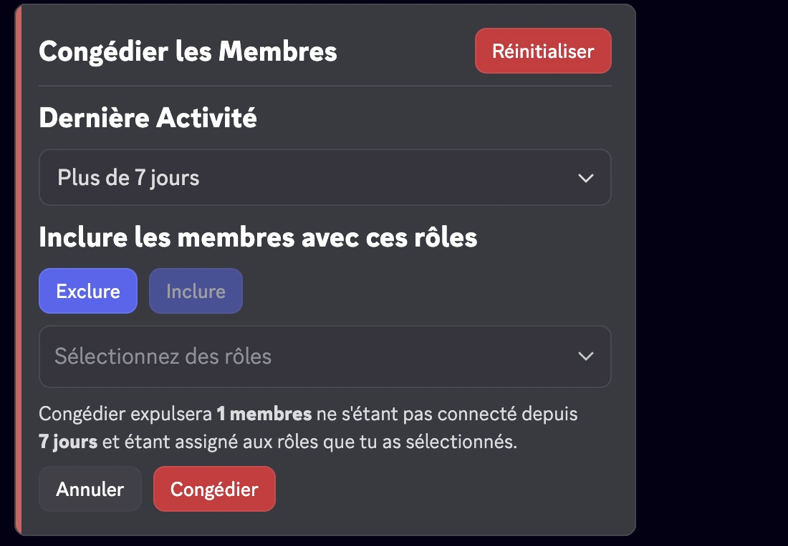
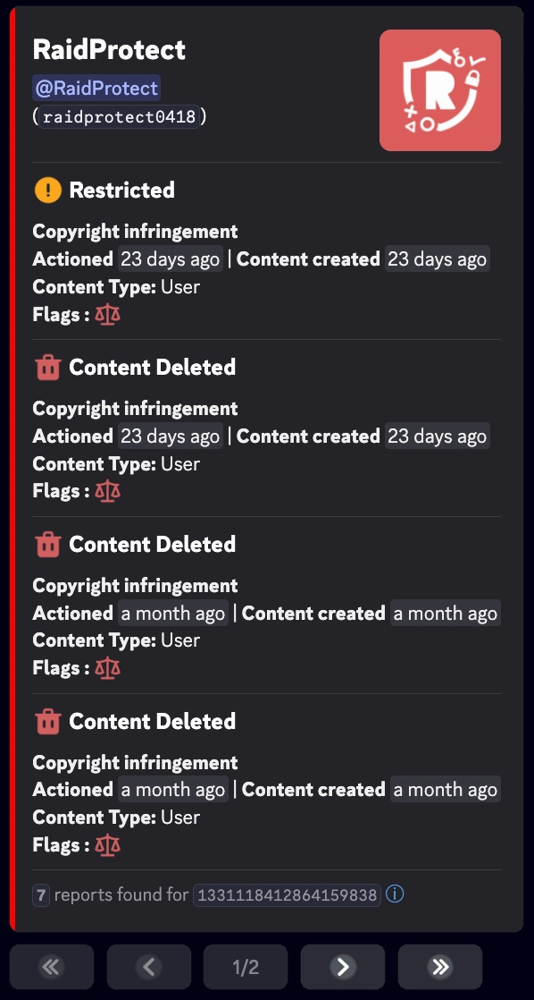
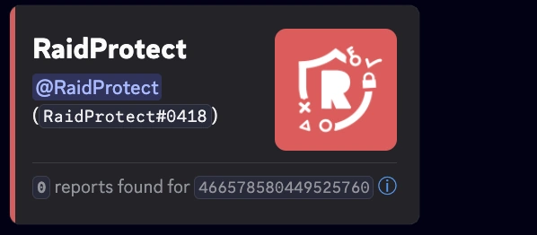

import SeparatedBox from '@site/src/components/SeparatedBox';
import Tabs from '@theme/Tabs';
import TabItem from '@theme/TabItem';
import Icon from "@site/src/components/Icon";

Zusätzliche Funktionen, um die Verwaltung Ihres Servers zu vereinfachen. 🔧

Neben den Hauptfunktionen wie dem Captcha-System und dem Anti-Raid-Schutz bietet RaidProtect mehrere Hilfswerkzeuge, die die Verwaltung Ihres Servers noch reibungsloser machen können.

## 📋 Einen Kanal duplizieren {#channel-duplicate}

Mit dem Befehl `/channel duplicate` können Sie einen Kanal vollständig duplizieren, einschließlich all seiner Einstellungen, Berechtigungen und Konfigurationen. Damit übertrifft er die native Discord-Funktion, die **Kategorien** und **bestimmte spezifische Einstellungen** wie die Tags von Forum-Kanälen nicht duplizieren kann.

Verwenden Sie den Befehl: ```/channel duplicate [kanal]```

Ersetzen Sie `[kanal]` durch die Erwähnung oder die ID des zu duplizierenden Kanals.

### 🎯 Funktionen {#duplicate-features}

Dieser Befehl dupliziert die Gesamtheit der folgenden Elemente:

- **Kanalname**
- **Berechtigungen** (Rollen und Benutzer)
- **Kanaltyp** (Text, Sprache, Forum usw.)
- **Spezifische Einstellungen** je nach Kanaltyp
- **Position** in der Kategorie (falls zutreffend)

### ⚙️ RaidProtect-Konfigurationen {#duplicate-config}

Wenn Sie einen Kanal duplizieren, der interne RaidProtect-Konfigurationen besitzt, bietet Ihnen der Bot automatisch an:

- Die bestehende Konfiguration zu **ersetzen**, um den neuen Kanal zu verwenden
- Die Konfiguration zu **duplizieren**, um beide Kanäle konfiguriert zu behalten

**Beispiel**: Wenn Sie den Log-Kanal duplizieren, schlägt Ihnen RaidProtect vor, seine Konfiguration so zu aktualisieren, dass der neue Kanal zum Log-Kanal wird, oder je nach Ihrer Präferenz beide Kanäle konfiguriert zu behalten.

## 🗑️ Einen Kanal löschen und neu erstellen {#channel-clear}

Mit dem Befehl `/channel clear` können Sie einen Kanal löschen und ihn identisch neu erstellen, wobei seine Einstellungen, Berechtigungen und RaidProtect-Konfigurationen erhalten bleiben.

Verwenden Sie den Befehl: ```/channel clear```

:::warning
Die Nachrichten und Webhooks des Kanals werden unwiderruflich gelöscht. Vor der Ausführung wird eine Bestätigung angefordert.
:::

## 🧹 Mitglieder bereinigen {#prune}

Mit dem Befehl `/prune` können Sie inaktive Mitglieder über ein interaktives Menü von Ihrem Server entfernen.

Verwenden Sie den Befehl: ```/prune [dauer]```

Ersetzen Sie `[dauer]` durch die gewünschte Anzahl an Tagen der Inaktivität. Der Bot zeigt ein interaktives Menü an, mit dem Sie:
- Die Inaktivitätsdauer auswählen können
- Bestimmte Rollen ein- oder ausschließen können
- Die Anzahl der betroffenen Mitglieder vor der Bestätigung sehen können



## 🚫 Nutzer blockieren {#block}

Mit dem Befehl `/block` können Sie einen Nutzer daran hindern, bestimmte Funktionen von RaidProtect auf Ihrem Server zu nutzen (zum Beispiel Meldungen zu senden oder die Tag-Rolle zu erhalten).

Beim Blockieren oder Entsperren bietet Ihnen RaidProtect an, die betroffenen Funktionen auszuwählen:

| Typ | Wirkung |
|---|---|
| **Alle Interaktionen** | Blockiert alle Interaktionen mit dem Bot |
| **Meldungen** | Der Nutzer kann keine [Meldung](./reports.md) mehr abgeben |
| **Tag-Rolle** | Der Nutzer kann die [Tag-Rolle](./tag-role.md) nicht mehr erhalten |

### Einen Nutzer blockieren {#block-add}

Verwenden Sie den Befehl: ```/block add (benutzer) [grund]```

### Einen Nutzer entsperren {#block-remove}

Verwenden Sie den Befehl: ```/block remove (benutzer) [grund]```

### Blockierte Nutzer auflisten {#block-list}

Verwenden Sie den Befehl: ```/block list```

## 📢 Informationspanels {#display}

Weitere Informationen über den Befehl `/display public` finden Sie auf der [dedizierten Seite zu den Informationspanels](./display.mdx).

## 📜 Meine Sanktionen {#my-sanctions}

Mit dem Befehl `/meine-sanktionen` können Mitglieder ihre eigenen Sanktionen auf dem Server einsehen, entsprechend der von den Administratoren konfigurierten [Vertraulichkeitsstufe](./sanctions.mdx#sanctions-privacy).

Verwenden Sie den Befehl: ```/meine-sanktionen```

:::info
Dieser Befehl ist auch über die Schaltfläche **Meine Sanktionen einsehen** auf den [Informationspanels](./display.mdx) zugänglich, wenn die Funktion aktiviert ist.
:::

## 🏠 Serverinformationen {#serverinfo}

Der Befehl `/serverinfo` zeigt die **Informationen des aktuellen Servers** an: Name, Eigentümer, Erstellungsdatum, Mitgliederzahl, Boost-Stufe, aktivierte Funktionen usw.

Verwenden Sie den Befehl: ```/serverinfo```

## 💬 Feedback geben {#feedback}

Mit dem Befehl `/feedback` kann jedes Mitglied des Servers **eine Meinung, einen Vorschlag oder eine Bug-Meldung** direkt aus Discord teilen, ohne dem Support-Server beitreten zu müssen.

Verwenden Sie den Befehl: ```/feedback```

Der Bot bietet Ihnen an, Ihre Erfahrung zu bewerten, und öffnet dann ein Fenster, um Ihr Feedback einzugeben. Je nach Art der Rückmeldung (Vorschlag, Bug, Erfahrung) leitet RaidProtect Sie zu den passenden Ressourcen weiter (Support-Server, Vorschlagsseite).

## 👤 Nutzerinformationen {#userinfo}

Mit dem Befehl `/userinfo` erhalten Sie detaillierte Informationen über einen Nutzer.

Verwenden Sie den Befehl: ```/userinfo [benutzer]```

Ersetzen Sie `[benutzer]` durch die gewünschte Erwähnung oder ID.

:::info
Der Befehl `userinfo` ist [per Präfix verwendbar](../guides/prefix.md).
:::

### 📋 Angezeigte Informationen {#displayed-userinfo}

- **Erstellungsdatum des Discord-Kontos**
- **Profilbild** des Nutzers
- **Profilbanner**
- **Profilabzeichen**
  - Die Abzeichen Nitro, Booster, Quest und früherer Name werden nicht angezeigt.


### 🎭 Informationen zu einem Servermitglied {#displayed-memberinfo}

Ist das Ziel ein Servermitglied, umfassen die zusätzlichen Informationen:

- **Beitrittsdatum zum Server**
- **Spitzname auf dem Server**
- **Anzahl der Rollen** und **Liste der ersten 6 Rollen**
- **Berechtigungskategorie** (nur für Moderatoren sichtbar):
<SeparatedBox>
<Tabs>
  <TabItem value="animator" label="Animator" default>

    Die Kategorie **Animator** wird angezeigt, wenn das Mitglied **mindestens eine** der folgenden Berechtigungen besitzt:

    - `MANAGE_EXPRESSIONS`
    - `CREATE_GUILD_EXPRESSIONS`
    - `MANAGE_EVENTS`

  </TabItem>
  <TabItem value="moderator" label="Moderator">

    Die Kategorie **Moderator** wird angezeigt, wenn das Mitglied **mindestens eine** der folgenden Berechtigungen besitzt:

    - `KICK_MEMBERS`
    - `BAN_MEMBERS`
    - `MODERATE_MEMBERS`
    - `MANAGE_MESSAGES`
    - `MUTE_MEMBERS`
    - `DEAFEN_MEMBERS`
    - `MOVE_MEMBERS`
    - `MANAGE_THREADS`

  </TabItem>
  <TabItem value="manager" label="Manager">

    Die Kategorie **Manager** wird angezeigt, wenn das Mitglied **mindestens eine** der folgenden Berechtigungen besitzt:

    - `MANAGE_GUILD`
    - `MANAGE_ROLES`
    - `MANAGE_CHANNELS`
    - `VIEW_AUDIT_LOG`
    - `MANAGE_WEBHOOKS`
    - `MANAGE_SERVER_EXPRESSIONS`

  </TabItem>
  <TabItem value="admin" label="Administrator">

    Die Kategorie **Administrator** wird in **zwei möglichen Fällen** angezeigt:

    1️⃣ Besitzt die Berechtigung:
    - `ADMINISTRATOR`

    2️⃣ Verfügt **gleichzeitig über die folgenden drei Berechtigungen**:
    - `MANAGE_GUILD`
    - `MANAGE_ROLES`
    - `MANAGE_CHANNELS`

  </TabItem>
  <TabItem value="owner" label="Eigentümer">

    **Bedingung**: Das Mitglied ist der **Serverbesitzer**.

  </TabItem>
</Tabs>
</SeparatedBox>

- **Mitglieder-Flags** (nur für Moderatoren sichtbar):

| **Flags**                                | **Emojis**                                                                                                             | **Bedeutungen**                                                |
| ---------------------------------------- | ---------------------------------------------------------------------------------------------------------------------- | ----------------------------------------------------------------- |
| `DID_REJOIN`                             | <Icon src="/img/icons/MemberDidRejoin.svg" alt="icon MemberDidRejoin" title=":MemberDidRejoin:"/>                      | Der Nutzer hat den Server verlassen und ist ihm erneut beigetreten. |
| `IS_GUEST`                               | <Icon src="/img/icons/MemberIsGuest.svg" alt="icon MemberIsGuest" title=":MemberIsGuest:"/>                            | Gastmitglied (temporäre Einladung oder Gastzugang).            |
| `COMPLETED_ONBOARDING`                   | <Icon src="/img/icons/OnboardingCompleted.svg" alt="icon OnboardingCompleted" title=":OnboardingCompleted:"/>          | Hat den Onboarding-Prozess des Servers abgeschlossen.         |
| `STARTED_ONBOARDING`                     | <Icon src="/img/icons/OnboardingStarted.svg" alt="icon OnboardingStarted" title=":OnboardingStarted:"/>                | Hat den Onboarding-Prozess begonnen.                          |
| `COMPLETED_SERVER_GUIDE`                 | <Icon src="/img/icons/ServerGuideCompleted.svg" alt="icon ServerGuideCompleted" title=":ServerGuideCompleted:"/>       | Hat den Server-Guide abgeschlossen, falls aktiviert.          |
| `STARTED_SERVER_GUIDE`                   | <Icon src="/img/icons/ServerGuideStarted.svg" alt="icon ServerGuideStarted" title=":ServerGuideStarted:"/>             | Hat den Server-Guide begonnen.                                |
| `AUTOMOD_QUARANTINED_NAME`               | <Icon src="/img/icons/MemberQuarantined.svg" alt="icon MemberQuarantined" title=":MemberQuarantined:"/>                | Durch die Automoderation wegen des Benutzernamens unter Quarantäne gestellt.|
| `AUTOMOD_QUARANTINED_GUILD_TAG`          | <Icon src="/img/icons/MemberQuarantined.svg" alt="icon MemberQuarantined" title=":MemberQuarantined:"/>                | Durch die Automoderation wegen des Tags oder Spitznamens unter Quarantäne gestellt.    |
| `BYPASSES_VERIFICATION`                  | <Icon src="/img/icons/BypassVerification.svg" alt="icon BypassVerification" title=":BypassVerification:"/>             | Der Nutzer kann die Verifizierung des Servers umgehen.       |
| `SPAMMER`                                | <Icon src="/img/icons/UnusualAccountActivity.svg" alt="icon UnusualAccountActivity" title=":UnusualAccountActivity:"/> | Konto als Spammer markiert oder ungewöhnliche Aktivität festgestellt.   |

## ⚖️ Discord-Sanktionen {#discord-sanctions}

Mit dem Befehl `/discord-sanctions` können Sie die **von Discord verhängten Sanktionen** gegen einen Nutzer einsehen, in Übereinstimmung mit der [europäischen Regelung](https://transparency.dsa.ec.europa.eu/).

Verwenden Sie den Befehl: ```/discord-sanctions (benutzer)```

Ersetzen Sie `(benutzer)` durch die gewünschte Erwähnung oder ID. Der Befehl ist auch per Rechtsklick auf ein Profil zugänglich, über **`Anwendungen`** und dann **`Discord Sanctions`**.

### 📋 Angezeigte Informationen {#displayed-sanctions}

- **Art der Sanktion**:

| **Sanktionen**                           | **Emojis**                                                                                                             | **Bedeutungen**                                                |
| ---------------------------------------- | ---------------------------------------------------------------------------------------------------------------------- | ----------------------------------------------------------------- |
| `CONTENT_DELETED`                        | <Icon src="/img/icons/ContentDeleted.svg" alt="icon ContentDeleted" title=":iconTrash:"/>                              | Vom Nutzer veröffentlichter Inhalt wurde gelöscht.            |
| `RESTRICTED`                             | <Icon src="/img/icons/AccountRestricted.svg" alt="icon AccountRestricted" title=":iconRestricted:"/>                   | Das Benutzerkonto wurde eingeschränkt.                        |
| `ACCOUNT_SUSPENDED`                      | <Icon src="/img/icons/AccountSuspended.svg" alt="icon AccountSuspended" title=":iconSuspended:"/>                      | Das Benutzerkonto wurde gesperrt.                             |
| `ACCOUNT_TERMINATED`                     | <Icon src="/img/icons/AccountTerminated.svg" alt="icon AccountTerminated" title=":iconTerminated:"/>                   | Das Benutzerkonto wurde gelöscht.                             |

- **Ausstellungsdatum**
- **Inhaltstyp**
- **Sanktions-Flags**:

| **Flags**                                | **Emojis**                                                                                                             | **Bedeutungen**                                                |
| ---------------------------------------- | ---------------------------------------------------------------------------------------------------------------------- | ----------------------------------------------------------------- |
| `ILLEGAL_CONTENT`                        | <Icon src="/img/icons/IllegalContent.svg" alt="icon IllegalContent" title=":iconIllegal:"/>                            | Sanktion wegen illegalen Inhalts angewendet.                  |
| `AUTOMATED_DETECTION`                    | <Icon src="/img/icons/AutomatedDetection.svg" alt="icon AutomatedDetection" title=":iconBots:"/>                       | Sanktion durch eine automatische Erkennung angewendet.        |

<SeparatedBox>
<Tabs>
  <TabItem value="reports-found" label="Berichte gefunden" default>



  </TabItem>
  <TabItem value="reports-not-found" label="Kein Bericht gefunden">



  </TabItem>
</Tabs>
</SeparatedBox>

:::note
Der Befehl ermöglicht es, die zwischen dem 22. August 2024 und dem 14. August 2025 ausgestellten Berichte einzusehen. Diese Informationen werden direkt von Discord bereitgestellt und **können nicht von RaidProtect geändert werden**.
:::
