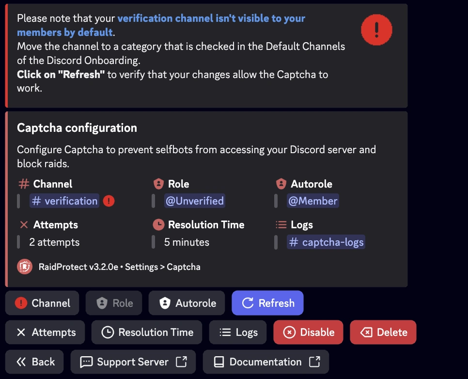
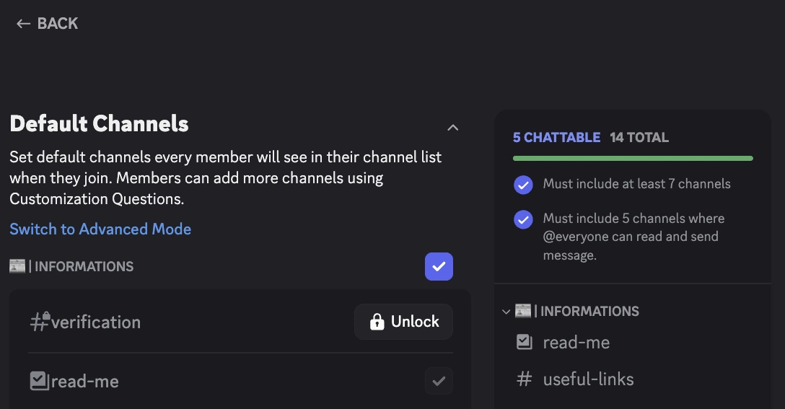

Wenn der Kanal `#verification` für neue Mitglieder standardmäßig nicht sichtbar ist, kann das Captcha-System nicht korrekt funktionieren. So behebst du das Problem Schritt für Schritt.

## 1️⃣ Kanalberechtigungen prüfen {#permissions}

1. Öffne die Einstellungen des Kanals `#verification` (Rechtsklick > **Kanal bearbeiten**).
2. Im Tab **Berechtigungen**:
   - Stelle sicher, dass `@everyone` **keine** Berechtigung hat, den Kanal zu sehen.
   - Stelle sicher, dass die Rolle `@Unverified` **Berechtigung** hat, den Kanal zu **sehen**, **Nachrichtenverlauf zu lesen** und **Nachrichten zu senden**.

## 2️⃣ Willkommen-Kategorie prüfen {#default-category}

1. Gehe zu **Servereinstellungen** > **Onboarding**.
2. Überprüfe im Bereich **Standardkanäle**, ob die Kategorie, die `#verification` enthält, für neue Mitglieder als sichtbar markiert ist.
3. Verschiebe `#verification` gegebenenfalls in eine markierte Kategorie.
4. Speichere die Änderungen.

## 3️⃣ Konfiguration in RaidProtect aktualisieren {#refresh-config}

1. Nutze den Befehl [`/settings`](../setup.md#settings) und wechsle in den Tab **Captcha**.
2. Klicke auf **Refresh**, um die Konfiguration zu erzwingen.
3. Wenn der Kanal nun sichtbar ist, funktioniert das Captcha-System korrekt.

## 4️⃣ Mit einem Testaccount prüfen {#test-account}

Um sicherzugehen, dass alles richtig eingerichtet ist:

1. Tritt mit einem anderen Discord-Account dem Server bei.
2. Überprüfe, ob der Kanal `#verification` beim Betreten sichtbar ist.
3. Gib den von RaidProtect gesendeten Captcha-Code ein.
4. Nach der Verifizierung sollte der Account Zugriff auf die anderen Kanäle haben.

## 🛠️ Häufige Probleme und Lösungen {#common-issues}

| Problem | Lösung |
|-------|---------|
| 🔴 Der Kanal `#verification` bleibt unsichtbar | Prüfe, ob er in den Willkommens-Einstellungen von Discord in einer **markierten Kategorie** liegt. |
| 🚫 Die Rolle `@Unverified` kann nicht schreiben | Gib ihr im Kanal `#verification` die Berechtigung **Nachrichten senden**. |
| ❌ Captcha funktioniert nach Änderungen nicht | Klicke in `/settings > Captcha` auf **„Refresh“**. |

---

✅ Wenn du diese Schritte befolgst, funktioniert dein Verifizierungssystem vollständig, um Mitglieder sicher willkommen zu heißen und Bots oder Raids effektiv zu blockieren.
