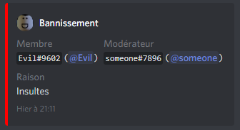
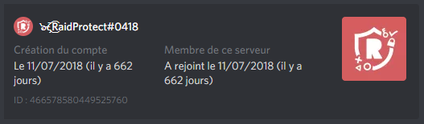

Explore all the secondary features of RaidProtect: moderation, channel locking, user information, and more.

In addition to the main features previously introduced, RaidProtect offers **a few additional minor features**. They are simple yet useful! 😯  

## 🤬 Moderation Commands {#moderation}

To make life easier for your moderators, RaidProtect includes commands for interacting with Discord’s native moderation features: **banning and kicking users**. In addition to banning or kicking a user (as expected), these commands send a private message to the user explaining the reason for their sanction and log the action in RaidProtect's logs channel. 🗣️  

Using these commands is **very straightforward**. For banning, simply run: `?ban @user reason`. The `?kick` command follows the same format. For example, to kick the user "Evil" for "insults," run: `?kick @Evil Insults`. It’s that quick!

For advanced users, note that you can ban a user even **if they are not on your server** by using their user ID. Convenient.

Example of a log message after banning a user.

## 🔒 Channel Locking {#lock}

Sometimes, you may need—for any reason—to lock a channel to **prevent members from speaking in it.** The lock command allows you to do this quickly: run `?lock`, and the channel is locked! To reverse the action, simply use the command `?unlock`.

This command **removes the permission to speak** from the @everyone role in the channel. For it to work effectively, make sure no other role has explicit permission to speak in the channel; otherwise, those with such roles will still be able to talk.

## 👤 User Information {#userinfo}

The final additional feature is the `?userinfo` command. This command primarily allows you to view **the account creation date of any user** and, if they are a server member, the date they joined your server. The command must be followed by a mention, a username with a tag, or a user ID. 👀  

