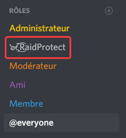

import DocCard from '@theme/DocCard';

Need help using RaidProtect? You'll find all the information you need in our documentation!

Welcome to the RaidProtect documentation! This guide is designed to help you understand how RaidProtect works. Feel free to share your feedback so we can continue to improve it.

Don't forget to join our Discord server to **stay updated on the latest news about the project**. You'll also be able to reach out to our support team, who will answer your questions about using the bot. 😄 

## 🚀 Getting Started with RaidProtect {#start}

To start using RaidProtect, simply **invite it to your server** using the following link. Be cautious of copies—only invite it from our official website.

:::note
To ensure proper functionality, make sure to grant RaidProtect the **Administrator** permission. This allows it to automatically moderate all your channels.

Also, make sure to **place its role at the same level as your server administrators** (see the image below). The permissions system prevents RaidProtect from taking action against users with a higher role.

:::

That's it, **RaidProtect is now on your Discord server**! A channel named `#raidprotect-logs` has been created. Do not delete this channel—it is essential for the bot to function. If you already have a logs channel, you can change the RaidProtect logs channel with the command `?settings logs #new-channel`.

:::note
**If the logs channel wasn't created automatically**, you'll need to manually set up the bot by running the `?setup` command in your server.
:::

Check out the various sections of this documentation to **explore all the features offered** by the bot! 😎 

<DocCard item={{ type: 'link', href: '/3.0.0/features/anti-spam', docId: 'features/anti-spam', label: 'Anti-Spam' }} />
 
<DocCard item={{ type: 'link', href: '/3.0.0/features/captcha', docId: 'features/captcha', label: 'Captcha (Verification)' }} />
 
<DocCard item={{ type: 'link', href: '/3.0.0/features/raid-mode', docId: 'features/raid-mode', label: 'Raid Mode' }} />
 
<DocCard item={{ type: 'link', href: '/3.0.0/features/others', docId: 'features/others', label: 'Others' }} />
 

For those in a hurry (or less adventurous), you can check out our quick guide, which summarizes the key information to get started. 😉 

<DocCard item={{ type: 'link', href: '/3.0.0/quick-guide', docId: 'quick-guide', label: 'Quick Guide' }} />

## 👥 About the Project {#about}

RaidProtect is a free and community-driven project that started in July 2018. Created by [baptiste0928](https://baptiste0928.net/), the project quickly gained a large user base and now boasts a team of around fifteen volunteers, especially for user support.