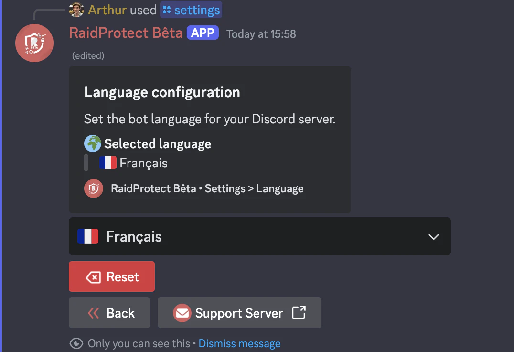

RaidProtect allows you to choose the language used by the bot to best suit your Discord community.

:::note
If your server is set as a community server (Discord setting), RaidProtect will by default use the language configured in the server's **community settings**.
:::

**Public Messages:** The configured language only affects public messages sent by RaidProtect in your server (logs, captcha messages, reports, etc.).

**Ephemeral Messages:** These private or temporary messages remain displayed in the language of the user interacting with the bot.

## 🌐 List of Supported Languages {#supported}

- **French**
- **English**

## ⚙️ Changing the Bot's Language {#change}

- Use the [`/settings` command](./setup.md#settings).
- Select the “**Language**” button.
- Choose the desired language.

Once the language is selected, the bot will automatically adapt all its messages, notifications, and commands to the chosen language for your server.

:::info
RaidProtect's language support is constantly evolving! [Suggest](https://suggestions.raidprotect.bot) languages you'd like to see on the bot or [vote](https://suggestions.raidprotect.bot) for proposed languages to have them added.
:::