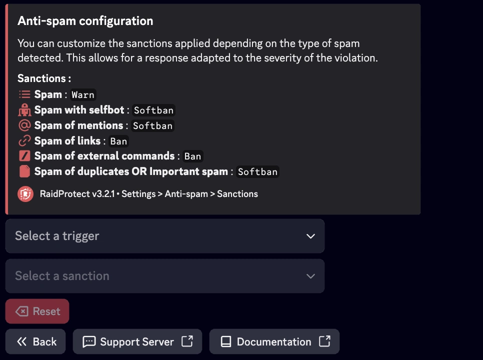

import SeparatedBox from '@site/src/components/SeparatedBox';
import Tabs from '@theme/Tabs';
import TabItem from '@theme/TabItem';

Das Anti-Spam-System von RaidProtect ist ein leistungsstarkes Werkzeug, um Spam auf deinem Discord-Server zu verhindern. Dank seines automatischen Erkennungssystems kümmert es sich selbstständig um Probleme, ohne dass du eingreifen musst.

## ❓ Wie das Anti-Spam-System funktioniert {#working}

Das System erkennt verdächtiges Verhalten und blockiert es automatisch. Dabei unterscheidet es zwischen zwei Spam-Arten:
- **Starker Spam:** Nachrichten mit Einladungslinks, Massen-Erwähnungen oder Bildern. Diese Form wird häufig bei Raids eingesetzt.
- **Leichter Spam:** Nachrichten, die zwar oft, aber weniger aufdringlich gesendet werden.

Das Anti-Spam-System greift auf zwei Arten ein.
- **Sanktionen:** Automatisches Kicken oder Bannen der Spammer.
- **Benachrichtigungen:** Sendet Meldungen in den Log-Kanal und fasst die erkannten Aktionen zusammen.

## 🛡️ Anti-Spam konfigurieren {#config}

RaidProtect bietet drei Sicherheitsstufen, um den Bedürfnissen deines Servers gerecht zu werden.
- 🔴 **Hoch:** Ahndet jeden Spam, auch starken Spam in ignorierten Kanälen.
- 🟠 **Mittel:** Ahndet allen Spam, respektiert jedoch ignorierte Kanäle.
- 🟢 **Niedrig:** Ahndet nur starken Spam.

### Sicherheitsstufe ändern {#level}

1. Verwende den [`/settings`-Befehl](../setup.md#settings).
2. Klicke auf die Schaltfläche "**Anti-Spam**".
3. Wähle im ersten Dropdown die gewünschte Anti-Spam-Stufe aus.

### Ignorierte Rollen, Nutzer und Kanäle verwalten {#ignore}

Du kannst bestimmte Kanäle, Rollen oder sogar Nutzer von der Anti-Spam-Überwachung ausnehmen, um flexibler zu sein. 😉
1. Verwende den [`/settings`-Befehl](../setup.md#settings).
2. Klicke auf die Schaltfläche "**Anti-Spam**".
3. Wähle in den Dropdowns die Elemente aus, die ignoriert werden sollen:
- Kanal(e) die ignoriert werden sollen
- Rolle(n) die ignoriert werden sollen
- Mitglied(er) die ignoriert werden sollen

:::info
Kanäle, die "**spam**" im Namen tragen, werden automatisch ignoriert. Nutzer mit Administratorrechten werden ebenfalls vollständig ignoriert.
:::

### Sanktionen nach Auslöser konfigurieren {#triggers}

Du kannst die verhängten Sanktionen je nach erkanntem Spam-Typ anpassen. So reagierst du passend zur Schwere des Verstoßes.

1. Verwende den [`/settings`-Befehl](../setup.md#settings).
2. Klicke auf die Schaltfläche "**Anti-Spam**".
3. Wechsle zum Tab "**Sanktionen**".
4. Wähle für jeden Auslöser eine konkrete Sanktion. Diese Werte kannst du über die Dropdown-Menüs ändern:
- **Auslöser wählen**: Typ des Spams auswählen
- **Sanktion wählen**: entsprechende Sanktion festlegen

#### Arten von Sanktionen und Auslösern {#sanctions}

Hier findest du die verschiedenen **möglichen Sanktionen** sowie die **Auslöser**, die RaidProtect erkennen kann, samt **standardmäßiger Timeout-Dauer**, sofern zutreffend:

- **Warnen**: Sendet dem Mitglied eine Verwarnung.
- **Kick**: Entfernt das Mitglied vom Server.
- **Timeout**: Stummschalten des Mitglieds für eine festgelegte Dauer.
- **Softban**: Bannt das Mitglied und hebt den Bann sofort wieder auf, wodurch seine Nachrichten gelöscht werden.
- **Ban**: Bannt das Mitglied dauerhaft.

| Auslöser                               | Beschreibung                              | Timeout-Dauer   |
|----------------------------------------|-------------------------------------------|-----------------|
| Spam                                   | Wiederholtes Senden von Nachrichten       | 1 Minute        |
| Spam mit Selfbot                       | Einsatz von Selfbots zum Spammen          | 1 Stunde        |
| Erwähnungs-Spam                        | Wiederholte Massen-Erwähnungen            | 30 Minuten      |
| Link-Spam                              | Massenhaftes Senden von Links             | 24 Stunden      |
| Duplizierter oder starker Spam         | Kopierte Nachrichten oder übermäßiger Spam| 24 Stunden      |

## 📑 Anti-Spam-Protokolle {#logs}

Es werden ausführliche Protokolle mit allen vom Anti-Spam gelöschten Nachrichten erstellt. Du kannst sie herunterladen oder den Inhalt direkt einsehen.

<SeparatedBox>
<Tabs>
  <TabItem value="animator" label="Eingeklappt" default>

  </TabItem>
  <TabItem value="moderator" label="Ausgeklappt">

  </TabItem>
</Tabs>
</SeparatedBox>
