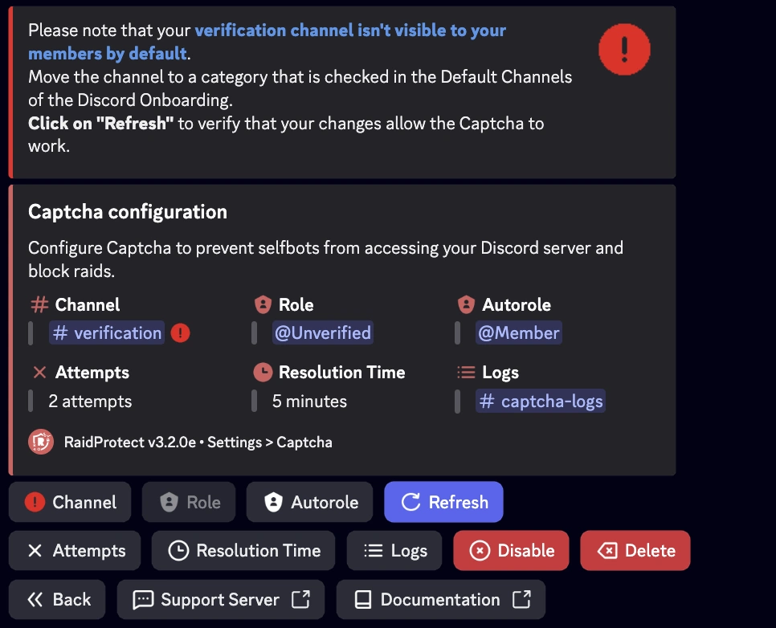
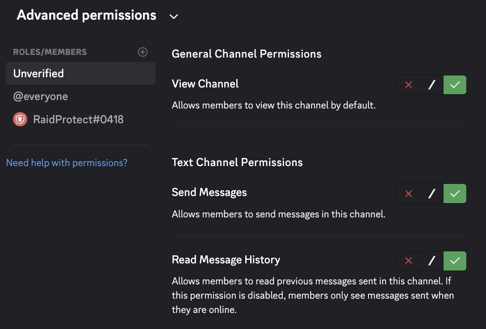

If the `#verification` channel is not visible by default for new members, this can prevent the Captcha system from working properly. Here’s how to fix this issue step by step.

## 1️⃣ Check the channel permissions {#permissions}

1. Open the `#verification` channel settings (right-click > **Edit Channel**).
2. In the **Permissions** tab:
   - Make sure `@everyone` **does not** have permission to view the channel.
   - Ensure the `@Unverified` role **has** permission to **view the channel**, **read message history**, and **send messages**.

## 2️⃣ Check the Welcome category {#default-category}

1. Go to **Server Settings** > **Onboarding**.
2. In the **Default Channels** section, verify that the category containing `#verification` is checked as visible for new members.
3. If needed, move `#verification` into a checked category.
4. Save the changes.

## 3️⃣ Refresh the configuration in RaidProtect {#refresh-config}

1. Use the [`/settings`](../setup.md#settings) command and go to the **Captcha** tab.
2. Click **Refresh** to force the configuration update.
3. If the channel is now visible, the Captcha system will work correctly.

## 4️⃣ Test with a test account {#test-account}

To confirm everything is set up properly:

1. Join the server with another Discord account.
2. Check that the `#verification` channel is visible on arrival.
3. Enter the Captcha code sent by RaidProtect.
4. Once verified, the account should have access to the other channels.

## 🛠️ Common issues and solutions {#common-issues}

| Issue | Solution |
|-------|----------|
| 🔴 The `#verification` channel remains invisible | Check that it is in a **checked category** in Discord’s Welcome settings. |
| 🚫 The `@Unverified` role cannot write | Grant it **send messages** permission in `#verification`. |
| ❌ Captcha doesn’t work after changes | Click **“Refresh”** in `/settings > Captcha`. |

---

✅ By following these steps, your verification system will be fully operational to safely welcome members and effectively block bots or raids.