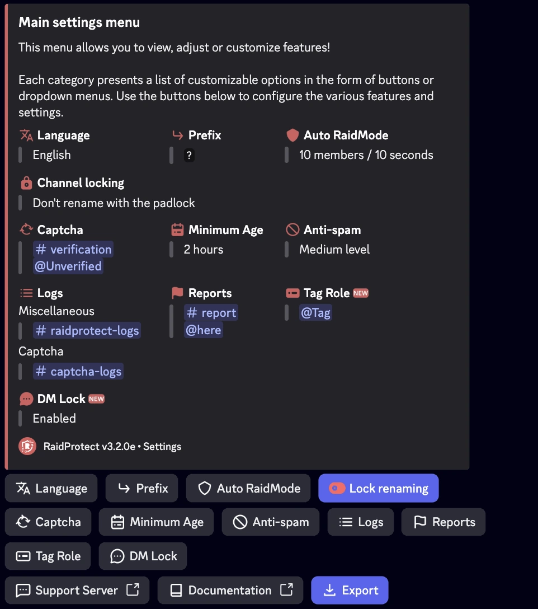

RaidProtect vereinfacht die Serververwaltung mit zwei mächtigen Werkzeugen: dem [`/setup`](#install)-Befehl für eine schrittweise geführte Einrichtung und dem [`/settings`](#settings)-Befehl, um deine Einstellungen jederzeit über ein zentrales Menü anzupassen. Diese Installationsanleitung erklärt, wie du sie effektiv nutzt.

## Geführte Installation {#install}

Der `/setup`-Befehl hilft dir, RaidProtect schnell oder detailliert einzurichten – je nach Bedarf. Er bietet zwei Konfigurationsmodi: [empfohlen](#recommended) oder [fortgeschritten](#advanced).

### 🔧 Empfohlene Konfiguration {#recommended}

Damit kannst du die wichtigsten Funktionen auf einen Blick über ein interaktives Auswahlmenü aktivieren oder deaktivieren.

1. Verwende den Befehl `/setup`.
2. Klicke auf die Schaltfläche "**Recommended Configuration**".
3. Aktiviere oder deaktiviere die gewünschten Funktionen über das Auswahlmenü.

Anschließend erhältst du eine Zusammenfassung der aktivierten Funktionen und der Änderungen, die am Server vorgenommen werden.

<!--
### 🛠️ Fortgeschrittene Konfiguration {#advanced}

Wenn du den Bot gründlicher konfigurieren möchtest, wähle die fortgeschrittene Konfiguration. Der Bot führt dich Schritt für Schritt mit klaren Erklärungen.

1. Verwende den `/setup`-Befehl.
2. Wähle die Schaltfläche "**Advanced Configuration**".
3. Jeder Schritt stellt eine Funktion, ihren Zweck und eine empfohlene Mindesteinstellung vor.
4. Mit den Schaltflächen "**Previous**" und "**Next**" kannst du vor- und zurückgehen.

Am Ende wird eine Zusammenfassung der Einstellungen angezeigt, um deine Auswahl zu bestätigen.
-->
## Konfiguration ändern {#settings}

Der `/settings`-Befehl ist nach der Installation die zentrale Anlaufstelle, um deine Einstellungen zu verwalten. Damit kannst du die Funktionen von RaidProtect jederzeit einfach und schnell einsehen, anpassen oder personalisieren.

### 🔍 Einstellungsmenü {#menu}

1. Tippe `/settings` in einen Kanal, in dem der Bot aktiv ist.
2. Navigiere bequem zwischen den verschiedenen Bereichen, um die gewünschten Einstellungen zu finden.
3. Passe die Optionen an: Jede Kategorie präsentiert eine Liste anpassbarer Optionen in Form von Buttons oder Dropdown-Menüs.

### 🔄 Eine Einstellung zurücksetzen {#reset}

1. Navigiere zur gewünschten Einstellung.
2. Klicke auf "**Reset**".

Der Bot bestätigt das Zurücksetzen, bevor er die Änderungen übernimmt.

:::info Konfigurationsproblem?
Solltest du auf ein Problem stoßen, sieh im Abschnitt [Fehlfunktionen](./guides/malfunctions) nach oder komme auf unseren [Support‑Server](https://raidprotect.bot/discord), um Hilfe zu erhalten.
:::
