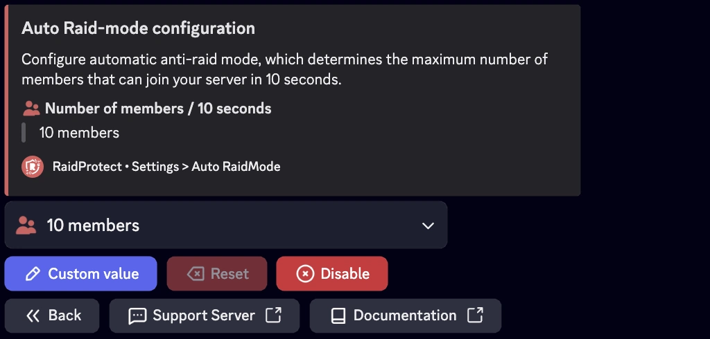

## Raid-Modus

Der Raid-Modus ist eine Notfallfunktion, die sofort alle neuen Nutzer blockiert, die deinem Server beitreten wollen. Damit übertrifft sie die native Discord-Beschränkung, die Einladungen nur für 24 Stunden über die Aktion "Einladungen pausieren" blockieren kann.

### ❓ Wie der Raid-Modus funktioniert {#working}

RaidProtect aktiviert den Raid-Modus automatisch, wenn in kurzer Zeit viele Nutzer deinem Server beitreten. Standardmäßig schaltet sich der Modus ein, wenn mehr als 10 Nutzer in weniger als 10 Sekunden joinen. Ist der Raid-Modus aktiviert, kann niemand dem Server beitreten – Einladungen werden sofort blockiert.

:::warning
Die Community-Funktionen von Discord sind für ein korrektes Funktionieren des Raid-Modus erforderlich. [Folge unserem Leitfaden, um sicherzustellen, dass Community auf deinem Server aktiviert ist.](../guides/community.md)
:::

#### Aktivieren {#enable}

- Um den Modus manuell zu aktivieren, muss ein Nutzer mit Kick-Berechtigung den Befehl `/raidmode` ausführen.
- Im Log-Kanal wird automatisch eine Nachricht gepostet, die die Aktivierung meldet.

#### Deaktivieren {#disable}

Der Raid-Modus deaktiviert sich nicht von selbst. Denke daran, ihn mit demselben Befehl wieder auszuschalten, sobald die Gefahr vorüber ist. 😇

:::info
Der Befehl `raidmode` ist [auch mit Prefix verfügbar](../guides/prefix.md).
:::

### 🚨 Automatische Raid-Modus-Konfiguration {#config}

Wenn auf deinem Server häufig viele Mitglieder gleichzeitig joinen, solltest du diese Schwelle anpassen, um Fehlalarme zu vermeiden.



:::note
Wir empfehlen einen Wert zwischen 10 und 20 Mitgliedern in 10 Sekunden, um das System optimal zu nutzen.
:::

1. Führe den [`/settings`-Befehl](../setup.md#settings) aus.
2. Klicke auf die Schaltfläche "**Auto RaidMode**".
3. Wähle aus, wie viele Mitglieder innerhalb von 10 Sekunden beitreten dürfen.

Du kannst den Standardwert (10) belassen oder über die Schaltfläche "**Benutzerdefinierter Wert**" einen eigenen Wert einstellen.

:::warning
Wenn der Raid-Modus automatisch ausgelöst wurde, vergiss nicht, ihn zu deaktivieren, sobald die Gefahr vorüber ist. Er schaltet sich nämlich nicht selbst aus. 😖
:::

## Mindestalter des Accounts {#minage}

Zur besseren Sicherheit kannst du ein Mindestalter der Discord-Accounts für neue Mitglieder festlegen.

1. Führe den [`/settings`-Befehl](../setup.md#settings) aus.
2. Klicke auf die Schaltfläche "**Minimum Age**".
3. Wähle den gewünschten Wert im Dropdown-Menü oder gib ein eigenes Datum im Format m/h/d/y an.

### 🎂 Mindestalter umgehen {#bypass-minage}

Verwende den Befehl: ```/bypass minage [user]```

Ersetze `[user]` mit der gewünschten ID; diese Person hat dann 10 Minuten Zeit, dem Server beizutreten, ohne wegen Nichterfüllung des Alterskriteriums gekickt zu werden. Sie können den Befehl auch ohne Angabe eines Benutzers verwenden, um die aktuelle Liste der Bypass-Benutzer anzuzeigen.