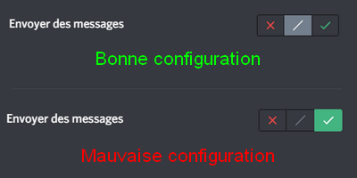

Ein Problem mit RaidProtect? Die Lösung finden Sie wahrscheinlich hier.

Manchmal funktioniert nicht alles wie erwartet. Hier sind die **häufigsten Probleme**, die auftreten können, und wie Sie sie beheben können.

Wenn diese Seite keine Antwort auf ein Problem bietet, das Sie haben, [**zögern Sie nicht, unser Support-Team zu kontaktieren**](https://raidprotect.bot/discord), das Ihnen gerne weiterhilft!

## Der Bot zeigt einen Fehler an, wenn ich einen Befehl ausführe {#commands}

Wenn der Befehl nicht erfolgreich ausgeführt wird, **kann RaidProtect einen Fehler anzeigen** anstelle des erwarteten Ergebnisses. In den meisten Fällen wird ein Hinweis in der Nachricht gegeben, aber es kann sich auch um eine allgemeinere Meldung handeln. So beheben Sie dieses Problem in den meisten Fällen.

- **Tun Sie, was angegeben ist.** Einige Fehler erklären das Problem deutlich. Wenn der Bot Sie auffordert, etwas zu tun, tun Sie es.

- **Überprüfen Sie die Befehlsparameter.** Der Befehl ist möglicherweise einfach falsch geschrieben; schauen Sie in der Hilfe nach, wie er verwendet wird. Vergessen Sie nicht, dass eckige Klammern ([]) nicht mit eingegeben werden sollen.

- **Überprüfen Sie die Berechtigungen des Bots.** Er muss die **Administrator**-Berechtigung haben und sich auf der Ebene der Administratoren in der Rollenhierarchie befinden.

- **Versuchen Sie den Befehl erneut.** Manchmal löst sich das Problem von selbst ohne erkennbaren Grund.

Wenn Sie trotz dieser Tipps weiterhin einen Fehler erhalten, [kontaktieren Sie unseren Support](https://raidprotect.bot/discord), damit wir Ihnen helfen können.

## Der Log-Kanal des Bots wurde nicht automatisch erstellt {#logs}

Um Sie über die durchgeführten Aktionen zu informieren, benötigt RaidProtect einen Log-Kanal. Dieser Kanal wird automatisch erstellt, wenn der Bot zum ersten Mal beitritt, aber manchmal wird kein Kanal erstellt. So beheben Sie dieses Problem.

- **Stellen Sie sicher, dass der Bot Administrator-Berechtigungen hat.** Für das ordnungsgemäße Funktionieren des Bots müssen Sie ihm die Administrator-Berechtigung erteilen. Falls dies noch nicht geschehen ist, gehen Sie zu den Rolleneinstellungen und gewähren Sie der RaidProtect-Rolle diese Berechtigung. Dann müssen Sie den Bot nur noch manuell initialisieren, damit alles funktioniert (siehe unten)!

- **Überprüfen Sie, ob der Bot korrekt initialisiert ist.** Dies geschieht normalerweise automatisch, aber Sie können diese Initialisierung mit dem [Befehl `/setup`](../setup.md#install) erzwingen. Der Log-Kanal sollte automatisch erstellt werden.

- **Legen Sie manuell einen Kanal fest.** Wenn nichts funktioniert, keine Panik, Sie können manuell den Kanal auswählen, den der Bot für Logs verwenden soll! Sobald ein dedizierter Kanal erstellt wurde, führen Sie den [Befehl `/settings`](../setup.md#settings) aus und wählen Sie Logs.

## Ein Benutzer hat gespammt, aber der Bot hat ihn nicht bestraft {#anti-spam}

Der [Anti-Spam](../features/anti-spam.mdx) ist eine der Hauptfunktionen von RaidProtect, und es kann ärgerlich sein, wenn er nicht funktioniert. Aber seien Sie beruhigt, meistens ist es nichts Ernstes.

- **Wenn der Anti-Spam auffordert, das Spammen zu stoppen**, aber nicht bestraft, liegt dies wahrscheinlich an fehlenden Berechtigungen. Denken Sie daran, der Bot muss die Administrator-Berechtigung haben und sich auf der Ebene der Administratoren in der Rollenhierarchie befinden.

- **Überprüfen Sie die Anti-Spam-Konfiguration.** Es klingt banal, aber manche vergessen, dass sie einen Kanal ignoriert haben.

- **Überprüfen Sie die Berechtigungen des Spammers.** Administratoren werden ignoriert. Wenn Sie also den Anti-Spam auf Ihrem eigenen Server testen, wird er Sie möglicherweise nicht erkennen.

- **Ist der Spam lang genug?** Der Bot erkennt Spam in der Regel erst ab mehr als 5 Nachrichten. Seien Sie nicht zu ungeduldig.

Wenn trotz alledem Spam immer noch nicht erkannt wird, [kontaktieren Sie uns auf unserem Support-Server](https://raidprotect.bot/discord) und fügen Sie einen **Screenshot des Problems** bei.

## Benutzer haben Zugang zum Server, ohne das Captcha zu bestehen {#captcha}

Dieses Problem tritt relativ häufig auf, hängt aber von **der Konfiguration Ihres Servers** ab. Sehen wir uns an, wie es behoben werden kann.

- **Haben Sie eine automatische Rolle?** Wenn Sie einen Bot (außer RaidProtect) konfiguriert haben, der neuen Mitgliedern auf Ihrem Server automatisch eine Rolle zuweist, kann dies das Captcha beeinträchtigen. Ersetzen Sie diese durch die [Autorole von RaidProtect](../features/captcha.md#autorole).

- **Haben Sie das Captcha aktiviert?** Dies ist eine vollständig optionale Funktion, die einen Befehl zur Aktivierung erfordert. Lesen Sie die [Dokumentationsseite zum Captcha](../features/captcha.md#config) für weitere Informationen.

## Benutzer können weiterhin schreiben, wenn ich einen Kanal sperre {#lock}

Der Sperrbefehl scheint magisch zu sein, hat aber auch seine Schwächen. Wie [in dieser Dokumentation erwähnt](../features/channel-lock.md#lock), **wirkt der Befehl nur auf die Rolle @everyone**. Das bedeutet, dass wenn eine Rolle in dem Kanal, den Sie sperren möchten, ausdrücklich die Berechtigung zum Schreiben hat, sie dies trotzdem tun kann. Da ein Bild mehr als tausend Worte sagt, hier ist, wie das in der Praxis aussieht.

