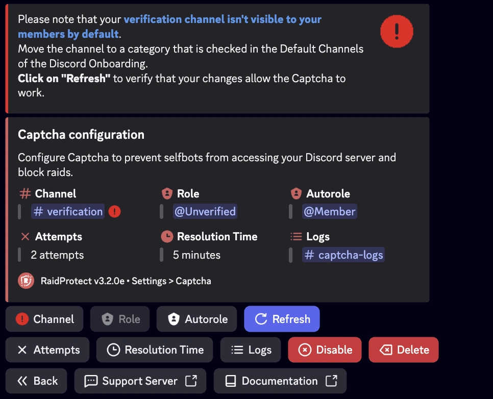

Wenn der Kanal `#verification` für neue Mitglieder standardmäßig nicht sichtbar ist, kann dies das ordnungsgemäße Funktionieren des Captcha-Systems verhindern. Hier erfahren Sie Schritt für Schritt, wie Sie dieses Problem beheben können.

## 1. Kanalberechtigungen überprüfen {#permissions}

1. Öffnen Sie die Einstellungen des Kanals `#verification` (Rechtsklick > **Kanal bearbeiten**).
2. Im Tab **Berechtigungen**:
   - Stellen Sie sicher, dass `@everyone` **keine** Berechtigung hat, den Kanal zu sehen.
   - Überprüfen Sie, dass die Rolle `@Nicht Verifiziert` die Berechtigung hat, den **Kanal zu sehen**, **den Nachrichtenverlauf zu lesen** und **Nachrichten zu senden**.

## 2. Onboarding-Kategorie überprüfen {#default-category}

1. Gehen Sie zu **Servereinstellungen** > **Onboarding-Prozess**.
2. Überprüfen Sie im Abschnitt **Standardkanäle**, dass die Kategorie, die `#verification` enthält, als sichtbar für neue Mitglieder markiert ist.
3. Verschieben Sie `#verification` bei Bedarf in eine markierte Kategorie.
4. Speichern Sie die Änderungen.

## 3. Konfiguration in RaidProtect aktualisieren {#refresh-config}

1. Verwenden Sie den Befehl [`/settings`](../setup.md#settings) und gehen Sie dann zum Tab **Captcha**.
2. Klicken Sie auf **Aktualisieren**, um die Konfigurationsaktualisierung zu erzwingen.
3. Wenn der Kanal jetzt sichtbar ist, funktioniert das Captcha-System korrekt.

## 4. Mit einem Testkonto testen {#test-account}

Um zu bestätigen, dass alles richtig konfiguriert ist:

1. Treten Sie dem Server mit einem anderen Discord-Konto bei.
2. Überprüfen Sie, ob der Kanal `#verification` bei der Ankunft sichtbar ist.
3. Geben Sie den von RaidProtect gesendeten Captcha-Code ein.
4. Nach der Verifizierung sollte das Konto Zugang zu den anderen Kanälen haben.

## Häufige Probleme und Lösungen {#common-issues}

| Problem | Lösung |
|---------|----------|
| Der Kanal `#verification` bleibt unsichtbar | Überprüfen Sie, ob er sich in einer **markierten Kategorie** im Discord-Onboarding befindet. |
| Die Rolle `@Nicht Verifiziert` kann nicht schreiben | Erteilen Sie ihr die **Berechtigung zum Senden von Nachrichten** in `#verification`. |
| Das Captcha funktioniert nach der Änderung nicht | Klicken Sie auf **"Aktualisieren"** in `/settings > Captcha`. |

---

Wenn Sie diese Schritte befolgen, ist Ihr Verifizierungssystem voll funktionsfähig, um Mitglieder sicher zu empfangen und Bots oder Raids effektiv zu blockieren.
