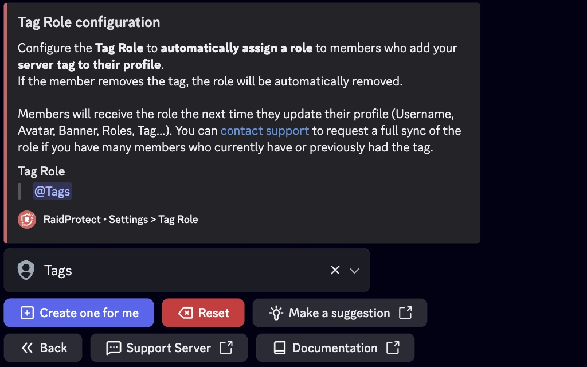

Die Tag-Rolle weist automatisch allen Mitgliedern eine Rolle zu, die [den Tag deines Servers](https://support.discord.com/hc/en-us/articles/31444248479639-Server-Tags) in ihr Discord-Profil einfügen. Durch das Vergeben dieser Rolle würdigst du ihr Engagement und [motivierst sie, deinen Server aktiv zu repräsentieren](https://dfr.gg/blog/2025/05/09/revolution-boosts-tags-serveur-publics#tags). Eine einfache, aber effektive Methode, um die gemeinsame Identität zu stärken und die treuesten Botschafter deiner Community zu belohnen.

## ❓ Wie die Tag-Rolle funktioniert {#working}

Ganz einfach: Sobald ein Mitglied den Server-Tag in sein Discord-Profil einträgt, weist RaidProtect ihm automatisch eine bestimmte Rolle zu.
Entfernt das Mitglied den Tag, wird auch die Rolle entfernt.

:::info
Ist die Tag-Funktion nicht aktiviert oder steht sie deinem Server noch nicht zur Verfügung, hat die Tag-Rolle keine Wirkung.
:::

## 🎖️ Die Tag-Rolle konfigurieren {#config}

Die Einrichtung dauert nur wenige Klicks:
1. Nutze den [Befehl `/settings`](../setup.md#settings).
2. Klicke auf die Schaltfläche "**Tag-Rolle**".
3. Wähle eine bestehende Rolle im Auswahlmenü oder klicke auf "**Einen für mich erstellen**".
4. Du kannst die Rolle jederzeit wieder abwählen, indem du auf "**Zurücksetzen**" klickst.

:::tip
Mitglieder erhalten die Rolle, wenn sie ihr Profil das nächste Mal aktualisieren (Benutzername, Avatar, Banner, Rollen, Tag...). Du kannst [den Support kontaktieren](https://raidprotect.bot/discord), um eine vollständige Rollensynchronisierung anzufordern, falls viele Mitglieder den Tag aktuell oder früher verwendet haben.
:::
