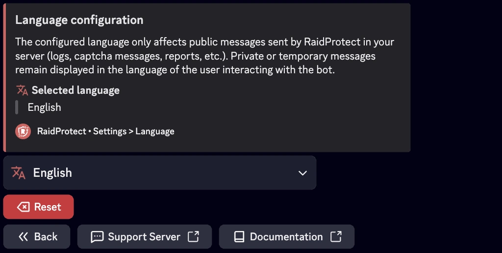

RaidProtect ermöglicht es Ihnen, die vom Bot verwendete Sprache zu wählen, damit sie bestmöglich zu Ihrer Discord-Community passt.

:::note
Ist Ihr Server als Community-Server eingerichtet (Discord-Einstellung), verwendet RaidProtect standardmäßig die in den **Community-Einstellungen** des Servers festgelegte Sprache.
:::

**Öffentliche Nachrichten:** Die eingestellte Sprache betrifft nur die öffentlichen Nachrichten, die RaidProtect auf Ihrem Server sendet (Logs, Captcha-Meldungen, Reports usw.).

**Ephemere Nachrichten:** Diese privaten oder temporären Nachrichten werden weiterhin in der Sprache des Nutzers angezeigt, der mit dem Bot interagiert.

## 🌐 Unterstützte Sprachen {#supported}

- **Französisch**
- **Englisch**
- **Deutsch**
- **Spanisch**
- **Brasilianisches Portugiesisch**

## ⚙️ Sprache des Bots ändern {#change}

- Verwenden Sie den [`/settings`-Befehl](./setup.md#settings).
- Wählen Sie die Schaltfläche "**Sprache**".
- Entscheiden Sie sich für die gewünschte Sprache.

Sobald die Sprache ausgewählt ist, passt der Bot automatisch alle seine Nachrichten, Benachrichtigungen und Befehle an die gewählte Sprache Ihres Servers an.

:::info
Die Sprachunterstützung von RaidProtect wird ständig erweitert! [Schlagen Sie Sprachen vor](https://suggestions.raidprotect.bot), die Sie gerne auf dem Bot sehen würden, oder [stimmen Sie](https://suggestions.raidprotect.bot) für vorgeschlagene Sprachen, damit sie hinzugefügt werden.
:::
