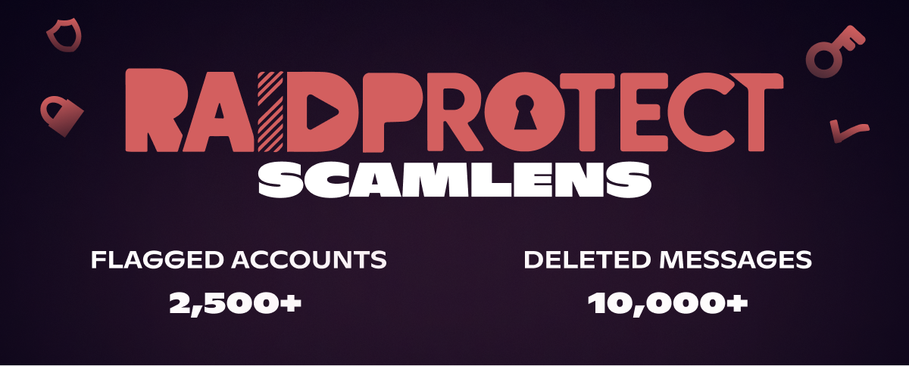

import Timestamp from '@site/src/components/Timestamp';

A major spam wave linked to the **"crypto images" scam** has led us to activate the `Deletion` mode of **RaidProtect ScamLens**, our anti-scam image analysis module, ahead of schedule.

{/* truncate */}

## 🛡️ Spam details {#threat}

Two massive spam waves occurred on <Timestamp value={1771023600} format="D" />, between <Timestamp value={1771023600} format="T" /> and <Timestamp value={1771068391} format="T" />. Over **2,500 compromised accounts** were used to send more than **10,000 messages** containing this type of image. These figures only represent what was observed across the 340,000 servers protected by RaidProtect — with Discord having several million active servers, the actual scale of this attack can be estimated at **several hundred thousand messages** across the platform.

The scam, known as "crypto images", involves mass-sending **4 images** urging users to buy fraudulent cryptocurrencies, in as many channels as possible.

#### Wave 1 {#wave-1}

#### Wave 2 {#wave-2}

Given the high volume of fraudulent messages, we activated the `Deletion` mode of **ScamLens** ahead of schedule — initially introduced in `Learning` mode in [update 3.3.1](/blog/3.3.1-jail-and-mute#changelog).
This module analyzes images sent on your servers and now automatically deletes those identified as fraudulent (no configuration needed).

### What's next? {#next}

The `Sanction` mode will be activated soon: in addition to deleting fraudulent images, ScamLens will automatically apply a **one-day timeout** to the sender. We chose not to ban these accounts, as they are almost exclusively **hacked accounts** — a ban would penalize the actual account owner. The timeout neutralizes the threat immediately, giving the owner time to regain control of their account.

:::info 🔒 Deliberately opaque operation
For security reasons, we do not and will not disclose the detection methods used by ScamLens. This "black box" approach is designed to prevent scammers from adapting their techniques to bypass our protections.
:::

---

## ❓ FAQ {#faq}

#### How to block image spam on Discord? {#antispam-images}
[Add RaidProtect](https://raidprotect.bot/invite) to your server. ScamLens is enabled by default and will delete all images detected as fraudulent — no additional configuration needed.

#### How to protect against crypto image scams on Discord? {#arnaque-images-crypto}
Simply [add RaidProtect](https://raidprotect.bot/invite). ScamLens will automatically detect and delete fraudulent images.

#### How to prevent spam bots on my Discord server? {#anti-spam-bots}
In addition to ScamLens, enable RaidProtect's [captcha](/features/captcha) to prevent automated accounts from joining your server.

---

:::tip 📚 Useful resources
- 🔗 [Add RaidProtect to your server](https://raidprotect.bot/invite)
- 📘 [Read the full documentation](https://docs.raidprotect.bot/)
- 💡 [Submit a suggestion or feedback](https://suggestions.raidprotect.bot/)
- 📣 [Follow announcements and join the community](https://raidprotect.bot/discord)
:::
