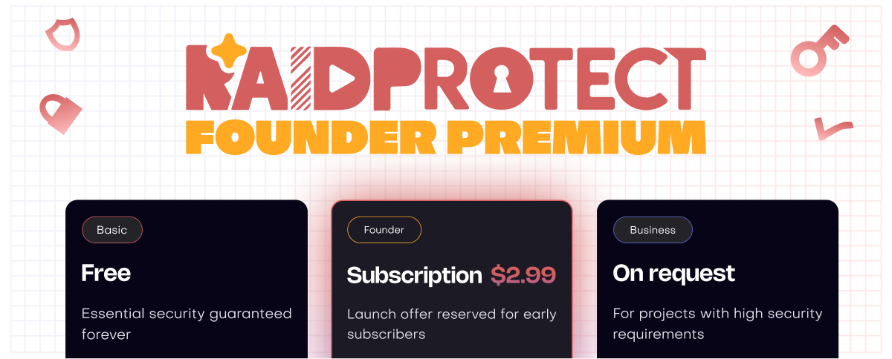

RaidProtect has been free since day one — and it will stay that way. Today, we're launching **RaidProtect Premium**: extended capabilities for servers that need more, and a concrete way to move the project forward.

<!--truncate-->

## ❓ Why a Premium? {#why}

RaidProtect is developed and maintained by a company whose revenue comes from other projects. From the start, it has been funding the entire bot: servers, bandwidth, development, maintenance. In practice, it's revenue generated by other clients, on other work, that pays for the service you use for free.

We made that choice because we believe in the project. But a bot funded by a budget that doesn't depend on it is a bot whose development moves forward when that budget allows. The goal of Premium is to change that: make RaidProtect self-sufficient. A self-funded project is one that can accelerate development, strengthen stability, and grow without depending on anyone.

What doesn't change: **the free version stays complete** and will continue to evolve at the same pace. Premium is for servers that need more: extended limits, advanced customization, early access — and for those who want to actively support the project.

---

## 🚀 The Founder Offer {#founder}

Premium launches with a **Founder offer**, reserved for early subscribers. The deal: **your price is locked for life**.

Over time, new plans will be introduced and the Founder offer will be removed from the store. Once closed, no one will be able to access it again.

Founder subscribers keep their price and continue to benefit from future improvements. You're betting on RaidProtect early — we won't forget that. If a future feature turns out to be particularly resource-intensive, it might not be included — but your current benefits and reasonable future additions are guaranteed.

:::tip Activate Premium
Use `/settings` on your Discord server and click "Premium", or go directly to the [RaidProtect store on Discord](https://discord.com/discovery/applications/466578580449525760/store) to discover the offer.
:::

---

## ✨ What Premium offers today {#features}

### 🏷️ [Customizable sanction names](/features/sanctions#custom-names)

Rename each sanction type to match your server's vocabulary. The displayed name, the verb used in messages, and the wording of the private message sent to the sanctioned member are all freely configurable.

### 🔐 [Authentication Manager: extended limits](/features/authentication-manager)

In the free version, the Authentication Manager is limited to 3 protected roles, 20 users, and sessions of 8 hours maximum. Premium raises these limits:

| | Free | Premium |
| --- | --- | --- |
| Protected roles | 3 | 10 |
| Users | 20 | 50 |
| Max. session duration | 8h | 24h |

### 📋 [Information Panels: extended limits](/features/display)

Go from 2 to 4 public information panels (+ the slot reserved for Jail), to cover more content on your server.

### 🔬 Public Beta Access

Get early access to certain experimental features before their official release.

---

For the full list of changes, check out [the changelog](/changelog).

:::tip Useful resources
- [Add RaidProtect to your server](https://raidprotect.bot/invite)
- [Browse the full documentation](https://docs.raidprotect.bot/)
- [Submit a suggestion or feedback](https://suggestions.raidprotect.bot/)
- [Follow announcements and join the community](https://raidprotect.bot/discord)
:::
