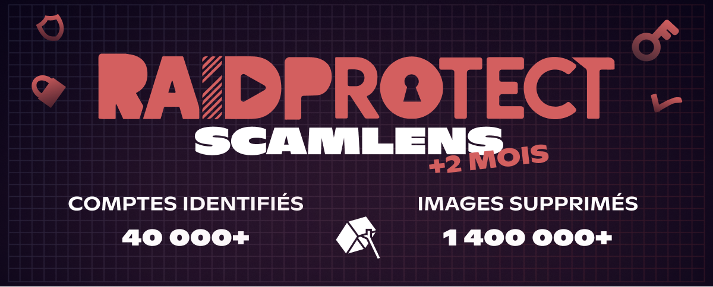

import Timestamp from '@site/src/components/Timestamp';

April 2026 recap across the **355,000 Discord servers** protected by RaidProtect (from March 21 to May 1, 2026): **1.4 million scam images deleted** by ScamLens and **40,000 hacked Discord accounts** identified. We're also launching the **HoneyPot**, a new **anti-spam trap channel** that complements ScamLens by catching **scams not yet cataloged** and other forms of automated spam (links, mentions, text raids).

{/* truncate */}

## 🛰️ Recap: ScamLens, RaidProtect's image anti-scam {#what-is-scamlens}

ScamLens is the **image anti-scam** module of RaidProtect, the **Discord protection bot**. It analyzes every image in real time and automatically deletes the ones it identifies as fraudulent: **crypto scams**, **fake celebrity giveaways** (MrBeast, Elon Musk, Kick, Stake…), **fake online casino promotions**. No rules to write, no blocklist to maintain: just [add RaidProtect](https://raidprotect.bot/en/invite), ScamLens activates by default.

  
  
  
  

## 📊 ScamLens recap since February 14, 2026 {#stats}

Cumulative data since the [early activation of ScamLens](/en/blog/scamlens-early-activation) on <Timestamp value={1771023600} format="D" />, across the **355,000 Discord servers** protected by RaidProtect:

| **Indicator (cumulative since February 14)** | **March 21, 2026** | **May 1, 2026** | **Change** |
|---|---|---|---|
| Images analyzed (unique) | 162,000 | **890,000** | **+450%** |
| Scam images detected (unique) | 62,000 | **82,000** | +32% |
| Fraudulent images deleted | 260,000 | **1,400,000** | **+440%** |
| Hacked Discord accounts identified | 15,000 | **40,000** | **+167%** |

The volume of deleted images has **more than quintupled**: the [extended coverage](/en/blog/scamlens-1-month-recap#coverage) now catches images that were escaping analysis for technical reasons related to the Discord CDN. The unique image catalog only grows by 32% because attackers keep cycling through a few **visual clusters** (re-crops, filters, retouches).

A **"2-image" variant** (instead of 4) has appeared during the period; ScamLens covers it, and several **spikes of ~2,000 deletions per minute** have already been intercepted. Each image is processed in **~400 ms**, before most members have even had time to see it.

---

## 🆕 Updates {#updates}

### ⏱️ Automatic 24h timeout {#scamlens-timeout}

We now apply a **24-hour automatic timeout** to any account flagged by ScamLens. This gives the legitimate owner (almost always a hijacking victim) time to regain control and cut off the attackers' access.

### 🍯 The RaidProtect HoneyPot {#honeypot}

A **[Discord HoneyPot](https://docs.raidprotect.bot/en/features/honeypot)** (or "trap channel") is a channel where no legitimate member is supposed to post. **Hacked accounts** and **spam bots**, on the other hand, dump their payload (images, links, mentions, pings) into **every channel** without filtering, including the trap. Any message landing there triggers an **automatic sanction**, regardless of its content.

**RaidProtect now ships its own HoneyPot.** With [`/settings` → **HoneyPot**](https://docs.raidprotect.bot/en/features/honeypot), the bot creates the channel, places it at the top of the server, and posts a translated warning message.

#### Why the RaidProtect HoneyPot rather than another? {#honeypot-vs-others}

Our HoneyPot is **directly connected to ScamLens**:

- **ScamLens runs first.** If an image posted in the trap is already known, it's deleted and the HoneyPot **does not trigger**: it lets ScamLens act.
- **The HoneyPot enriches ScamLens.** Any new image caught in a trap channel feeds our catalog, which then blocks the wave **across the 355,000 protected servers**.

#### What each one covers {#scamlens-honeypot}

- **ScamLens** = known scam images, deleted with 24h timeout.
- **HoneyPot** = everything else: **link spam, text raids, mass mentions, bots**, and **new images** not yet identified.

ScamLens is active by default. **Enabling the HoneyPot doesn't break anything**, it just closes the blind spots.

---

## ❓ FAQ {#faq}

#### Why is my Discord account sending messages on its own? {#compte-discord-envoie-messages-seul}
Your account has likely been **hacked**. Scammers steal the **authentication token** (fake site, infected software, malicious extension) and use it to spam scam images on every server you're in. Change your Discord password, enable **two-factor authentication** and revoke active sessions.

#### What should I do if one of my members is broadcasting a crypto scam? {#membre-diffuse-scam-crypto}
Don't ban them: it's almost always a **hacked account**, not a malicious user. Reach out privately so they can secure their account. ScamLens already removes the image on the fly, without punishing the legitimate owner.

#### How do I recognize a fake crypto promotion on Discord? {#reconnaitre-fausse-promo-crypto}
Any **crypto "giveaway"**, **online casino** with a celebrity logo or **miracle investment** is a scam. Discord never runs cryptocurrency distributions, and no serious brand spams across multiple servers.

#### What is a HoneyPot on Discord? {#qu-est-ce-qu-un-honeypot}
A **HoneyPot** (or trap channel) is a channel visible to everyone but where **no legitimate member should write**. Any message that lands there is necessarily automated spam: RaidProtect automatically sanctions the account (ban, softban, kick, timeout, jail or mute, your choice).

#### How do I enable the HoneyPot on my Discord server? {#activer-honeypot}
[Add RaidProtect](https://raidprotect.bot/en/invite), run `/settings` → **HoneyPot**, then "**Create the channel**". The bot creates the trap channel, places it at the top of the server and posts a translated warning message. Details in the [documentation](https://docs.raidprotect.bot/en/features/honeypot).

#### Does RaidProtect automatically protect against spam? {#raidprotect-spam-auto}
Yes. [Add RaidProtect](https://raidprotect.bot/en/invite) with the recommended permissions: **ScamLens is active by default** and deletes fraudulent images in ~400 ms. The **HoneyPot** activates in one click via `/settings` to close the blind spots (link spam, text raids, new image formats).

---

:::tip 📚 Useful resources
- 🔗 [Add RaidProtect to your server](https://raidprotect.bot/en/invite)
- 📘 [HoneyPot documentation](https://docs.raidprotect.bot/en/features/honeypot)
- 💡 [Submit a suggestion](https://suggestions.raidprotect.bot/)
- 📣 [Join our Discord server](https://raidprotect.bot/discord)
:::
