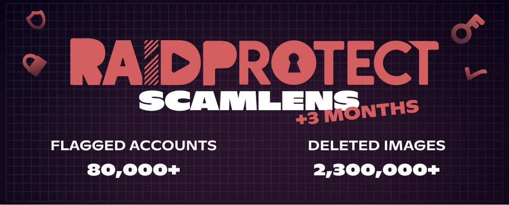

import Timestamp from '@site/src/components/Timestamp';
import Head from '@docusaurus/Head';

June 2026 recap across the **375,000 Discord servers** protected by RaidProtect (from June 1 to July 1, 2026): **4 million scam images deleted** by ScamLens and **160,000 hacked Discord accounts** identified. These scams **impersonate celebrities** like MrBeast, Elon Musk or Andrew Tate, who obviously have no connection to these messages. New this month: ScamLens now **sanctions on the very first detected image**, instead of cleaning the whole wave before sanctioning, to cut off a hacked account before it can post any more.

{/* truncate */}

## 🛰️ Recap: ScamLens, RaidProtect's image anti-scam {#what-is-scamlens}

For servers just discovering RaidProtect: ScamLens is the module that handles **scam images**. As soon as an image is posted, it checks it against its catalog and automatically **deletes** the fraudulent ones: **crypto scams**, **fake celebrity giveaways** (MrBeast, Elon Musk, Andrew Tate, Kick, Stake…), **fake online casino promotions**. Nothing to configure or maintain on your end: ScamLens runs **by default** as soon as you [add RaidProtect](https://raidprotect.bot/en/invite).

  
  
  
  

## 📊 ScamLens recap since February 14, 2026 {#stats}

Cumulative data since the [early activation of ScamLens](/en/blog/scamlens-early-activation) on <Timestamp value={1771023600} format="D" />:

| **Indicator (cumulative since February 14)** | **June 1, 2026** | **July 1, 2026** | **Change** |
|---|---|---|---|
| Images analyzed (unique) | 1,800,000 | **3,000,000** | **+67%** |
| Scam images detected (unique) | 141,000 | **275,000** | **+95%** |
| Fraudulent images deleted | 2,300,000 | **4,000,000** | **+74%** |
| Hacked Discord accounts identified | 80,000 | **160,000** | **+100%** |

The number of **hacked accounts identified has doubled again** in a month (80,000 → 160,000), and the volume of deleted images now reaches **4 million**. The unique image catalog is climbing fast (+95%): **new visual clusters** keep appearing in bulk. A visual cluster is one same scam image **plus all its micro-variants** (re-crops, filters, retouches); when the unique count climbs this much, **new visuals** are being launched, not just spin-offs of the old ones (see May's ["3-image" combo](/en/blog/threat-weather-may-2026#updates)).

---

## 🆕 Update: sanction on the very first image {#updates}

Until now, when a hacked account dumped a wave of images, ScamLens **deleted all the messages first**, then applied the sanction (24 h timeout). The catch: during that cleanup, the account could **keep posting** for a few more seconds.

Now we **flip the order**: as soon as ScamLens recognizes **the first scam image**, it **immediately sanctions the account** (24 h timeout), *then* cleans up the rest of the wave. The hacked account's access is cut off **on the very first image**, without giving it time to send any more.

On big spikes (over 2,000 images within minutes), this sharply reduces the number of images that reach the channels before the sanction. Each image is still processed in **~400 ms**, and the legitimate owner regains control when the timeout expires: remember, it's **almost always a hacking victim**, not a malicious member.

---

## ❓ FAQ {#faq}

<Head>
  
</Head>

#### What is ScamLens on Discord? {#quest-ce-que-scamlens}
ScamLens is RaidProtect's **image anti-scam** module, the **Discord protection bot**. It analyzes every posted image in real time and **automatically deletes** the ones it identifies as fraudulent (crypto scams, fake celebrity giveaways, fake online casino promotions), **with no configuration at all**.

#### Does ScamLens delete the images or sanction the account first? {#suppression-ou-sanction}
Since June 2026, ScamLens **sanctions the account on the very first** detected scam image (24 h timeout), *then* cleans up the rest of the wave. Before, it deleted all the messages first before sanctioning, which let a hacked account post a few more images.

#### Why is my Discord account sending scam messages on its own? {#compte-discord-envoie-messages-seul}
Your account has most likely been **hacked**. Scammers steal your **authentication token** (fake site, infected software, malicious extension) and use it to spam scam images on **every server you are in**, without you knowing.

#### What should I do if a member of my Discord server is broadcasting a crypto scam? {#membre-diffuse-scam-crypto}
**Don't ban them**: it's almost always a **hacked account**, not a malicious user. Reach out privately so they can secure their account. ScamLens already removes the image on the fly, without punishing the legitimate owner.

#### How do I recognize a fake giveaway or fake crypto promotion on Discord? {#reconnaitre-fausse-promo-crypto}
Any **crypto "giveaway"**, **online casino** with a celebrity logo (MrBeast, Elon Musk, Andrew Tate, Kick, Stake) or **"guaranteed" investment** is a scam. **These personalities are not behind these messages**: scammers simply impersonate their image and reputation. Discord never runs cryptocurrency distributions, and no serious brand spams across multiple servers.

---

:::tip 📚 Useful resources
- 🔗 [Add RaidProtect to your server](https://raidprotect.bot/en/invite)
- 📘 [HoneyPot documentation](https://docs.raidprotect.bot/en/features/honeypot)
- 💡 [Submit a suggestion](https://suggestions.raidprotect.bot/)
- 📣 [Join our Discord server](https://raidprotect.bot/discord)
:::
