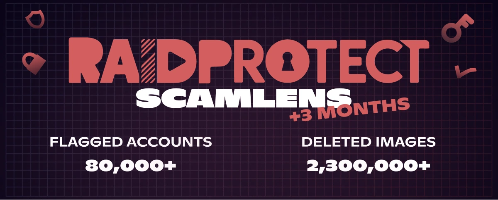

import Timestamp from '@site/src/components/Timestamp';
import Head from '@docusaurus/Head';

May 2026 recap across the **365,000 Discord servers** protected by RaidProtect (from May 1 to June 1, 2026): **2.3 million scam images deleted** by ScamLens and **80,000 hacked Discord accounts** identified. These scams **impersonate celebrities** like MrBeast, Elon Musk or Andrew Tate, who obviously have no connection to these messages. We're also extending coverage to a new variant, the **"3-image" combo**, spotted during a **spike of over 2,000 images** intercepted within minutes.

{/* truncate */}

## 🛰️ Recap: ScamLens, RaidProtect's image anti-scam {#what-is-scamlens}

For servers just discovering RaidProtect: ScamLens is the module that handles **scam images**. As soon as an image is posted, it checks it against its catalog and automatically **deletes** the fraudulent ones: **crypto scams**, **fake celebrity giveaways** (MrBeast, Elon Musk, Andrew Tate, Kick, Stake…), **fake online casino promotions**. Nothing to configure or maintain on your end: ScamLens runs **by default** as soon as you [add RaidProtect](https://raidprotect.bot/en/invite).

  
  
  
  

## 📊 ScamLens recap since February 14, 2026 {#stats}

Cumulative data since the [early activation of ScamLens](/en/blog/scamlens-early-activation) on <Timestamp value={1771023600} format="D" />:

| **Indicator (cumulative since February 14)** | **May 1, 2026** | **June 1, 2026** | **Change** |
|---|---|---|---|
| Images analyzed (unique) | 890,000 | **1,800,000** | **+100%** |
| Scam images detected (unique) | 82,000 | **141,000** | **+72%** |
| Fraudulent images deleted | 1,400,000 | **2,300,000** | **+64%** |
| Hacked Discord accounts identified | 40,000 | **80,000** | **+100%** |

The number of **hacked accounts identified has doubled** in a month, and the volume of deleted images now exceeds **2.3 million**. The unique image catalog is growing too (+72%): this mainly signals that **new visual clusters** are appearing. A visual cluster is one same scam image **plus all its micro-variants** (re-crops, filters, retouches); when the unique count climbs this much, **new visuals** are being launched, not just spin-offs of the old ones.

---

## 🆕 Update: "3-image" combo coverage {#updates}

Scammers split their visual into several **combined formats** to fool detection: 4 images at first, then 2 images last month (see the ["2-image"](/en/blog/threat-weather-april-2026#stats)), and now a **3-image combo**. We spotted this new format during a **spike of over 2,000 images** intercepted within minutes.

This 3-image combo also arrived with a **new visual cluster**: a brand-new scam visual not yet in our catalog. We covered both at once, and ScamLens now recognizes this combo in full, with no action needed on your part. Each image is still processed in **~400 ms**, before most members even have time to see it.

---

## ❓ FAQ {#faq}

<Head>
  
</Head>

#### What is ScamLens on Discord? {#quest-ce-que-scamlens}
ScamLens is RaidProtect's **image anti-scam** module, the **Discord protection bot**. It analyzes every posted image in real time and **automatically deletes** the ones it identifies as fraudulent (crypto scams, fake celebrity giveaways, fake online casino promotions), **with no configuration at all**.

#### How do I automatically delete crypto scam images on Discord? {#supprimer-images-arnaque-crypto}
[Add RaidProtect](https://raidprotect.bot/en/invite) to your server: **ScamLens is active by default** and deletes crypto scam images in **~400 ms**, before most members ever see them. No rules to write and no blocklist to maintain.

#### Why is my Discord account sending scam messages on its own? {#compte-discord-envoie-messages-seul}
Your account has most likely been **hacked**. Scammers steal your **authentication token** (fake site, infected software, malicious extension) and use it to spam scam images on **every server you are in**, without you knowing.

#### What should I do if a member of my Discord server is broadcasting a crypto scam? {#membre-diffuse-scam-crypto}
**Don't ban them**: it's almost always a **hacked account**, not a malicious user. Reach out privately so they can secure their account. ScamLens already removes the image on the fly, without punishing the legitimate owner.

#### How do I recognize a fake giveaway or fake crypto promotion on Discord? {#reconnaitre-fausse-promo-crypto}
Any **crypto "giveaway"**, **online casino** with a celebrity logo (MrBeast, Elon Musk, Andrew Tate, Kick, Stake) or **"guaranteed" investment** is a scam. **These personalities are not behind these messages**: scammers simply impersonate their image and reputation. Discord never runs cryptocurrency distributions, and no serious brand spams across multiple servers.

---

:::tip 📚 Useful resources
- 🔗 [Add RaidProtect to your server](https://raidprotect.bot/en/invite)
- 📘 [HoneyPot documentation](https://docs.raidprotect.bot/en/features/honeypot)
- 💡 [Submit a suggestion](https://suggestions.raidprotect.bot/)
- 📣 [Join our Discord server](https://raidprotect.bot/discord)
:::
