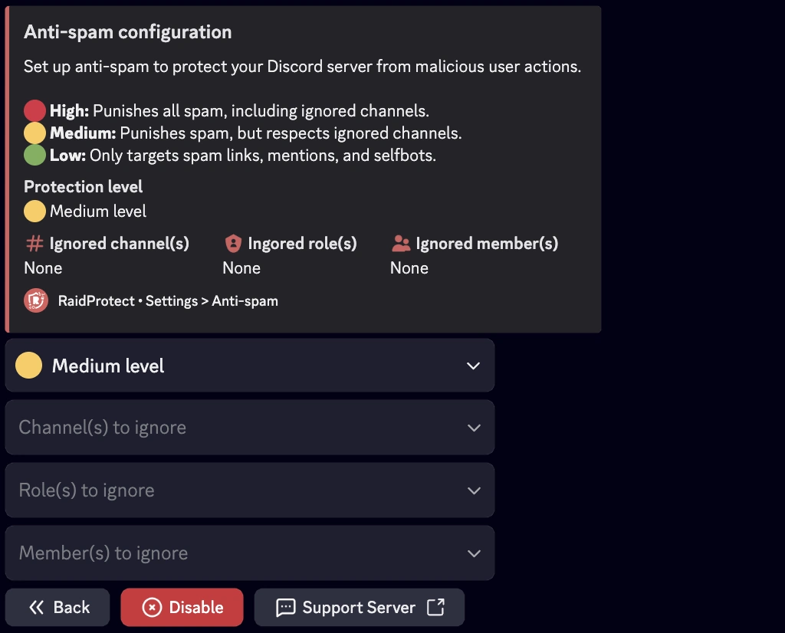
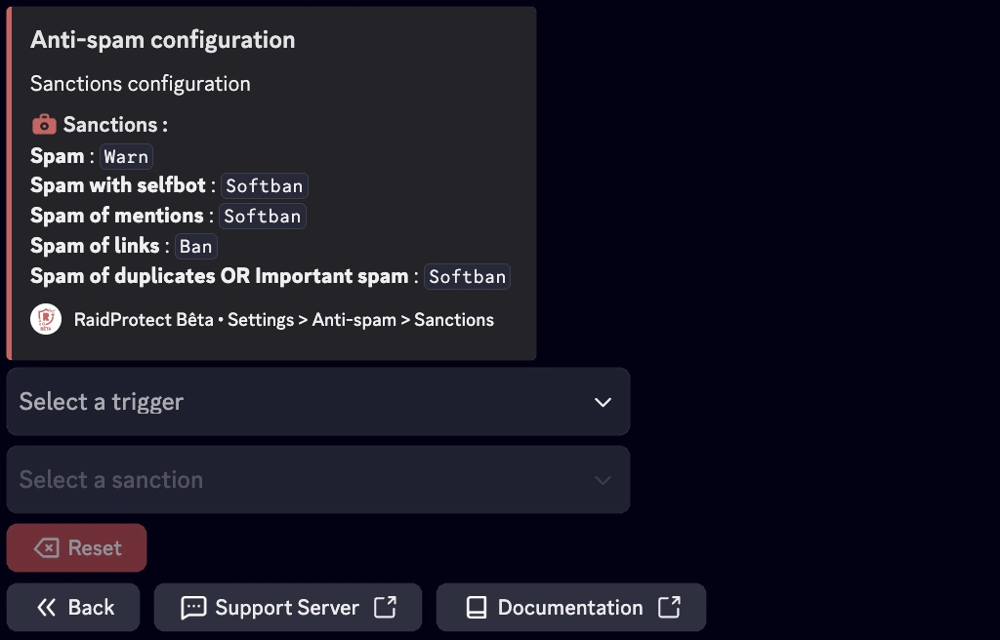
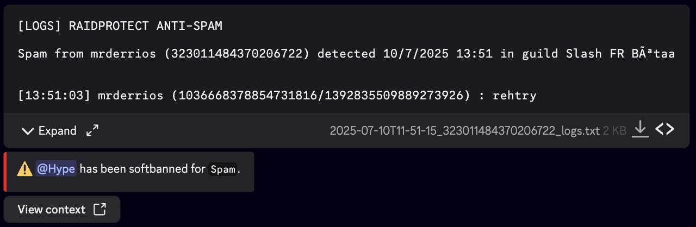
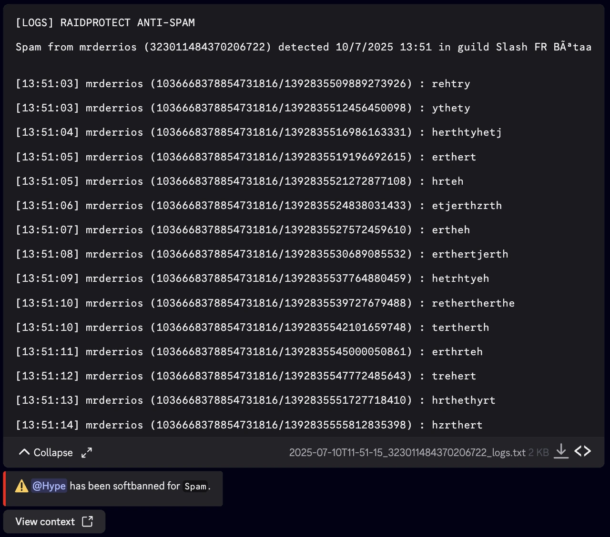

RaidProtect's Anti-spam is a powerful tool to prevent spam on your Discord server. Thanks to its automatic detection system, it handles issues on its own without requiring your intervention.

## ❓ How the Anti-spam Works {#working}

RaidProtect's anti-spam detects and automatically blocks suspicious behavior. It distinguishes between two types of spam.
- **Heavy spam:** Messages containing invitation links, mass mentions, or images. This type of spam is often used during raids.
- **Light spam:** Messages sent frequently but less intrusive.

RaidProtect's anti-spam acts in two ways.
- **Sanctions:** Automatic kicking or banning of spammers.
- **Notifications:** Sends messages to the log channel to report blocked spam with an overview of detected actions.

## 🛡️ Configuring the Anti-spam {#config}

RaidProtect offers three security levels to meet your server's needs.
- 🔴 **High:** Sanctions all spam, including heavy spam in ignored channels.
- 🟠 **Medium:** Sanctions all spam but respects ignored channels.
- 🟢 **Low:** Sanctions only heavy spam.

### Changing the Security Level {#level}

1. Use the [`/settings` command](../setup.md#settings).
2. Click on the “**Anti-spam**” button.
3. Select the desired anti-spam level from the first dropdown.

### Managing Ignored Roles, Users, and Channels {#ignore}

You can exclude certain channels, roles, or even users from anti-spam monitoring for added flexibility. 😉
1. Use the [`/settings` command](../setup.md#settings).
2. Click on the “**Anti-spam**” button.
3. Select the different options to ignore in the dropdowns:
- Channel(s) to ignore
- Role(s) to ignore
- Member(s) to ignore

:::info
Channels containing “**spam**” in their name are automatically ignored. Users with administrator permissions are completely ignored.
:::

### Configure sanctions by trigger {#triggers}

You can customize the sanctions applied depending on the type of spam detected. This allows for a response adapted to the severity of the violation.

1. Use the [ `/settings` command](../setup.md#settings).
2. Click on the “**Anti-spam**” button.
3. Go to the “**Sanctions**” tab.
4. For each trigger, select a specific sanction. You can modify these values using the dropdown menus:
- **Select a trigger**: choose the type of spam to configure.
- **Select a sanction**: choose the corresponding sanction.

## 📑 Anti-spam Logs {#logs}

Detailed logs are generated with all messages deleted by the anti-spam. You can simply download or expand the content.

<SeparatedBox>
<Tabs>
  <TabItem value="animator" label="Collapsed" default>

  </TabItem>
  <TabItem value="moderator" label="Expanded">

  </TabItem>
</Tabs>
</SeparatedBox>